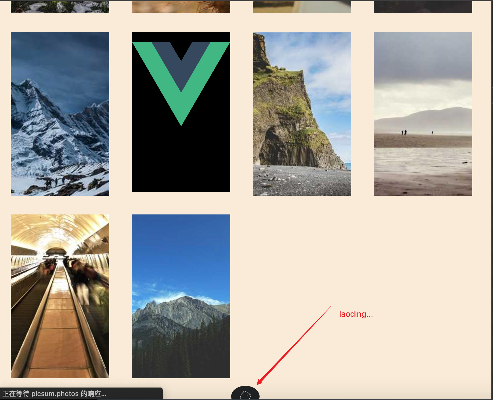

# 加载更多



设置目标元素`loading`与边界盒交叉的比值 `threshold`，达到后触发 callback，执行我们的逻辑。

```html
<template>
  <div class="intersection-container">
    <div class="box" v-for="(item, idx) in listLength">
      {{ item }}
    </div>
    <Loading class="loading" />
  </div>
</template>

<script setup lang='ts'>
import {ref, onMounted} from 'vue'
import Loading from '@/components/Loading.vue';

const listLength = ref(10)

onMounted(() => {
  const ob = new IntersectionObserver(function(entries) {
    const options = entries[0]
    // intersectionRatio 为0，表示目标在视野外
    // isIntersecting 为 true，表示目标进入视野，为false表示离开视野区域，离开时不执行逻辑
    if (options.intersectionRatio <= 0 && !options.isIntersecting) return;

    listLength.value = listLength.value + 10
  }, {
    threshold: 0.5
  })

  // 监听目标元素
  ob.observe(document.querySelector('.loading')!)
})

</script>
<style scoped lang="less">
.intersection-container {

  display: flex;
  flex-wrap: wrap;
  justify-content: flex-start;
  width: 100%;

  .box {
    width: 20%;
    height: 300px;
    background-color: black;
    flex-shrink: 0;
    margin: 20px;
    text-align: center;
    line-height: 300px;
    color: #fff;
    font-size: 24px;
    font-weight: bold;
  }
}
</style>
```

# 图片懒加载

假如页面上要渲染 1000 个图片，当用户一打开页面，可能只显示了 10 个图片，剩余的 990 张图片没有显示在屏幕上，那么这 990 张图片，是完全不需要发起网络请求去加载图片的。


源码如下

```html
<template>
  <div class="intersection-container">
    <div class="box" v-for="(item, idx) in listLength">
      
    </div>
  </div>
</template>

<script setup lang='ts'>
import {ref, onMounted, ImgHTMLAttributes} from 'vue'

// 默认的占位图片
import vueLogo from '../assets/imgs/vue.svg'

// 渲染100个 img
const listLength = ref(1000)

onMounted(() => {
  // 监听图片是否出现在可视区域
  const imgOb = new IntersectionObserver(function(entries) {
    for(const entry of entries) {
      // true 表示进入可视范围内
      if (entry.isIntersecting) {
        const img = entry.target;
        
        (img as ImgHTMLAttributes).src = `https://picsum.photos/300/500?r=${Math.random()}`

        // 图片加载后，要取消监听，防止再次修改图片的 src 属性
        imgOb.unobserve(img)
      }
    }
  }, {
    threshold: 0.1
  })

  const imgs = document.querySelectorAll('.img')
  imgs.forEach(img => {
    imgOb.observe(img)
  })
})

</script>
<style scoped lang="less">
.intersection-container {

  display: flex;
  flex-wrap: wrap;
  justify-content: flex-start;
  width: 100%;

  .box {
    width: 20%;
    height: 282.33px;
    background-color: black;
    flex-shrink: 0;
    margin: 20px;
    text-align: center;
    line-height: 300px;
    color: #fff;
    font-size: 24px;
    font-weight: bold;

    img {
      width: 100%;
    }
  }
}
</style>
```

## 监听 scroll 事件（不推荐了）

不推荐：`scroll` 回调函数执行太多次了

1. 使用自定义属性（`data-*`）来表示图片的 src，浏览器不会处理这个 `data-src` 的属性值

2. 监听 `scroll`，当图片出现在视图中，将 `data-src` 赋值给 `src`

```html

```

```js
const imgs = document.querySelectorAll('img')

window.addEventListener('scroll', function() {
  imgs.forEach(img => {
    const imgTop = img.getBoundingClientRect().top // 图片距离窗口顶部的距离
    if (imgTop < window.innerHeight) {
      // 表示图片进入到窗口内部了

      const data_src = img.getAttribute('data-src')

      img.setAttribute('src', data_src)
    }
  })
})
```

# 文本动态划线效果


对于刚进入窗口的 `mark` 标签，动态划线

```js
let observer = new IntersectionObserver((entries, observer) => {
  entries.forEach(entry => {
    if (entry.isIntersecting) {
      // 当 mark 标签进入到可视区域，动态添加类名
      entry.target.classList.add('animate')
      observer.unobserve(entry.target)
    }
  })
})

document.querySelectorAll('mark').forEach(mark => {
  observer.observe(mark)
})
```

css 部分，添加动画 `animation`

```css
html {
  font-size: 12px;
}

body {
  font-family: Helvetica;
  color: #333;
  width: 60%;
  margin: auto;
}

h1 {
  font-size: 4rem;
  margin: 10rem 0 3rem 0;
}

p {
  font-size: 2rem;
  line-height: 3.8rem;
  margin: 2.6rem 0;
  letter-spacing: .05rem;
}

mark {
  background-color: transparent;
  color: inherit;
  background-image: linear-gradient(#73FFA0, #73FFA0);
  background-repeat: no-repeat;
  background-size: 0% 38%;
  background-position: 0 100%;
}

mark.animate {
  animation: 2s highlight ease-in-out forwards;
}

@keyframes highlight {
  to {
    background-size: 100% 38%;
  }
}
```

```html
<h1>JavaScript 的歷史及現況</h1>

<p>1990 年，科學家 Tim Berners-Lee 在互聯網的基礎上發明了萬維網 (World Wide Web)，<mark>World Wide Web 這個詞在互聯網早期經常提到，還一直影響至今，大家記得網址開端一般都是以 www 起首的嗎？就是 World Wide Web 的簡寫。</mark>發明了 www，從此我們可以在網上互傳檔案。但這個時候的只能通過命令行模式 (Command Mode) 存取網絡，而且只能顯示文字，顯然是不方便的。</p>

<p>1992 年史上第一個圖形化的網頁瀏覽器 Mosaic 誕生，1994 年改名為 Netscape Navigator (網景) 並推出 1.0 版本，市場佔有率超過 90%。<mark>由於當時的互聯網速度很慢，而且上網費昂貴，Netscape 公司為了優化瀏覽體驗，覺得有必要研發一套腳本語言，是在瀏覽器端運行的。</mark>例如我們在一個網站登入會員，忘了填寫用戶名稱就點擊了「登入」，這是候網頁再次載入，才提醒需要填寫用戶名稱，這顯然晚了一點。瀏覽器應該可以在用戶點擊「登入」時就進行初步檢查，在檢查到錯誤時及時彈出提示訊息讓用戶修正。</p>

<p>Netscape 公司對於這種基於瀏覽器的腳本語言的想法是：功能不需要太強，語法較簡單，容易學習和應用。公司聘請了 Brendan Eich 研發這個腳本語言，<mark>據說他只用了 10 天，就設計好這個語言的第一版</mark>，最初命名為 Mocha，及後改名為 LiveScript。</p>

<p>而據說當時 Sun 公司的 Java 語言相當受歡迎，出於市場推廣的原因，固意將這門語言與 Java 在名義上扯上關係（而實際上幾乎沒有）。Netscape 與 Sun 公司達成「合作協議」允許將 LiveScript 命名為 JavaScript。大家還記得當時有 JavaApplet 這種瀏覽器插件嗎？JavaApplet 是 Sun 公司發展出來，真正使用 Java 語言編寫，在瀏覽器端運行的應用程式，當時期望 JavaScript 的角色是像膠水一樣將各部份連接起來。<mark>後來 JavaApplet 失敗了，JavaScript 卻發揚光大了。</mark></p>

<p>1996 年 JavaScript 隨著 Netscape 2.0 正式推出。</p>

<p>1996 年 8 月 Microsoft 仿效 Netscape，於自己的 IE 瀏覽器發展出一門與 JavaScript 相近的腳本語言，取命 JScript。一山不能藏二虎，<mark>Netscape 公司將 JavaScript 提交給 ECMA International（歐洲電腦製造商協會）進行標準化，它就是 ECMAScript。</mark>不過基於歷史原因及市場原因，大家都習慣用 JavaScript 這個名字而非 ECMAScript。我們現在說的 JavaScript ES5 / ES6 等等，ES 就是 ECMAScript 版本的簡寫，後面的是版本號。</p>

<p>ECMAScript 一直持續發展，但由於瀏覽器的支援滯後，在好長一段時間內一直流行 ECMAScript 3。直至 2012 年出現轉捩點，<mark>各大網站開始停止對舊版 IE 瀏覽器的支援</mark>，以及 Chrome 與 Firefox 等瀏覽器的佔有率開始提升，使得 ECMAScript 5 流行起來。</p>

<p>在 2018 年的今天，即使 ECMAScript 6 在瀏覽器端還未正式普及，<mark>但有轉譯工具可以幫助我們今天起就編寫 ES6 的 JavaScript</mark>，而 Node.js 陣型（如 React Native）使用 ES6 已非常普遍了。</p>
```
