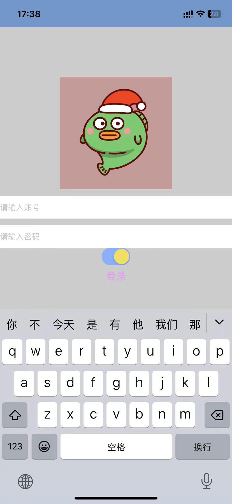
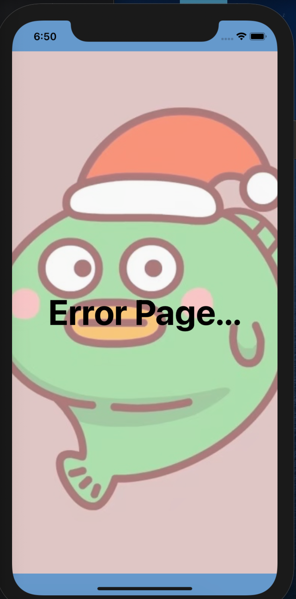

# react native

React Native 是一个使用React和应用平台的原生功能来构建 Android 和 iOS 应用的开源框架。通过 React Native，您可以使用 JavaScript 来访问移动平台的 API，以及使用 React 组件来描述 UI 的外观和行为：一系列可重用、可嵌套的代码。你可以在下一节了解更多关于 React 的信息。但首先，让我们介绍一下组件在 React Native 中是如何工作的。


# react-native-cli

方便在命令行执行一些命令

`npm install -g react-native-cli`

> react-native run-ios

# 初始化项目

1. react-native init project-name

2. npx

```js
1. npx react-native@latest init AwesomeProject

2. npx react-native@X.XX.X init AwesomeProject --version X.XX.X
```

`cd AwesomeProject`

```js
yarn ios

// or

yarn react-native run-ios
```

# Andriod studio
启动 andriod
# Xcode

启动 ios
# 调试 APP

`Command + D` 打开调试模式，如果无效，也可以通过 `Device + Shake` 弹出，需要开启的功能如下：

1. remote js debugge
2. enable hot reloading

也可以安装 `react native debugger.app` 来调试

# 处理 ios 和 android 兼容性

## 特定平台后缀

方式一，创建指定平台的 `入口文件`

```js
index.ios.js

index.android.js
```

某个组件

```js
BigButton.ios.js
BigButton.android.js
```

去掉平台后缀直接引用，`React Native 会根据运行平台的不同自动引入正确对应的组件。`

```js
import BigButton from './BigButton';
```

## Platform

适用于细粒度控制兼容性 `Platform`

`.OS`在 iOS 上会返回ios，而在 Android 设备或模拟器上则会返回android。

```js
import { Platform } from 'react-native';

Platform.OS === 'ios' ? ...
```

还有个实用的方法是 `Platform.select()`，它可以以 Platform.OS 为 key，从传入的对象中返回对应平台的值

```js
import {Platform, StyleSheet} from 'react-native';

const styles = StyleSheet.create({
  container: {
    flex: 1,
    ...Platform.select({
      ios: {
        backgroundColor: 'red',
      },
      android: {
        backgroundColor: 'blue',
      },
    }),
  },
});
```

这一方法可以接受任何合法类型的参数，因此你也可以直接用它针对不同平台返回不同的组件，像下面这样：

```js
// 返回特定平台的 组件
const Component = Platform.select({
  ios: () => require('ComponentIOS'),
  android: () => require('ComponentAndroid'),
})();

<Component />;
```

# WebView

> https://github.com/UnPourTous/react-native-0.51.0/blob/master/Libraries/Components/WebView/WebView.ios.js#L559

现在 Android App大多嵌入了 Android Webview 组件进行 Hybrid 开发，它具备开发周期短、灵活性好的优点，但是缺点也很明显，加载速度慢 & 消耗流量。引起缺点的主要原因如下：

  1. js解析效率，以及手机硬件设备的性能
  2. 页面资源的下载（图片、js文件、css文件）

## 安装 react-native-webview

`npm install --save react-native-webview`

> https://github.com/react-native-webview/react-native-webview/blob/master/docs/Getting-Started.md


# Hybrid技术原理

Hybrid App的本质，其实是在原生的 App 中，使用 WebView 作为容器直接承载 Web页面。因此，最核心的点就是 Native端 与 H5端 之间的双向通讯层，其实这里也可以理解为我们需要一套跨语言通讯方案，来完成 Native(Java/Objective-c/...) 与 JavaScript 的通讯。这个方案就是我们所说的 `JSBridge(JS桥接)`，而实现的关键，便是作为容器的 WebView，一切的原理都是基于 WebView 的机制。

## 优势

- 快速更新

一般来说， App 一个功能的上线需要经过漫长流程，版本的发布存在铺量的问题；而 WebView 加载远端页面的方式，远端页面一经发布，立即全量。所以，页面需要频繁更新时可以考虑 WebView 实现。

- 缩小 App 安装包大小

H5 页面是远端资源，能有效减少 App 安装包的大小。

- 页面复用

一次开发，多处运行。新开发的 H5 页面可以在 RN App WebView、微信/QQ的内置浏览器、微信小程序 WebView 等 WebView 组件上运行。页面在 iOS/Android 上都能获得不错表现。

# 原生组件

在 Android 开发中是使用 Kotlin 或 Java 来编写视图；

在 iOS 开发中是使用 Swift 或 Objective-C 来编写视图。

在 React Native 中，则使用 React 组件通过 JavaScript 来调用这些视图。在运行时，React Native 为这些组件创建相应的 Android 和 iOS 视图。

由于 `React Native 组件就是对原生视图的封装`，因此使用 React Native 编写的应用外观、感觉和性能与其他任何原生应用一样。我们将这些平台支持的组件称为原生组件。

# 核心组件

React Native 具有许多核心组件，从表单控件到活动指示器，应有尽有。

# 长列表

React Native 提供了几个适用于展示长列表数据的组件，一般而言我们会选用FlatList或是SectionList。

`FlatList更适于长列表数据，且元素个数可以增删。和ScrollView不同的是，FlatList并不立即渲染所有元素，而是优先渲染屏幕上可见的元素。`

FlatList组件必须的两个属性是data和renderItem。data是列表的数据源，而renderItem则从数据源中逐个解析数据，然后返回一个设定好格式的组件来渲染。

```js
import React from 'react';
import { FlatList, StyleSheet, Text, View } from 'react-native';

const styles = StyleSheet.create({
  container: {
   flex: 1,
   paddingTop: 22
  },
  item: {
    padding: 10,
    fontSize: 18,
    height: 44,
  },
});

const FlatListBasics = () => {
  return (
    <View style={styles.container}>
      <FlatList
        data={[
          {key: 'Devin'},
          {key: 'Dan'},
          {key: 'Dominic'},
          {key: 'Jackson'},
          {key: 'James'},
          {key: 'Joel'},
          {key: 'John'},
          {key: 'Jillian'},
          {key: 'Jimmy'},
          {key: 'Julie'},
        ]}
        renderItem={({item}) => <Text style={styles.item}>{item.key}</Text>}
      />
    </View>
  );
}
```

# awesome-react-native

https://github.com/jondot/awesome-react-native

# 使用 Expo 创建项目

> Expo官网： https://docs.expo.dev/tutorial/create-your-first-app/

```js
npx create-expo-app StickerSmash && cd StickerSmash

yarn install

npx expo install react-dom react-native-web @expo/webpack-config
```

## 启动项目

```json
"scripts": {
  "start": "expo start",
  "android": "expo start --android",
  "ios": "expo start --ios",
  "web": "expo start --web"
},
```

## 手机安装 Expo Go，实时预览效果

启动项目后，控制台会有个二维码，手机使用相机扫码即可打开 `Expo Go` App，我们修改的代码，也会实时在手机端更新。

# Text

`numberOfLines` 表示文本需要显示几行，超出的用 `省略号表示`

`onLongPress` 长按触发事件

`onPress` 点击触发事件

```js
import { StatusBar } from 'expo-status-bar';
import { StyleSheet, Text, View } from 'react-native';

export default function App() {
  return (
    <View style={styles.container}>
      <Text numberOfLines={1} onLongPress={() => alert(1)}>First AppFirst AppFirst AppFirst AppFirst AppFirst AppFirst AppFirst AppFirst AppFirst AppFirst App</Text>
      <StatusBar style="auto" />
    </View>
  );
}

const styles = StyleSheet.create({
  container: {
    flex: 1,
    backgroundColor: '#fff',
    alignItems: 'center',
    justifyContent: 'center',
  },
});
```

`如果要渲染的是一组需要分组的数据，也许还带有分组标签的，那么SectionList将是个不错的选择`

# StatusBar

> https://docs.expo.dev/versions/latest/sdk/status-bar/

可以控制 StatusBar 显示隐藏、动画之类的


# ActivityIndicator(loading效果)

`<ActivityIndicator color={'red'} />`

# Image

> [Image API](https://docs.expo.dev/versions/latest/sdk/image/#image)

使用图片的三种方式

- 引用网络图片

- 通过 import / require 导入本地图片

- 使用 base64 格式的图片

`安装`

> npx expo install expo-image

`contentFit` 替代了原来的 `resizeMode`

`contentFit` 确定图像应如何调整大小以适合其容器。这个属性告诉图像以多种方式填充容器，例如“保持纵横比”或“拉伸并尽可能地占用空间”。它反映了 CSS 对象匹配属性。

```js
import { Image } from 'expo-image';
import { StyleSheet, View } from 'react-native';

const blurhash =
  '|rF?hV%2WCj[ayj[a|j[az_NaeWBj@ayfRayfQfQM{M|azj[azf6fQfQfQIpWXofj[ayj[j[fQayWCoeoeaya}j[ayfQa{oLj?j[WVj[ayayj[fQoff7azayj[ayj[j[ayofayayayj[fQj[ayayj[ayfjj[j[ayjuayj[';

export default function App() {
  return (
    <View style={styles.container}>
      <Image
        style={styles.image}
        source="https://picsum.photos/seed/696/3000/2000"
        placeholder={blurhash}
        contentFit="cover"
        transition={1000}
      />
    </View>
  );
}

const styles = StyleSheet.create({
  container: {
    flex: 1,
    backgroundColor: '#fff',
    alignItems: 'center',
    justifyContent: 'center',
  },
  image: {
    flex: 1,
    width: '100%',
    backgroundColor: '#0553',
  },
});
```

支持图片加载过程中的几种方法

- onLoad

- onLoadStart

- onLoadEnd

- onError

# ImageBackground

背景图的使用

```js
import { View, Text, StyleSheet, ImageBackground } from 'react-native'
import { Image } from 'expo-image'

const ImageDemo = () => {
  return (
    <View style={styles.container}>
      <ImageBackground
        style={styles.image}
        source={require('../../assets/chrome.jpg')}
      >
          <Text>Hello ImageBackground</Text>
      </ImageBackground>
    </View>
  )
}

const styles = StyleSheet.create({
  container: {
    flex: 1,
    backgroundColor: '#fff',
  },
  image: {
    flex: 1,
    width: '100%',
    backgroundColor: '#0553',
  },
})

export default ImageDemo
```

# ScrollView

> https://www.reactnative.cn/docs/scrollview

一个封装了平台的 ScrollView（滚动视图）的组件，同时还集成了触摸锁定的“响应者”系统。

记住 ScrollView 必须有一个确定的高度才能正常工作，因为它实际上所做的就是将一系列不确定高度的子组件装进一个确定高度的容器（通过滚动操作）。

`一般来说我们会给 ScrollView 设置flex: 1以使其自动填充父容器的空余空间，但前提条件是所有的父容器本身也设置了 flex 或者指定了高度，否则就会导致无法正常滚动，你可以使用元素查看器来查找具体哪一层高度不正确。`

## ScrollView和FlatList应该如何选择？

ScrollView 会简单粗暴地把所有子元素一次性全部渲染出来。其原理浅显易懂，使用上自然也最简单。然而这样简单的渲染逻辑自然带来了性能上的不足。想象一下你有一个特别长的列表需要显示，可能有好几屏的高度。创建和渲染那些屏幕以外的 JS 组件和原生视图，显然对于渲染性能和内存占用都是一种极大的拖累和浪费。

这就是为什么我们还有专门的FlatList组件。FlatList会惰性渲染子元素，只在它们将要出现在屏幕中时开始渲染。这种惰性渲染逻辑要复杂很多，因而 API 在使用上也更为繁琐。除非你要渲染的数据特别少，否则你都应该尽量使用FlatList，哪怕它们用起来更麻烦。

此外FlatList还可以方便地渲染行间分隔线，支持多列布局，无限滚动加载等等。

## scrollEventThrottle(节流)

这个属性控制在滚动过程中，scroll 事件被调用的频率（单位是 ms，事件触发的间隔时间）。更小的间隔时间能够更及时的跟踪滚动位置，不过可能会带来性能问题，因为更多的信息会通过 bridge 传递。由于 JS 事件循环需要和屏幕刷新率同步，因此设置为 1-16 之间的数值不太可能有实质区别（一般屏幕刷新率为 60 帧，即每帧间隔不低于 16 ms）。默认值为 0，意味着每次视图被滚动，scroll 事件都会被调用。

```js
<ScrollView
  style={styles.container}
  horizontal={false} // 控制垂直方向滚动、true 表示水平风向滚动
  onScroll={() => {
    console.log('ScrollView scroll ...')
  }}
  scrollEventThrottle={1000}
>
  {
    new Array(10).fill('').map((item, idx) => {
      return (
        <View style={styles.box}>
          <Text style={styles.text}> {idx} </Text>
        </View>
      )
    })
  }
</ScrollView>
```

# 解决键盘遮挡问题

`关键组件`: `KeyboardAvoidingView`

本组件用于解决一个常见的尴尬问题：手机上弹出的键盘常常会挡住当前的视图。本组件可以自动根据键盘的高度，调整自身的 height 或底部的 padding，以避免被遮挡。

`关键属性`: `behavior`，可选值为 `'height', 'position', 'padding'`

`关键代码`

```js
import { KeyboardAvoidingView, Platform } from 'react-native'

<KeyboardAvoidingView
  style={{ flex: 1 }}
  behavior={Platform.OS == "ios" ? "padding" : "height"}
/>
```

整体代码如下

```js
import React, { useState } from 'react'
import {
  Text,
  StyleSheet,
  View,
  TextInput,
  Switch,
  Button,
  KeyboardAvoidingView,
  Platform
} from 'react-native'
import { Image } from 'expo-image'

const index = () => {

  const [isEnabled, setIsEnabled] = useState(false);
  const toggleSwitch = () => setIsEnabled(previousState => !previousState);

  return (
    <KeyboardAvoidingView
      style={styles.container}
      behavior={Platform.OS == "ios" ? "padding" : "height"}
    >
      <Image
        style={{ width: 200, height: 200, alignSelf: 'center'}}
        source={require('../../assets/avatar.jpg')}
      />
      <TextInput style={styles.inputStyle} placeholder='请输入账号' />
      <TextInput style={styles.inputStyle} placeholder='请输入密码' />
      <Switch
        title='记住密码'
        trackColor={{ false: "#767577", true: "#81b0ff" }} // 卡槽颜色
        thumbColor={isEnabled ? "#f5dd4b" : "#f4f3f4"} // 开关上圆形按钮的背景颜色
        onValueChange={toggleSwitch}
        value={isEnabled}
      />
      <Button title='登录' color="#f194ff"></Button>
    </KeyboardAvoidingView>
  )
}

const styles = StyleSheet.create({
  container: {
    flex: 1,
    backgroundColor: '#ccc',
    alignItems: 'center',
    justifyContent: 'center'
  },
  inputStyle: {
    height: 40,
    width: '100%',
    backgroundColor: '#fff',
    marginTop: 12
  }
})

export default index
```

效果如下



# webview

- [webview 官方文档](https://github.com/react-native-webview/react-native-webview/blob/master/docs/Guide.md#react-native-webview-guide)

- [React Native WebView API Reference](https://github.com/react-native-webview/react-native-webview/blob/master/docs/Reference.md)

## 安装

`npx expo install react-native-webview`

## 使用

注意，包裹 `WebView` 组件的容器，必须使用 `flex: 1`

```js
import { StyleSheet, SafeAreaView } from 'react-native';
import { WebView } from 'react-native-webview'

export default function App() {
  return (
    <SafeAreaView style={styles.container}>
      <WebView source={{
        uri: 'https://m.baidu.com'
      }} />
    </SafeAreaView>
  );
}

const styles = StyleSheet.create({
  container: {
    backgroundColor: 'pink',
    flex: 1 
  }
});
```


## 显示 HTML

注意：`设置 html 源需要原始 WhiteList 属性设置为[’*’]。`

```html
<WebView source={{
  originWhitelist={['*']}
  html: '<h1><center>Hello webview</center></h1>'
}} />
```

`加载本地 HTML 文件`

```js
import React, {Component} from 'react';
import {View, Text, Alert, TextInput, Button} from 'react-native';
import { WebView } from 'react-native-webview';
const localHtmlFile = require('../assets/test.html');

export default class LocalPageLoad extends Component<Props, State> {
    render() {
      return (
        <View style={{ width: '100%', height: '100%' }}>
          <WebView source={localHtmlFile}/>
        </View>
      );
    }
  }
```

## 获取 webview 实例

class 组件

```js
class MyWeb extends Component {
  webview = null;

  render() {
    return (
      <WebView
        ref={(ref) => (this.webview = ref)}
      />
    );
  }
}
```

函数组件

```js
import {createRef} from 'react'
import { WebView } from 'react-native-webview'


const WebViewDemo = () => {
  const webviewRef = createRef()

  // webviewRef.current.stopLoading 阻止加载

  return (
    <WebView ref={webviewRef} />
  )
}

export default WebViewDemo
```

`useRef`

```js
const webViewRef = useRef(null);

if (webViewRef.current) {
  webViewRef.current.goBack();
}

<WebView
  ref={webViewRef}
/>
```
## 接入 H5 调试工具 `vConsole`

```html
<script src="https://cdn.bootcss.com/vConsole/3.3.0/vconsole.min.js"></script>
```

```js
<script>
  const vConsole = new VConsole()
</script>
```

## 控制导航状态的更改

有时候你想拦截一个用户在你的 webview 中点击一个链接，然后做一些不同于在 webview 中导航的事情。我们可以使用 `onNavigationStateChange` 方法监听。

```js
const WebViewDemo = () => {
  const webviewRef = createRef()

  const onNavigationStateChange = newNavState => {
    const { url } = newNavState

    // 我们可以判断 newNavState.url 中的参数，来决定 webview 的行为
    // 比如，webview 中有一个 PDF 连接，点击之后，我们应该显示 PDF
    if (url.includes('.pdf')) {
      this.webview.stopLoading();
      // open a modal with the PDF viewer
      Alert.alert('打开 PDF modal')
    }

    Alert.alert('执行其他逻辑!')
  }

  return (
    <WebView
      ref={webviewRef}
      source={{ uri: 'https://reactnative.dev/' }}
      onNavigationStateChange={onNavigationStateChange}
    />
  )
}
```

## JS（HTML）与本机之间的通信

我们需要发送消息到网页浏览加载的网页，也可以接收来自这些网页的消息。

为此，React NativeWebView 公开了三个不同的选项

1. React Native -> Web: The injectedJavaScript prop
2. React Native -> Web: The injectJavaScript method
3. Web -> React Native: The postMessage method and onMessage prop

## The injectedJavaScript prop

`injectedJavaScript` 字符串是一个脚本，首次加载网页后立即执行脚本的内容。它只运行一次，即使页面被重新加载或导航离开。

下面的代码中，当 webview 加载了 html 页面，首先会将 `body` 设置为 `粉色`，同时在 `window` 对象上挂在一个方法 `sayHello`。

`html` 中，我们可以定义一个按钮，点击按钮后，可以调用 `window.sayHello`。

### 注意
`injectedJavaScript` 字符串脚本最后，有一个 `true`，***这是必须的，否则有时候你会无声地失败***

```js
// rn component
const injectedJavaScript = `
  document.body.style.backgroundColor = 'pink';
  window.sayHello = function() { alert('我是 RN 通过 injectedJavaScript 注入的方法') };
  true;
`

return (
  <WebView
    source={localH5}
    injectedJavaScript={injectedJavaScript}
  />
)

// h5
const button = document.querySelector('button')
button.addEventListener('click', () => {
  if (typeof window.sayHello === 'function') {
    window.sayHello()
  }
})
```


## injectedJavaScriptBeforeContentLoaded prop

这是在网页首次加载之前运行的脚本。即使页面重新加载或导航离开，它也只运行一次。

如果您想在执行 Web 代码之前将任何内容注入到窗口、本地存储或文档中，这非常有用。

```js

const runFirst = `
  window.isNativeApp = true;
  true; // note: 这是必须的，否则有时候你会无声地失败
`;

<WebView
  source={{
    uri: 'xxx',
  }}
  injectedJavaScriptBeforeContentLoaded={runFirst}
/>
```

> `Warning`: On Android, this may work, but it is not 100% reliable (see #1609 and #1099).

## The injectJavaScript method

虽然方便，但是前面提到的 `injectedJavaScript` prop的缺点是它`只运行一次`。这就是为什么还在 webview 参考文献中公开了一个名为 `injectJavaScript` 的方法(`注意这个名字稍有不同!`).

如下例子，当首次加载 `localH5.html` 时，背景色是 `粉色`，`三秒过后，我们通过 webview本身提供的 injectJavaScript 方法，将 html 的背景色改为了 橙色`

```js
const WebViewDemo = () => {

  const webviewRef = createRef()

  const injectedJavaScript = `
    document.body.style.backgroundColor = 'pink';
    window.sayHello = function() { alert('我是 RN 通过 injectedJavaScript 注入的方法') };
    true
    `

  // 3s 后，localH5.html 的背景色自动改为 `橙色`
  setTimeout(() => {
    webviewRef.current.injectJavaScript(`
      document.body.style.backgroundColor = 'orange';
    `)
  }, 3000)

  return (
    <WebView
      ref={webviewRef}
      source={localH5}
      injectedJavaScript={injectedJavaScript}
    />
  )
}
```

> 在 iOS 上，injectJavaScript 调用 WebView 的 evaluateJS
> 
> 在 Android 上，injectJavaScript 调用 Android WebView 的 evaluateJavascriptWithFallback 方法

## window.ReactNativeWebView.postMessage

web page 可以给 `React Native code` 发送消息啦!

你必须设置 webview `onMessage` 属性，否则`window.reactativewebview.postmessage`方法将不会被注入到网页中。

window.ReactNativeWebView.postMessage only accepts one argument which must be a string.

rn

```js
<WebView
  source={localH5}
  onMessage={event => {
    console.log('🔥', event.nativeEvent.data) // 你好 ReactNativeWebview
  }}
/>
```

localH5.html

```js
const button = document.querySelector('button')
button.addEventListener('click', () => {
  // 给 RN 发送消息
  window.ReactNativeWebView.postMessage('你好 ReactNativeWebview')
})
```

## 处理 H5 的消息类型

WebView `onMessage`

```js
onMessage = (event) => {
  const data = JSON.parse(event.nativeEvent.data)
  const { type } = data
  switch (type) {
    case 'route':
      // 路由跳转
      break
    case 'emitCallback':// h5触发回调
      const routeParams = this.props?.navigation?.state?.params

      routeParams[callbackName] && routeParams[callbackName](callbackResult)
      break
    case 'tel':
      // 拨打电话
      break
    case 'captureCheck':
      // 检查照相机权限
      break
    case 'msg':
      // 发短信
      break
    case 'upload':
      // 上传图片
      this.beforeUpload(data)
      break
    case 'eventEmit':// 事件监听-触发
      key && RCTDeviceEventEmitter.emit(key, params)
      break
    case 'console':
      // 控制台输出信息
      const [ tag, ...restVal ] = val
      if (typeof tag === 'string' && tag.startsWith('console.')) {
        const type = tag.replace('console.', '')
        console[type].call?.(this, ...restVal)
      } else console.log(...val)
      break
  }
}
```

## 自定义 headers, sessions, and cookies

### Setting Custom Headers

自定义 headers

```html
<WebView
  source={{
    uri: 'http://example.com',
    headers: {
      'my-custom-header-key': 'my-custom-header-value',
    },
  }}
/>
```

这将在第一次加载时设置标头，`但不会在后续页面导航中设置标头`。

为了解决这个问题，我们可以跟踪当前的 URL，拦截新的页面加载，然后自己导航到它们([这项技术的原创者是来自 Big Binary 的 Chirag Shah](https://www.bigbinary.com/blog/passing-request-headers-on-each-webview-request-in-react-native)) 

`解决方法`

WebView 提供了`onLoadStart`属性 ，它接受 WebView 开始加载时调用的函数

我们可以使用此 prop 来了解何时单击链接，然后使用新的 url 重新渲染 WebView 组件。`重新渲染 WebView 组件将加载该页面，就好像它是第一页一样，然后将传递请求标头。`

我们知道，在 React 中，当组件的任何状态发生变化时，组件都会重新渲染自身。这里唯一改变的是 url，所以让我们将 url 移动到一个状态并将其初始化为欢迎页面，该页面是应用程序的根目录。然后使用onLoadStart属性将 url 状态更改为单击的 url。


webview 的 prop `onShouldStartLoadWithRequest`，允许自定义处理任何 Web 视图请求的函数。从函数返回 true 以继续加载请求，并返回 false 以停止加载。

`webview 代码`

```js
const CustomHeaderWebView = (props) => {
  const { uri, onLoadStart, ...restProps } = props;
  const [currentURI, setURI] = useState(props.source.uri);
  const newSource = { ...props.source, uri: currentURI };

  return (
    <WebView
      {...restProps}
      source={newSource}
      onShouldStartLoadWithRequest={(request) => {
        // If we're loading the current URI, allow it to load
        if (request.url === currentURI) return true;

        // We're loading a new URL -- change state first
        setURI(request.url);
        return false;
      }}
    />
  );
};

<CustomHeaderWebView
  source={{
    uri: 'http://example.com',
    headers: {
      'my-custom-header-key': 'my-custom-header-value',
    },
  }}
/>;
```

`server 代码`，服务端通过 `request.headers["my-custom-header-key"]` 获取请求头。

```js
var http = require("http");
var port = 9000;

function logRequest(request) {
  console.log("Processing request for: ", request.url);
  console.log("Custom Header: ", request.headers["my-custom-header-key"]);
  console.log("Request Processed\n");
}

http
  .createServer(function (request, response) {
    response.writeHead(200, { "Content-Type": "text/html" });
    switch (request.url) {
      case "/":
        response.write(
          "<html><body>Welcome<a href='/bye'>Bye</a></body></html>"
        );
        logRequest(request);
        break;
      case "/bye":
        response.write("<html><body>Bye<a href='/'>Welcome</a></body></html>");
        logRequest(request);
        break;
      default:
        break;
    }
    response.end();
  })
  .listen(port);
```

## renderError 渲染错误的 WebView 页面

`renderError` 函数返回一个视图以显示是否存在错误。

`注意`: 渲染错误的容器 `view`，样式需要设置 `height: '100%'`，而不是 `flex: 1`，否则 `错误页面显示不全。`

```jsx
<WebView
  originWhitelist={[ '*' ]}
  source={{
    uri: 'http://127.0.0.1:1500/components/webview/h5.html'
  }}
  renderError={() => {
    return (
      <TouchableOpacity style={styles.errorPage}>
        <Text style={styles.errorContent}>Error Page</Text>
      </TouchableOpacity>
    )
  }}
/>

const styles = StyleSheet.create({
  errorPage: {
    height: '100%', // 注意
    backgroundColor: '#333',
    alignItems: 'center',
    justifyContent: 'center'
  },
  errorContent: {
    textAlign: 'center',
    fontSize: 24,
    fontWeight: 'bold',
    color: '#fff',
  }
})
```

当出现错误到了错误页面之后，我们可以点击错误页面，刷新 `webview`

```js
<TouchableOpacity
  style={styles.errorPage}
  onPress={() => {
    // Alert.alert('错误啦，刷新下试试')
    webviewRef.current?.reload()
  }}
>
  <Text style={styles.errorContent}>Error Page</Text>
</TouchableOpacity>
```

我们来给错误页面，加个背景图，并且给背景图设置`透明度`

```js
renderError={() => {
  return (
    <ImageBackground
      source={require('../../assets/avatar.jpg')}
      style={styles.errorPage}
      contentFit='fill'
      imageStyle={{
        opacity: 0.5, // 背景图片设置透明度
      }}
    >
      <TouchableOpacity
        onPress={() => {
          webviewRef.current?.reload()

          // 或者返回

          props.navigation.goBack()
        }}
      >
        <Text style={styles.errorContent}>Error Page...</Text>
      </TouchableOpacity>
    </ImageBackground>
  )
}}
```

效果如下



# Expo Router

> https://docs.expo.dev/routing/introduction/

# [React Navigation](https://reactnavigation.org/docs/4.x/getting-started)

> React Navigation 版本 > 4.x

建立两个组件 Home 和 HomeDetails

```js
import { createAppContainer } from 'react-navigation'
import { createStackNavigator } from 'react-navigation-stack'

const AppNavigator = createStackNavigator({
  Home: HomeScreen,
  HomeDetails: HomeDetailsScreen
})
export default createAppContainer(AppNavigator)
```

跳转路由，可以通过组件 props 上的 `this.props.navigation.navigate` 方法

```js
<Button
  onPress={() => {
    this.props.navigation.navigate('HomeDetails')
  }}
  title='Home Details'
/>
```

完整示例如下：

```js
import React, { Component } from 'react'
import { Text, StyleSheet, View, Button } from 'react-native'
import { createAppContainer } from 'react-navigation'
import { createStackNavigator } from 'react-navigation-stack'

class HomeDetailsScreen extends React.Component {
  render() {
    return (
      <View style={{ flex: 1, alignItems: 'center', justifyContent: 'center' }}>
        <Text>Details Screen</Text>
      </View>
    );
  }
}

class HomeScreen extends Component {
  render() {
    return (
      <View>
        <Text> HomeScreen </Text>
        <Button
          onPress={() => {
            this.props.navigation.navigate('HomeDetails')
          }}
          title='Home Details'
        />
      </View>
    )
  }
}

const AppNavigator = createStackNavigator({
  Home: HomeScreen,
  HomeDetails: HomeDetailsScreen
})

const styles = StyleSheet.create({})

export default createAppContainer(AppNavigator)
```

`回退`

```js
<Button
  onPress={() => {
    this.props.navigation.goBack()
  }}
  title='Go Back'
/>
<Button
  onPress={() => {
    this.props.navigation.navigate('Home')
  }}
  title='Go Home'
/>
```

## 路由参数

`navigate` and `push` accept an optional `second argument` to let you pass parameters to the route you are navigating to. For example: this.props.navigation.navigate('RouteName', {paramName: 'value'}).

```js
<Button
  onPress={() => {
    this.props.navigation.navigate('HomeDetails', {
      itemId: 86,
      otherParam: 'anything you want here',
    })
  }}
  title='Home Details'
/>
```

目标页面，获取路由参数

```js
// 方式1
const { navigation } = this.props;
navigation.getParam('otherParam', 'default value') // 获取路由的单个参数

// 方式2
this.props.navigation.state.params // 获取路由的所有参数，如果未指定任何参数，则为 null。
```

## 设置页面的 Header title
```js
class HomeScreen extends React.Component {
  static navigationOptions = {
    title: 'Home',
  };

  /* render function, etc */
}

class DetailsScreen extends React.Component {
  static navigationOptions = {
    title: 'Details',
  };

  /* render function, etc */
}
```

`navigationOptions` 也可以配置成函数，函数的参数是 `navigation`，等同于组件内的 `this.props.navigation`

```js
static navigationOptions = ({ navigation }) => {
  return {
    title: `首页详情 itemId:${navigation.getParam('itemId', '0')}`,
  }
}
```

我们还可以动态的改变路由参数，路由参数变化，会引起组件的重新渲染。

```js
<Button
  onPress={() => {
    this.props.navigation.setParams({
      itemId: 99
    })
  }}
  title='更新Params'
/>
```

## 调整页面 Header 样式

```js
static navigationOptions = ({ navigation }) => {
  return {
    title: `首页详情 itemId:${navigation.getParam('itemId', '0')}`,
    headerStyle: {
      backgroundColor: 'pink'
    },
    headerTintColor: '#fff', // 文字、返回按钮都会应用此颜色
    headerTitleStyle: {
      fontWeight: 'bold',
      fontSize: 20,
    },
  }
}
```

## 夸屏幕共享公共的 navigationOptions

我们不希望每个 Header 的样式都不一样，我们可以配置通用的 Header Style

`createStackNavigator` 第二个参数，可以配置通用的 Header style

```js
const AppNavigator = createStackNavigator(
  {
    Home: HomeScreen,
    Details: DetailsScreen,
  },
  {
    initialRouteName: 'Home',
    /* The header config from HomeScreen is now here */
    defaultNavigationOptions: {
      headerStyle: {
        backgroundColor: '#f4511e',
      },
      headerTintColor: '#fff',
      headerTitleStyle: {
        fontWeight: 'bold',
      },
    },
  }
);
```

## 自定义 Header Title

```js
const HomeTitle = () => {
  return (
    <Image
      source={require('../../assets/icon.png')}
      style={{ width: 50, height: 35 }}
    />
  );
}

class HomeScreen extends React.Component {
  static navigationOptions = {
    // headerTitle instead of title
    // title: () => <HomeTitle />,
    headerTitle: () => <HomeTitle />,
  };

  /* render function, etc */
}
```

## Header Buttons

```js
static navigationOptions = {
  headerTitle: <HomeTitle />,
  headerRight: () => (
    <Button
      onPress={() => alert('This is a button!')}
      title="Info"
      color="#000"
    />
  ),
  headerLeft: () => (
    <Button
      onPress={() => alert('This is a button!')}
      title="返回"
      color="#000"
    />
  ),
}
```

## 跳转到 H5 页面

我们先定义好 H5 页面（`WebView`），如果 H5 页面中，不想要看到 `Header`，可以单独给 `H5Demo` 配置 `navigationOptions`，其中 `headerShown` 就可以控制 `Header` 的显示隐藏。

想要返回的话，从屏幕左侧向右滑动即可。


```js
import WebviewDemo from '../webview/webview-demo'

const AppNavigator = createStackNavigator({
  Home: HomeScreen, // 首页
  HomeDetails: HomeDetailsScreen, // 首页详情
  H5Demo: { // H5页面
    screen: WebviewDemo,
    navigationOptions: {
      headerShown: null, // 不显示 header
    }
  }
}, {
  initialRouteName: 'Home',
  defaultNavigationOptions: {
    headerStyle: {
      backgroundColor: '#fff'
    },
    headerTintColor: '#000',
  }
})
```

## H5如何打开 RN 页面？

`其实就是 H5 和 RN 通信的逻辑，只不过是在 RN 侧做了路由的处理`

首先，我们可以在 `injectedJavaScript` 向 Web 端`window对象`注入一个全变量 `isRN`，在 Web 端通过 `window.isRN` 判断当前 Web 页面是不是通过 `RN` 内嵌的。

```js
const injectedJavaScript = `
  window.isRN = true;
  document.body.style.backgroundColor = 'pink';
  window.sayHello = function() { alert('我是 RN 通过 injectedJavaScript 注入的方法') };
  true
`

<WebView
  source={localH5}
  onMessage={(event) => {
    if (event.nativeEvent.data) {
      const data = JSON.parse(event.nativeEvent.data)
      console.log('', data)
    }
  }}
  injectedJavaScript={injectedJavaScript}
/>
```

localH5.html

H5这边通过 `window.ReactNativeWebView.postMessage` 将路由信息发送到 `RN` 这边，路由信息比如包括 `type: route`、`path: ComponentName`、以及可选的参数

如下示例，表示 H5 页面跳转到 `RN` 的 `HomeDetails` 页面。

```js
goBackBtn.addEventListener('click', () => {
  if (window.isRN) {
    const routeInfo = {
      type: 'route',
      path: 'HomeDetails',
      params: {
        itemId: 11,
      }
    }
    
    // 注意：传递的参数是 string 类型
    window.ReactNativeWebView.postMessage(JSON.stringify(routeInfo))
  }
})
```

RN 这边，通过 `WebView` 的 `onMessage` 函数接收消息，在函数内部通过判断当前参数是不是路由信息，如果是路由信息，则通过 `props` 上的 `navigation` 去操控路由跳转。

```js
<WebView
  source={localH5}
  onMessage={(event) => {
    if (event.nativeEvent.data) {
      const data = JSON.parse(event.nativeEvent.data)

      if (data.type === 'route') {
        props.navigation.navigate(data.path, {
          itemId: data.query.itemId
        })
      }
    }
  }}
  injectedJavaScript={injectedJavaScript}
/>
```


# 参考资料
[^1]: [Android Webview H5 秒开方案实现](https://juejin.cn/post/6844903673697402887)

[^2]: [英文 Expo构建App教程](https://www.bilibili.com/video/BV1NT41167zK?p=3&vd_source=a9f38e58a519cc0570c2dacd34ad7ebe)
> https://github.com/adrianhajdin/project_react_native_jobs/blob/main/README.md

[^3]: [Mosh React Native on Expo](https://www.bilibili.com/video/BV1yi4y137u5/?spm_id_from=333.788.top_right_bar_window_history.content.click&vd_source=a9f38e58a519cc0570c2dacd34ad7ebe)
