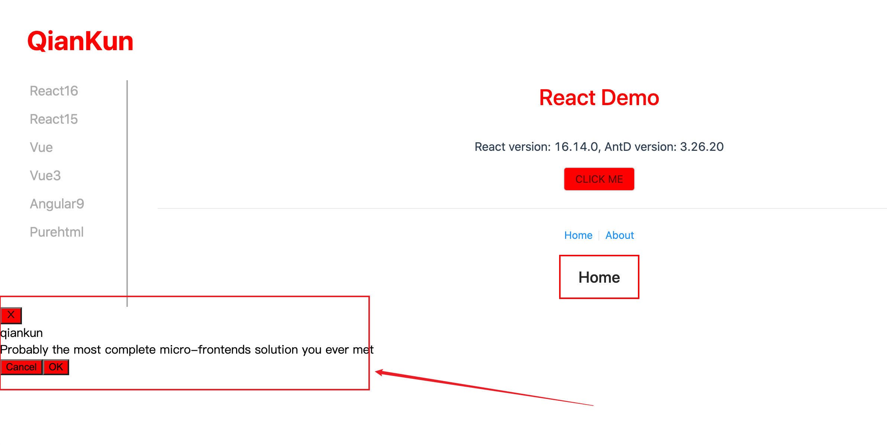
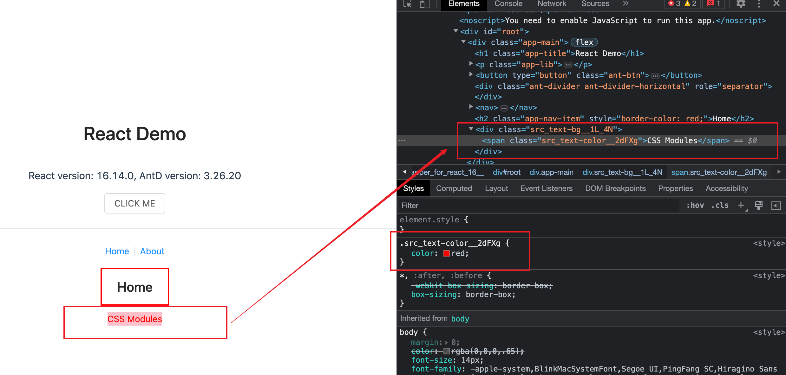

# qiankun

> https://qiankun.umijs.org/zh

基于 single-spa，通过 import-html-entry 包处理 html / css

```json
"dependencies": {
  "import-html-entry": "^1.14.0",
  "single-spa": "^5.9.2"
  // ...
},
```


# 微前端的子项目是怎么引入到主项目里的

```js
registerMicroApps(
  [
    {
      name: 'react16',
      entry: '//localhost:7100',
      container: '#subapp-viewport',
      loader,
      activeRule: '/react16',
    },
    {
      name: 'react15',
      entry: '//localhost:7102',
      container: '#subapp-viewport',
      loader,
      activeRule: '/react15',
    },
  ]
)
```

1. 容器指定路由匹配规则加载子应用，一旦路径匹配就会加载子应用资源

2. 子应用打包输出格式为 umd，并且要允许跨域

```js
// vue.config.js

module.exports = {
  devServer: {
    // ...
    headers: {
      'Access-Control-Allow-Origin': '*',
    },
  },
  // 自定义webpack配置
  configureWebpack: {
    output: {
      // 把子应用打包成 umd 库格式
      library: `${name}-[name]`,
      libraryTarget: 'umd',
      jsonpFunction: `webpackJsonp_${name}`,
    },
  },
}
```

# umd

umd全称是UniversalModuleDefinition，是一种通用模块定义格式，通常用于前端模块化开发中。

由于不同的模块化规范定义不同，为了让各种规范的模块可以通用，在不同的环境下都可以正常运行，就出现了umd这个通用格式。


## 特点

umd 格式是一种既可以在浏览器环境下使用，也可以在 node 环境下使用的格式。它将 CommonJS、AMD以及普通的全局定义模块三种模块模式进行了整合。

# 获取子应用资源 - import-html-entry

> https://zhuanlan.zhihu.com/p/369414267

HTML Entry + Sandbox 是 qiankun 区别于 single-spa 的主要两个特性。

single-spa和qiankun最大的不同，大概就是qiankun实现了html entry，而single-spa只能是js entry

通过 import-html-entry，我就能像 iframe 一样加载一个子应用，只需要知道其 html 的 url 就能加载到主应用中。

importHTML 几个核心方法:

首先importHTML的参数为需要加载的页面url，拿到后会先通过 `fetch方法` 读取页面内容，并且返回为页面html的字符串

- processTpl

- execScript

- getExternalStyleSheets

- getExternalScripts


## processTpl

它会解析html的内容并且删除注释，获取style样式及script代码。通过`大量的正则` + replace，每一个步骤都做了很多适配，比如获取script脚本，需要区分该script是不是entry script，type是JavaScript还是module，是行内script还是外链script，是相对路径还是绝对路径，是否需要处理协议等等。


processTpl的返回值有 template，script，style，entry。

# JS 沙箱

> [文章](https://juejin.cn/post/6920110573418086413)
>
> [视频](https://www.bilibili.com/video/BV1Gv4y177yn/?spm_id_from=333.337.search-card.all.click&vd_source=a9f38e58a519cc0570c2dacd34ad7ebe)

## 快照沙箱-SnapshotSandbox

缺点：

- 遍历 window 上所有属性，性能差

- 同一时间只能激活一个微应用

- 污染全局 window

优点：

可以支持不兼容Proxy的浏览器。


先了解 SnapshotSandbox 的功能

1. 我们激活沙箱后，在 window 上修改的所有属性，都应该存起来，在下一次激活时，需要还原上次在 window 上修改的属性

2. 失活后，应该将 window 还原成激活前的状态

我们来举个例子

```js
// 激活前
window.city = 'Beijing'

// 激活
sanbox.active()

window.city = '上海'

// 失活
sanbox.inactive()
console.log(window.city) // 打印 'Beijing'

// 再激活
console.log(window.city) // 打印 '上海'
```

接下来，实现一个简易版的 SnapshotSandbox

1. SnapshotSandbox 能够还原 window 和记录自己以前的状态，那么就需要两个对象来存储这些信息

```js
1. windowSnapshot 用来存储沙箱激活前的 window

2. modifyPropsMap 用来存储沙箱激活期间，在 window 上修改过的属性
```

2. 沙箱需要两个方法及作用

```js
1. sanbox.active() // 激活沙箱

  - 保存 window 的快照

  - 再次激活时，将 window 还原到上次 active 的状态

2. sanbox.inactive() // 失活沙箱

  - 记录当前在 window 上修改了的 prop

  - 还原 window 到 active 之前的状态
```

我们先来实现沙箱内部细节：

```js
class SnapshotSandbox {

  constructor() {
    this.windowSnapshot = {}

    this.modifyPropsMap = {}
  }

  active() {
    // 1. 保存 window 的快照
    for (let prop in window) {
      if (window.hasOwnProperty(prop)) {
        this.windowSnapshot[prop] = window[prop]
      }
    }

    // 2. 再次激活时，将 window 还原到上次 active 的状态，modifyPropsMap 存储了上次 active 时在 widow 上修改了哪些属性
    Object.keys(modifyPropsMap).forEach(prop => {
      window[prop] = this.modifyPropsMap[prop]
    })
  }

  inactive() {
    for(let prop in window) {
      if (window.hasOwnProperty(prop)) {
        // 两者不相同，表示修改了某个 prop 记录当前在 window 上修改了的 prop
        if (window[prop] !== this.windowSnapshot[prop]) {
          this.modifyPropsMap[prop] = window[prop]
        }

        // 还原 window
        window[prop] = this.windowSnapshot[prop]
      }
    }
  }
}
```

我们来验证一下，首先设置 `window.city` 一个初始值 `beijing`，然后初始化 沙箱，在第一次激活后，修改了 `window.city` 为 `上海`，那么应该在失活后，打印 `beijing`，再次激活时，`window.city` 是 `上海`

```js
window.city = 'beijing'

const ss = new SnapshotSandbox()

console.log('window.city0 ', window.city)

ss.active() // 激活

window.city = '上海'

console.log('window.city1 ', window.city) // 上海

ss.inactive()

console.log('window.city2 ', window.city) // beijing

ss.active()

console.log('window.city3 ', window.city) // 上海

ss.inactive()
console.log('window.city4 ', window.city) // beijing

ss.active()
console.log('window.city5 ', window.city) // 上海
```


不支持多个应用同时运行，因为污染了全局 window

```js
window.city = 'beijing'

const ss = new SnapshotSandbox()
ss.active() // 激活
window.city = '上海'

const ss1 = new SnapshotSandbox()
ss1.active() // 激活

window.city = '广州'

console.log(window.city) // 广州
```


## Legacy沙箱-LegacySandbox（单例）

- 不需要遍历 window 上的所有属性，性能比快照沙箱要好

- 基于 proxy 实现，依然操作了 window，污染了全局，同一时间只能运行一个应用

- 兼容性没有快照沙箱好

功能和 `快照沙箱` 一样，但内部实现是通过 proxy 实现的。

```js
export default class LegacySandbox {
  /** 沙箱期间新增的全局变量 */
  private addedPropsMapInSandbox = new Map();

  /** 沙箱期间更新的全局变量 */
  private modifiedPropsOriginalValueMapInSandbox = new Map();

  /** 持续记录更新的(新增和修改的)全局变量的 map，用于在任意时刻做 snapshot */
  private currentUpdatedPropsValueMap = new Map();


  active() {
    //...
  }

  inactive() {
    //...
  }

  constructor() {
    // ...
  }
}
```


## ProxySandbox 沙箱（多例）

- 基于 proxy 代理对象，不需要遍历 window，性能要比快照沙箱好

- 支持多个应用

- 没有污染全局 window

- 应用失活后，依然可以获取到激活时定义的属性。

主要实现在 `constructor` 中，创建一个 `fakeWindow` 对象，通过 Proxy 代理这个对象，全程没有改变 window

只是在获取属性值的时候，如果在代理对象上没有找到想要的属性，才回去 window 中查找。

```js
class ProxySandbox {

  constructor() {
    // 沙箱是否是激活状态
    this.isRunning = false

    const fakeWindow = Object.create(null)

    const _this = this

    this.proxyWindow = new Proxy(fakeWindow, {
      set(target, prop, value) {
        // 只有激活状态下，才做处理
        if (_this.isRunning) {
          target[prop] = value
          return true
        }
      },
      get(target, prop, reciver) {
        // 如果fakeWindow里面有，就从fakeWindow里面取，否则，就从外部的window里面取
        return prop in target ? target[prop] : window[prop]
      }
    })
  }

  active() {
    this.isRunning = true
  }

  inactive() {
    this.isRunning = false
  }
}

window.city = '北京'

const p1 = new ProxySandbox()
const p2 = new ProxySandbox()

// 激活
p1.active()
p2.active()

p1.proxyWindow.city = '上海'
p2.proxyWindow.city = '杭州'

console.log(p1.proxyWindow.city) // '上海'
console.log(p2.proxyWindow.city) // '杭州'
console.log(window.city) // 北京

// 失活
p1.inactive()
p2.inactive()

console.log(p1.proxyWindow.city) // '上海'
console.log(p2.proxyWindow.city) // '杭州'
console.log(window.city) // '北京'
```

# qiankun 的样式问题

如果不启动样式隔离，主应用、子应用所有的样式都是全局环境下，意味着，如果我在主应用里面设置了高权重的 css 样式，是会直接影响到子应用的。

```css
// 主应用 main.css
h1 {
  color: red !important;
}

button {
  background-color: red !important;
}
```

主应用、子应用所有的 h1 和 button 都会应用以上颜色。

当然我们不能这样做，我们的应用间样式应该独立，不能互相影响。可以通过 BEM 解决，不过在大型项目下，约定是一件很不靠谱的事情，最好是在框架中解决此问题，一劳永逸。

## qiankun 样式隔离方案

- shadow dom（sanbox: strictStyleIsolation）

- scoped css（sanbox: experimentalStyleIsolation）

在 start 方法中，配置 sanbox 属性，即可开启 css 隔离。

```js
// sanbox: boolean | { strictStyleIsolation?: boolean, experimentalStyleIsolation?: boolean }

start({
  sanbox: true
})

```

- strictStyleIsolation

`strictStyleIsolation` 模式下 qiankun 会为每个微应用的容器包裹上一个 `shadow dom` 节点，**`所有的子应用都被 #shadow-root 所包裹`**，从而确保微应用的样式不会对全局造成影响。


当我们开启了 `strictStyleIsolation` 模式后，主应用设置的高权重 css 确实没有影响子应用了。但是，但是，咱们去看看 Vue `dialog` 的样式（别看 React 的，因为React事件在 Shadow DOM 中根本不起作用 😂😂😂）

> `注意：`
>
> `shadow dom` 并不是一个无脑的解决方案，特别是在 React 中，事件的处理可能不那么奏效了😄！
>
>[React 官方关于 web component 的解释](https://legacy.reactjs.org/docs/web-components.html)

乍一看是不是没问题？


我们摁下电脑的 `ESC` 键，会触发 `是否取消弹窗` 的二次确认，你再看看有没有问题？


样式完全丢失了，这是为什么呢？`因为二次确认的 Dialog 是挂在 body 下，而我们整个子应用都被 shadow dom 所包裹，内部的样式对外部的样式起不到任何作用，所以这个弹窗失去了漂亮的外衣了😭😭😭`！

不过，为啥弹窗要挂在 body 下？

这个是为了避免被父元素的样式影响，比如父元素设置了 display:none，那么这个弹窗也是无法展示的。

- experimentalStyleIsolation

`experimentalStyleIsolation` 被设置为 true 时，qiankun 会改写子应用所添加的样式为所有样式规则增加一个特殊的选择器规则来限定其影响范围，因此改写后的代码会表达类似为如下结构：

```css
// 假设应用名是 react16 中的样式是这样
.app-main {
  font-size: 14px;
}

// ===== 处理后 ======>

div[data-qiankun-react16] .app-main {
  font-size: 14px;
}
```

有点类似 Vue 中的 css scoped 作用，给每个子应用加了一个 ”唯一“ 的属性选择器。

这个时候，React 的事件处理没问题了（真好啊😁），我们来到页面上看看效果：



事件是生效了，但是弹窗样式丢失了😭😭😭

这个弹窗是挂在 body 下，而加了 `experimentalStyleIsolation` 之后，所有的样式都加了 `div[data-qiankun="react16"]` 前缀，唯独 body 下的 dialog 没有加前缀，导致无法应用到正确的样式了。(Vue子应用 也有这样的问题!!)

还有就是，在主应用设置的`高权重样式`依然影响到了子应用。


## Vue Scoped

在 Vue 的单文件组件中使用 `<style scoped>` 标签时，Vue 会自动将该样式应用于当前组件的元素，并在编译过程中为每个 CSS 规则添加一个`唯一的属性选择器`，以确保样式仅对当前组件有效。

```css
h3 {
  background-color: pink;
  color: blue;
}

// ======= 使用 style scoped 后 ====>

h3[data-v-469af010] {
  background-color: pink;
  color: blue;
}
```

## CSS Modules

要使用 CSS Modules，首先要改造 webpack.config.js，修改 css-loader 部分

```js
// webpack.config.js
{
  test: /\.(le|c)ss$/,
  use: ['style-loader', {
    loader: 'css-loader',
    options: {
      modules: true // 开启 css modules
    }
  }, 'less-loader'],
},
```

然后定义 模块 css `index.module.css`

```css
.text-color {
  color: red;
}

.text-gb {
  background-color: pink;
}
```

使用的时候，导入 `index.module.css`

```js
import styles from './index.module.css'

<div className={styles['text-bg']}>
  <span className={styles['text-color']}>CSS Modules</span>
</div>
```

我们再查看页面上的元素，看看样式长什么样:



使用 CSS Modules 之后，选择器名字上加了 hash。

既然 父元素 class name 用 css modules 加上了 hash，那么内部元素的 class name 该怎么用怎么用，不使用 `模块CSS` 中的样式也是 OK 的。

css modules 和 scoped css 差不多，都能实现组件级别样式隔离，能设置子组件和全局样式，只是实现方式不同，导致了使用起来也有差异。

# 那么 qiankun 的样式隔离就毫无作用了？

老项目还是可以用的，比如 JQuery 这种，qiankun 的样式隔离能用。

如果要在 JQuery 这种项目中使用 CSS Module、CSS in JS，可能改造成本有点大了。

只是现在的应用，不管是 vue 还是 react 基本都开启了组件级别样式隔离，qiankun 自带的样式隔离问题太多了，不能用了。


# CSS 沙箱解决方案

在前端开发中，为了实现 CSS 的沙箱化，即将某个 CSS 样式应用于特定的范围而不影响其他元素，可以采用以下几种实现方案：

1. **命名约定（BEM）**：通过给特定范围内的元素添加特定的类名或命名前缀，然后在 CSS 中通过类选择器或属性选择器来应用相应的样式。这种方式需要在开发过程中遵循命名约定，确保样式只作用于指定的元素，避免与其他元素产生冲突。

```css
<div class="block">
  <div class="block__element"></div>
  <div class="block__element--modifier"></div>
</div>

<div class="header-section">
  <div class="header-section__logo"></div>
  <div class="header-section__menu"></div>
</div>
```

2. **CSS Modules**：CSS Modules 是一种在构建过程中将 CSS 样式模块化的解决方案。它通过为每个模块生成唯一的类名，将样式限定在模块的范围内。在使用 CSS Modules 时，可以在 JavaScript 代码中导入样式文件，并通过类名来引用特定的样式，从而实现样式的沙箱化。

要使用 CSS Modules，需要在 css-loader 中开启 module：

```js
// webpack.config.js
{
  test: /\.(le|c)ss$/,
  use: ['style-loader', {
    loader: 'css-loader',
    options: {
      modules: true // 开启 css modules
    }
  }, 'less-loader'],
}
```

Button.module.css

```css
.button {
  background-color: blue;
  color: white;
}

.button--disabled {
  opacity: 0.5;
}
```

App.js

```js
import React from 'react';
import styles from './Button.module.css';

interface ButtonProps {
  disabled?: boolean;
  onClick: () => void;
}

const Button: React.FC<ButtonProps> = ({ disabled, onClick, children }) => {
  const buttonClasses = `${styles.button} ${disabled ? styles['button--disabled'] : ''}`;

  return (
    <button className={buttonClasses} onClick={onClick} disabled={disabled}>
      {children}
    </button>
  );
};

export default Button;
```

3. **CSS-in-JS**：CSS-in-JS 是一种将 CSS 样式写在 JavaScript 代码中的方式，通过将样式与组件绑定在一起，实现了样式的局部化和沙箱化。常见的 CSS-in-JS 解决方案包括 styled-components、Emotion、CSS Modules with React 等。

```js
import React from 'react';
import styled from 'styled-components';

const Button = styled.button`
  background-color: blue;
  color: white;
  padding: 10px 20px;
  border: none;
  border-radius: 4px;
  cursor: pointer;

  &:hover {
    background-color: darkblue;
  }

  &:disabled {
    opacity: 0.5;
    cursor: not-allowed;
  }
`;

const ExampleComponent = () => {
  return (
    <div>
      <Button onClick={() => console.log('Button clicked')}>Click me</Button>
      <Button disabled>Disabled Button</Button>
    </div>
  );
};

export default ExampleComponent;
```
在使用 CSS-in-JS 的方案中，样式是通过 JavaScript 运行时动态生成的，每个组件都具有自己独特的样式，并且不会与其他组件的样式发生冲突。这种方式提供了更好的样式隔离和组件化能力，并且使得样式与组件的代码更紧密集成在一起，提高了可维护性和可读性。

4. **Shadow DOM**：Shadow DOM 是 Web 标准中的一个技术，可以创建一个隔离的 DOM 子树，其中的样式和脚本不会影响到外部的 DOM。通过在元素上应用 Shadow DOM，可以将样式限定在 Shadow DOM 内部，实现样式的沙箱化。Shadow DOM 主要用于 Web 组件开发，可以实现组件样式的封装和隔离。

这些方案各有特点，选择合适的方案取决于具体的需求和项目情况。命名约定是最简单的方式，适用于小型项目和简单的样式隔离。CSS Modules 和 CSS-in-JS 提供了更丰富的功能和工具支持，适用于中大型项目和复杂的样式需求。Shadow DOM 则主要应用于 Web 组件开发，提供了更强大的封装和隔离能力。

```html
<!DOCTYPE html>
<html>
<head>
  <style>
    .outer {
      background-color: pink;
      padding: 20px;
    }
  </style>
</head>
<body>
  <div class="outer">
    <h2>Outer Component</h2>
    <div id="inner-root"></div>
  </div>

  <script>
    const outerElement = document.querySelector('.outer');
    const innerRoot = document.getElementById('inner-root');

    // 创建 Shadow DOM，open 表示可以通过页面内的 JavaScript 方法来获取 Shadow DOM
    const shadowRoot = innerRoot.attachShadow({ mode: 'open' });

    // 在 Shadow DOM 中创建样式
    const style = document.createElement('style');
    style.textContent = `
      .inner {
        background-color: aqua;
        padding: 10px;
      }
    `;
    shadowRoot.appendChild(style);

    // 在 Shadow DOM 中创建内容
    const innerDiv = document.createElement('div');
    innerDiv.className = 'inner';
    innerDiv.textContent = 'Inner Component';
    shadowRoot.appendChild(innerDiv);
  </script>
</body>
</html>
```

# 微前端框架

qiankun、wujie、micro-app 的区别主要还是实现容器（或者叫沙箱）上有区别

- qiankun: function + proxy + with

- micro-app: web components

- wujie: web components 和 iframe。


# 参考链接
- [qiankun CSS隔离问题](https://zhuanlan.zhihu.com/p/596349482?utm_medium=social&utm_oi=762241709898739712&utm_psn=1593891522373799936&utm_source=wechat_session)