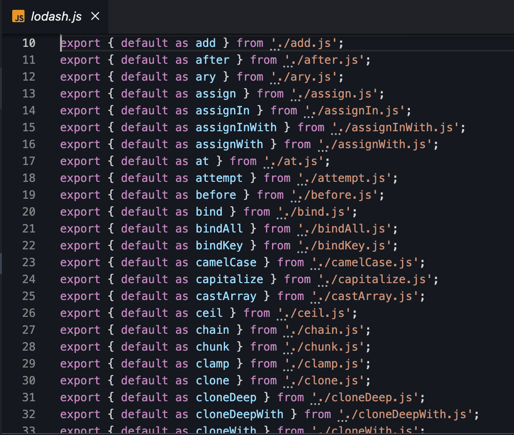

# [vite](https://cn.vitejs.dev/)

> Vite 需要 Node.js 版本 14.18+，16+。

由两部分组成：

1. 一个开发服务器，以项目最外层的 `index.html` 为入口文件

2. 一套针对生产环境的 Rollup 构建命令。

## 浏览器支持

`默认的构建目标`是能支持 `原生 ESM 语法的 script 标签`、`原生 ESM 动态导入` 和 `import.meta` 的浏览器。

## 在线体验

> https://stackblitz.com/edit/vitejs-vite-p476hg?file=index.html&terminal=dev

## 本地体验

直接安装 `vite` 即可。

`npm init -y`、`npm install vite -D`，然后配置 `vite 启动命令` 即可。

```json
// package.json
{
  "name": "vite-starter",
  "private": true,
  "version": "0.0.0",
  "type": "module",
  "scripts": {
    "dev": "vite", // 启动开发服务器，别名：`vite dev`，`vite serve`
    "build": "vite build", // 为生产环境构建产物
    "preview": "vite preview" // 本地预览生产构建产物
  },
  "devDependencies": {
    "vite": "^4.3.9"
  }
}
```

也可以通过 `npm create vite@latest` 或者 `yarn create vite` 创建项目

## 兼容性

Vite 需要 Node.js 版本 14.18+，16+。然而，有些模板需要依赖更高的 Node 版本才能正常运行，当你的包管理器发出警告时，请注意升级你的 Node 版本。

## vite 指定根目录启动项目

`vite` 以当前工作目录作为根目录启动开发服务器。你也可以通过 `vite serve some/sub/dir` 来指定一个替代的根目录。

注意 Vite 同时会解析项目根目录下的`配置文件（即 vite.config.js）`，因此如果根目录被改变了，你需要将配置文件移动到新的根目录下。

## 冷启动/预构建依赖

冷启动是指项目启动开发服务器时, `node_module/.vite` 下没有任何之前的预构建文件, 这一般是项目第一次启动, 或项目通过`vite server --force`启动, 也可能是你手动删除了`node_module/.vite`之后启动, 此时Vite需要扫描项目的依赖并使用esbuild对这些依赖进行预构建

`依赖预构建`：构建的包存放在 `node_modules/.vite/deps` 目录下，目的有如下几点：

1. 不同的包有不同的导出格式（commonjs，umd，esmodule），通过预构建整合包的导出格式

2. 引用包的路径可以直接使用 `.vite/deps`，方便路径重写（浏览器默认是不会去 node_modules 下寻找包的）

3. 解决网络多包传输的性能问题（以 lodash 为例，它有几千个模块，如果不做处理，在导入后浏览器会发几千个 HTTP 请求）

可以通过安装 `lodash-es` 这个包来做个实验，在项目中导入 `lodash-es`，你会发现 vite 对它进行了修改，将所有导出的模块整合成了一个 `js` 文件，浏览器也只会发送一次 HTTP 请求。

`lodash-es` 导出的所有定义好的模块方法



启动项目，Vite 已经整合所有 `lodash-es` 导出的模块

HTTP请求：`/node_modules/.vite/deps/lodash-es.js?v=4db083fa`

```js
...

// node_modules/lodash-es/add.js
var add = createMathOperation_default(function(augend, addend) {
  return augend + addend;
}, 0);
var add_default = add;

...

var math_default_default = {
  add: add_default,
  ...
}

...

export {
  add_default as add,
  ...
}
```

我们可以通过 `vite.config.js` 来配置一下，不对 `lodash-es` 预构建：

```js
// vite.config.js

export default {
  optimizeDeps: {
    exclude: ['lodash-es']
  }
}
```

重启服务后，你会发现浏览器发送了很多个 HTTP 请求去加载 `lodash-es` 导出的每个模块方法。


# vite为什么快？

1. 开发环境不打包(`Vite 以 原生 ESM 方式提供源码`)，目前主流的浏览器已经支持模块化了。`<script type="module" src="...">`

2. 按需加载模块，不像webpack那样构建所有源码，vite是根据路由拆分的代码模块，只会处理当前屏幕上实际使用到的模块

3. vite 使用 esbuild 预构建依赖（不经常改动的依赖包）

4. 利用 HTTP 头来加速整个页面的重新加载。（`源码模块`的请求会根据 304 Not Modified 进行`协商缓存`，而`依赖模块`请求则会通过 Cache-Control: max-age=31536000,immutable 进行`强缓存`，因此一旦被缓存它们将不需要再次请求。）

# vite.config.js

如果项目添加了 `vite.config.js`，启动项目或者打包项目时，vite 会自动读取这个配置文件

## defineConfig

写配置文件时，为了有更好的语法提示，我们可以使用 `defineConfig` 方法来包裹配置对象

```js
import { defineConfig } from 'vite';

export default defineConfig({
  optimizeDeps: {
    exclude: ['lodash-es'],
  },
});
```

或者这样写：

```js
/** @type import("vite").UserConfig */
const viteConfig = {
  optimizeDeps: {
    exclude: ['lodash-es'],
  },
}

export default viteConfig
```

`defineConfig` 也可以接收一个函数作为参数，这个函数也有一个参数：

```js
defineConfig(({
  command: "serve", // "build" or "serve"
  mode: "development",
  ssrBuild: false,
}) => {
  ...
})
```

我们可以通过 `command` 或者 `mode` 来执行不同环境的配置。

## 区分打包配置

我们可以根据不同环境，编写不同的配置文件 `vite.base.config`、`vite.dev.config`、`vite.prod.config`。

vite.config.js

```js

const env = {
  'serve': () => Object.assign({}, vite.base.config, vite.dev.config),
  'build': () => Object.assign({}, vite.base.config, vite.prod.config),
}

defineConfig(({ command: "serve" }) => {
  return env[serve]()
})
```

# 环境变量配置

Vite 使用 `dotenv` 从你的 环境目录 中的下列文件加载额外的环境变量：

```js
.env                # 所有情况下都会加载
.env.local          # 所有情况下都会加载，但会被 git 忽略
.env.[mode]         # 只在指定模式下加载
.env.[mode].local   # 只在指定模式下加载，但会被 git 忽略
```

在 `vite.config.js` 中，想要获取配置的环境变量，我们需要通过如下形式获取:

```js
import { defineConfig, loadEnv } from 'vite'

export default defineConfig((options) => {
  // 读取指定的环境变量
  const env = loadEnv(options.mode, process.cwd(), '')

  // ...
})
```

`options.mode` 可以通过 `yarn dev --mode develop` 指定。

`process.cwd()` 表示当前文件的 `执行目录`

`loadEnv` 第三个参数是 `prefixs`，环境变量的前缀，默认是 `VITE_`，`默认情况下只有前缀为 VITE_ 会被加载，除非更改了 prefixes 配置。`

## 在客户端获取环境变量

配置的环境变量会存放到 `import.meta.env` 中。

`为了防止意外地将一些环境变量泄漏到客户端，只有以 VITE_ 为前缀的变量才会暴露给经过 vite 处理的代码。`

## 修改默认的环境变量前缀

```js
export default defineConfig((options) => {
  
  return {
    // ..
    envPrefix: 'ENV_' // 默认是 `VITE_`
  }
})
```

## 增加测试环境

package.json

```js
"scripts": {
  "test": "vite --mode test",
},
```

添加 `.env.test` 文件，写入测试环境的配置即可。

# Vite 如何执行 `.vue` 文件

Vite 是一个开发服务器，以项目最外层的 `index.html` 为入口文件。当它遇到 `.js` 文件结尾的文件，会去开发服务器请求这个 js 文件。并且告诉浏览器以 `Content-Type: text/javascript` 去解析这个文件。

如果遇到是 `.vue` 文件，首先会在开发服务器解析 `vue` 文件，将 `vue` 文件的内容转化为 `js` 内容，虽然它是 `.vue` 结尾的文件，我们还是可以通过 `Content-Type: text/javascript` 告诉浏览器使用 `js` 的形式去解析执行文件。

假设 Vite 开发服务器如下：

```js
const app = new Koa();

app.use(async (ctx) => {
    if (ctx.request.url === "/") {
        const indexContent = await fs.promises.readFile(path.resolve(__dirname, "./index.html"));
        ctx.response.set("Content-Type", "text/html");
        ctx.response.body = indexContent;
    }

    if (ctx.request.url === "/App.vue") {
        const AppContent = await fs.promises.readFile(path.resolve(__dirname, "./App.vue"));

        // 对 .vue 文件做一系列解析操作，将其内容转为纯 js 内容
        //...

        ctx.response.set("Content-Type", "text/javascript");
        ctx.response.body = AppContent;
    }
})
```

# css modules

任何以 .module.css 为后缀名的 CSS 文件都被认为是一个 CSS modules 文件。

```css
/* example.module.css */
.red {
  color: red;
}
```

```js
import classes from './example.module.css'
document.getElementById('foo').className = classes.red
```

CSS modules 行为可以通过 css.modules 选项 进行配置。

如果 `css.modules.localsConvention` 设置开启了 camelCase 格式变量名转换（例如 localsConvention: 'camelCaseOnly'），你还可以使用按名导入。

```js
// .apply-color -> applyColor
import { applyColor } from './example.module.css'
document.getElementById('foo').className = applyColor
```

## 原理

在 Vite 开发服务器中，遇到了 `.module.css` 结尾的文件，通过一定的规则将`类名`进行替换，比如 `.red` 替换成 `._red_hjlk23_1`

并创建一个映射对象 `{ red: '_red_hjlk23_1' }`

将替换过后的内容，塞进动态创建的`style` 标签里，并且插入到 `head` 中

将 `.module.css` 结尾的内容全部替换成 `js` 内容，方便 `热更新`

## 其他配置

css.modules

`配置 CSS modules 的行为。选项将被传递给 postcss-modules。`

```js
interface CSSModulesOptions {
  scopeBehaviour?: 'global' | 'local' // 如果是 global，则不会产生模块化的 css
  globalModulePaths?: RegExp[]
  generateScopedName?: // 配置模块化 css 名字的格式，比如 `[name]_[local]_[hash:5]`
    | string
    | ((name: string, filename: string, css: string) => string)
  hashPrefix?: string
  /**
   * 默认：null
   */
  localsConvention?:
    | 'camelCase' // 展示驼峰式和横杠
    | 'camelCaseOnly' // 只展示驼峰式
    | 'dashes' // 横杠
    | 'dashesOnly' // 只展示横杠
    | null
}
```

