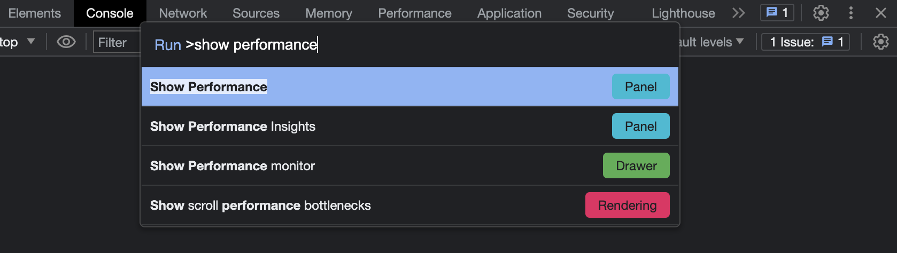
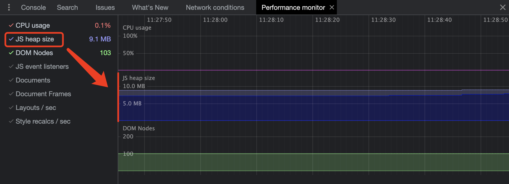
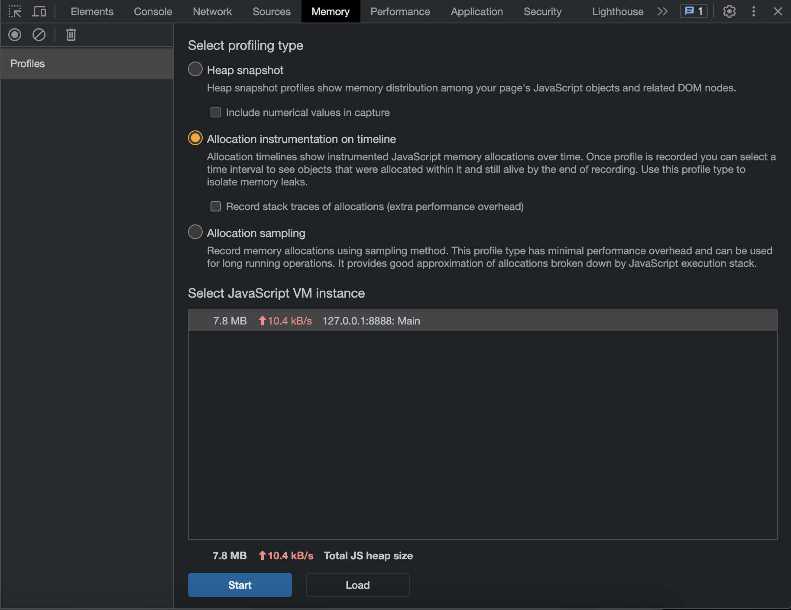
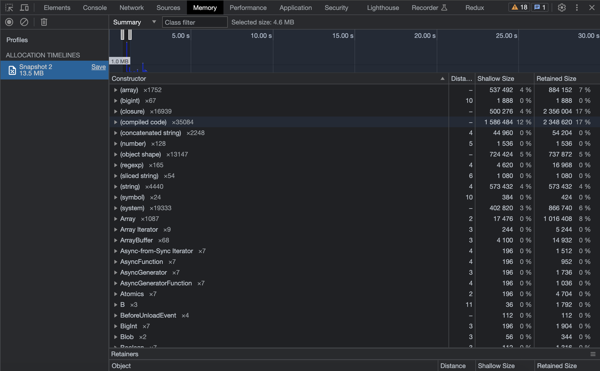

# 内存泄漏

# 排查方式

1. 打开Chrome控制台，摁住 `command + shift + p`，搜索 `Run>show performance monitor`，主要查看 `JS heap size`

2. 找到控制台的 `memory`，使用内存面板，`选第二个选项`，按时间线记录内存分配情况。

点击开始，刷新页面或者切换页面，`蓝色柱子最高的`代表使用内存最多，蓝色柱子有一段`灰色`，表示已经回收了的内存。

3. 通过鼠标，聚焦到某一个最高的`蓝色柱子`，查看 `Constructor` 那一栏，找出实例最多的那个构造函数，点开并查看详情。

