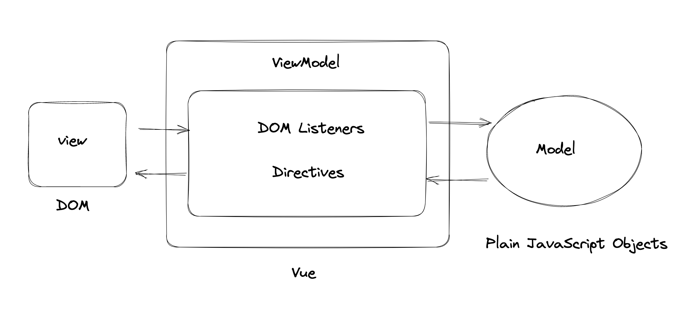

# 如何理解 MVVM

> Model–view–viewmodel



数据驱动视图。

修改 Model 的数据（plain objects），Vue 的 ViewModel 会帮我们处理数据、监听数据变化等，异步渲染、更新 DOM。避免了我们手动去操作 DOM。

如何理解 ViewModel ？

在 Vue 中， ViewModel 代表 Vue 提供的底层能力，比如事件的处理、响应式系统等，它是作为 View 层和 Model 层的桥梁，View 和 Model 之间的同步工作，都是自动的。

# MVVM与MVC有什么区别？

MVC是Model-View-Contoller的简写，即模型-视图-控制器。

MVC是单向通信，也就是View和Model必须通过Controller来承上启下。

比如用户在页面上（View层）操作了一个按钮，事件被控制器接收处理，修改 Model 层的数据，然后将最新的数据同步到 View 层。当然，用户也可以直接操作控制器，通过控制器修改 Model 层的数据，将更新后的数据同步到 View 中。

MVVM实现了View和Model的自动同步，当Model的属性改变时，不再需要自己手动操作DOM元素，提高了页面渲染性能。

在MVVM架构下，View 和 Model 之间并没有直接的联系，而是通过ViewModel进行交互，Model 和 ViewModel 之间的交互是双向的。

**View 可以通过 ViewModel 中`事件绑定` 的方式影响 Model，Model 可以通过 ViewModel 中 `数据绑定` 的方式去影响 View。**

# Vue 三要素

- 响应式

  Vue 如何监听到 data 的每个属性变化

```js
const obj = {}
let name = ''

Object.defineProperty(obj, 'name', {
  get: function() {
    console.log('触发 get')

    return name
  },
  set: function(value) {
    console.log('触发 set')
    name = value
  }
})

console.log('打印： ', obj.name)

obj.name = '你好，世界'

console.log('打印： ', obj.name)
```

- 模板引擎

  本质：字符串。

  包含事件、指令、js 数据。

  模板如何解析、指令如何处理。

```js
// 到 Vue 源码中，查找 code.render

with(this){
  return _c(
    'div',
    {
      attrs:{"id":"app"}
    },
    [
      _c('ul',_l((list),function(item){return _c('li',[_v("姓名："+_s(item.name)+", 年龄："+_s(item.age))])}),0)
    ]
  )
}
```

- render 渲染函数

  将字符串模板转化为 js 语法（虚拟DOM），那么是渲染成 html？渲染过程是如何？


# Vue 响应式系统

- Object.defineProperty（缺点）

  1. 深度监听，需要递归给所有对象的属性进行监听，如果我们的数据对象嵌套太深，计算量大。
  2. 直接给数据对象新增属性、或者通过 delete 删除对象属性，Vue 监听不到。所以有了 `Vue.$set` 和 `Vue.$delete`
  3. defineProperty 本身不具备监听数组，需要对数组的方法特殊处理

- Proxy（IE11不支持，兼容性不好，无法 polyfill）

## Vue2 如何深度监听数据

```js
function observer(target) {
  for(let i in target) {
    defineReactive(target, i, target[i])
  }
}
function defineReactive(target, key, value) {
  Object.defineProperty(target, key, {
    get: function() {
      return value
    },
    set: function(newValue) {
      value = newValue

      updateView() // 更新视图
    }
  })
}
```

## Vue2 如何监听数组

重写数组方法

```js
const arrayPrototype = Array.prototype

// 创建新对象，原型链指向数组的原型对象 newArrayProto.__proto__ === Array.prototype
// 再扩展方法就不会影响到 Array.prototype 了，并且我们还可以覆盖原有的数组方法
const newArrayProto = Object.create(arrayPrototype)
```

扩展原有方法

```js
const methodsToPatch = [
  'push',
  'pop',
  'shift',
  'unshift',
  'splice',
  'sort',
  'reverse'
];

  methodsToPatch.forEach(function (method) {
    // cache original method
    const original = arrayPrototype[method];

    // 劫持数组方法
    newArrayProto[method] = function() {
      updateView()

      // 执行原数组
      original.call(this, ...arguments)
    }
  })
```

## Vue3 的 Proxy 来代理对象
```js
const o = {
  name: '对象',
  age: 19,
  favor: ['sing', 'dance']
}

const proxy = new Proxy(o, {
  get(target, key, receiver) {
    console.log('有人来获取属性啦：', target, key)

    return target[key]
  },
  set(target, key, value) {
    target[key] = value
  }
})

console.log(proxy.name)

proxy.name = '123'

console.log(proxy.name)

proxy.favor.push('hahahahahah')

console.log(proxy.favor)
```

# 虚拟 DOM 和 Diff 算法

为什么需要 vDom，又为什么说操作 DOM 耗性能？

主要是在两个方面：

1. DOM 的实现和 JS 的实现属于两个独立的模块，跨模块交互性能消耗挺高。

2. 耗浏览器性能，当我们操作 DOM，通常会引起浏览器的重绘和回流。


## Virtual DOM

用 JavaScript 对象结构表示 DOM 树的结构；然后用这个树构建一个真正的 DOM 树


## Diff 算法

树的 diff 算法时间复杂度为 O（n^3），是如优化到 O(n)的？

1. 只比较同一层级，不跨层比较

2. tag 不相同，直接删掉重建，不再深度比较

3. tag 和 key 相同，则认为是相同节点，不再深入比较


# 参考视频

[^1]: 百度网盘-我的资源-前端框架及项目面试（Vue&React原理、Webpack&Babel、项目设计&项目流程）

