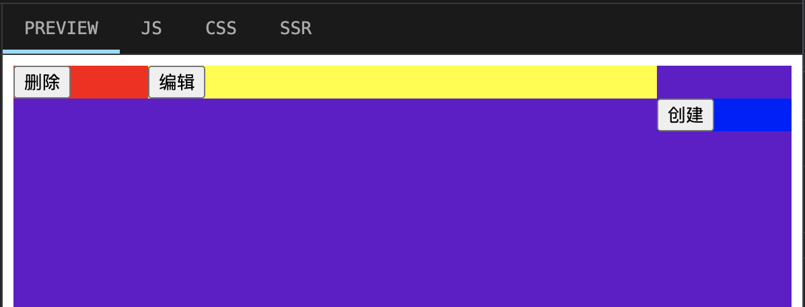
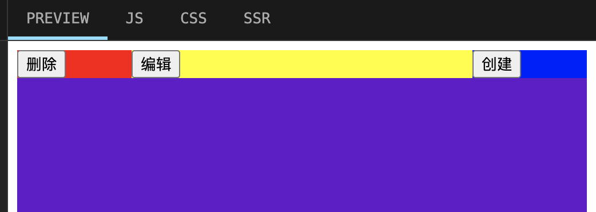
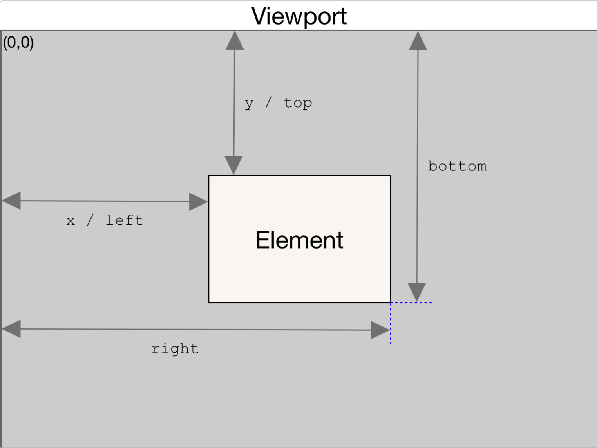

# css div 垂直水平居中，并完成 div 高度永远是宽度的一半（宽度可以不指定）

`考点：padding-bottom 的 百分比 使用`

设置成百分比：定义基于父元素宽度的百分比下内边距。

具体来说，当设置 `padding-bottom: 50%` 时，表示元素的 `高度` 被设置为其`宽度的50%`。这样做的效果是，.inner 元素的高度被限制在其宽度的一半，同时保持宽高比为1:2（高度是宽度的一半）。

```html
<style>
  * {
    margin: 0;
    padding: 0;
  }

  html,
  body {
    width: 100%;
    height: 100%;
  }

  .outer {
    width: 600px;
    height: 100%;
    background: pink;
    margin: 0 auto; /* 子元素水平居中 */
    display: flex;
    align-items: center; /* 子元素垂直居中 */
  }

  .inner {
    width: 100%;
    height: 0;
    padding-bottom: 50%; /* 定义基于父元素宽度的百分比下内边距 */
    background: #ccc;
  }
</style>

<body>
  <div class="outer">
    <div class="inner">
    </div>
  </div>
</body>
```

# 三栏布局

1. flex 布局

```css
.container {
  display: flex;
  justify-content: space-between;
}
.left {
  width: 200px;
}
.right {
  width: 200px;
}
.center {
  flex: 1;
}
```

2. 浮动布局 + margin

```css
.container {
  overflow: hidden;
}

.left {
  float: left;
  width: 200px;
}
.right {
  float: right;
  width: 200px;
}
.center {
  overflow: hidden;
  margin: 0 200px; // 重点
}
```



因为 `div` 是块级元素，占据一行，所以 `.right` 右浮动时，你会发现它和其它两个元素不在一排，不过我们可以通过 `inline-block` 来修复这个问题。

3. 浮动布局 + calc

```css
.left {
  display: inline-block;
  width: 100px;
  background-color: red;
  float: left;
}
.right {
  width: 100px;
  display: inline-block;
  background-color: blue;
  float: right;
}
.mid {
  width: calc(100% - 200px); // 重点
  background-color: yellow;
  display: inline-block;
}
```



# css 权重值

1. 内联样式的权重：1000
2. ID 选择器的权重：100
3. 类选择器、属性选择器和伪类选择器的权重：10
4. 元素选择器和伪元素选择器的权重：1
5. 通配符 0

# 盒模型

盒模型是指在网页中，每个元素都被表示为一个矩形的盒子，这个盒子包含了元素的内容（content）、内边距（padding）、边框（border）和外边距（margin）。

`CSS盒模型：标准模型(content-box) + IE模型(border-box)`

`标准盒模型：` 盒子总宽度/高度 = width/height + padding + border + margin。（ 即 width/height 只是内容高度，不包含 padding 和 border 值 ）

`IE盒子模型：` 盒子总宽度/高度 = width/height + margin = (内容区宽度/高度 + padding + border) + margin。（ 即 width/height `包含了 padding 和 border 值` ）

## JS如何获取盒模型的 宽和高

```css
.test {
  box-sizing: border-box;
  border: 5px solid black;
  height: 200px;
  width: 200px;
  padding: 10px;
}


<div class="test"></div>
```


```js
const test = document.querySelector('.test')

console.log(test.style.width, test.style.height) // 只能获取到行内的样式
console.log(window.getComputedStyle(test).width) // 200px，取到的是最终渲染后的宽和高
console.log(test.getBoundingClientRect().width) // 200
console.log(test.offsetWidth, test.offsetHeight) // 包括高度（宽度）、内边距和边框，不包括外边距
```

`window.getComputedStyle(test).width` 不管 box-sizing 为何值，都是你设置的 witdh/height

box-sizing 为 `content-box` 时，`test.getBoundingClientRect().width/height` 和 `test.offsetWidth, test.offsetHeight` 是 `宽/高 + 内边距 + 边框`

box-sizing 为 `border-box` 时，`test.getBoundingClientRect().width/height` 和 `test.offsetWidth, test.offsetHeight` 是 `宽/高`，不包含 `内边距、边框`

# dom.getBoundingClientRect()

Element.getBoundingClientRect() 方法返回一个 DOMRect 对象，其提供了元素的大小及其相对于视口的位置。

该方法返回的 DOMRect 对象中的 width 和 height 属性是包含了 padding 和 border-width 的，而不仅仅是内容部分的宽度和高度。

在标准盒子模型中，这两个属性值分别与元素的 width/height + padding + border-width 相等。而如果是 box-sizing: border-box，两个属性则直接与元素的 width 或 height 相等。



注意 right 和 bottom。

# 计算父元素高度

```css
.outer {
  background-color: pink;
  /* overflow: hidden; */
}

.inner {
  width: 100%;
  height: 100px;
  background-color: aqua;
  margin-top: 10px;
}
```

```html
<div class="outer">
  <div class="inner">
  </div>
</div>

<script>
  const test = document.querySelector('.outer')

  console.log(test.getBoundingClientRect().height)
  console.log(test.offsetHeight)
</script>
```

在父元素没有设置 `overflow: hidden` 时，获取的高度都是 `100px`

在父元素设置 `overflow: hidden` 时，获取的高度都是 `110px`。


加了 `overflow: hidden`，给父元素创建了一个 BFC，父元素创建了一块独立的渲染区域，是一个环境，里面的元素不会影响到外部的元素 。

# BFC

BFC 是 CSS 布局的一个概念，是一块独立的渲染区域，是一个环境，里面的元素不会影响到外部的元素 。

## BFC 渲染规则/原理
1. 内部的 Box 会在垂直方向，从顶部开始一个接着一个地放置；
2. Box 垂直方向的距离由 margin (外边距)决定，属于同一个 BFC 的两个相邻 Box 的 margin 会发生重叠；
3. 每个元素的 margin Box 的左边， 与包含块 border Box 的左边相接触，（对于从左到右的格式化，否则相反）。即使存在浮动也是如此；
4. BFC 在页面上是一个隔离的独立容器，外面的元素不会影响里面的元素，反之亦然。文字环绕效果，设置 float；
5. BFC 的区域不会与 float Box 重叠（清浮动）;
6. 计算 BFC 的高度时，浮动元素也参与计算。

## CSS在什么情况下会创建出BFC（即脱离文档流）

0. 根元素，即 HTML 元素（最大的一个 BFC）
1. 浮动（ float 的值不为 none ）
2. 绝对定位元素（ position 的值为 absolute 或 fixed ）
3. 行内块（ display 为 inline-block ）
4. 表格单元`display: table、table-cell、table-caption、inline-block 等`
5. display 为 flex 或 inline-flex
6. 设置元素的`overflow`属性为除了visible以外的值，例如 auto、scroll、hidden等。

# 两个div上下排列，都设margin，有什么现象？

外边距重叠现象 

- 都正取大值
- 一正一负相加

```css
.outer {
  background-color: pink;
}

.c1 {
  width: 100%;
  height: 100px;
  background-color: aqua;
  margin-bottom: 10px; /* 小 margin 被 大 margin 吃掉了 */
}
.c2 {
  width: 100%;
  height: 100px;
  background-color: blue;
  margin-top: 30px; /* 大 margin */
}


<div class="outer">
  <div class="c1"></div>
  <div class="c2"></div>
</div>
```

上面例子的结果是，c1 和 c2 之间只有 `30px` 的 margin 间距。

解决办法：

1. 父元素使用 flex 布局，设置 `flex-direction: column;`

2. 使用 padding

3. 将 c1 和 c2 用一个容器包裹起来，然后让这个容器触发 BFC（如：overflow: hidden;）

# 子元素浮动后，父元素高度塌陷问题？

```css
<div class="container">
  <div class="cube"></div>
</div>

.container {
  border: 1px solid red;
}

.cube {
  width: 100px;
  height: 100px;
  background-color: blue;
  margin: 100px;
  float: left; // 浮动
}
```

子元素设置浮动后，由于脱离了正常的文档流，导致父元素高度塌陷（因为父元素没有设置高度）

解决办法是，让父元素触发 BFC （如：overflow: hidden;），相当于

# BFC 清除浮动

```css
<div class="floatDiv"></div>
<div class="normalDiv"></div>

.floatDiv {
  width: 50px;
  height: 50px;
  background-color: blue;
  float: left;
}

.normalDiv {
  width: 100px;
  height: 100px;
  background-color: red;
}
```

我们设置 floatDiv 浮动后，floatDiv 覆盖在 normalDiv 之上，要想 normalDiv 不被覆盖，触发 normalDiv BFC 即可。

```js
.normalDiv {
  width: 100px;
  height: 100px;
  background-color: red;
  overflow: hidden;
}
```
# 瀑布流

- multi-column 实现

```css
.container {
  column-count: 3; // 3列
  column-gap: 10px; // 间隙 10px
  padding: 10px;

  .item {
    break-inside: avoid; // 防止文字截断
    border: 1px solid #999;
    margin-bottom: 10px;
    img {
      width: 100%;
      vertical-align: middle;
    }
    .title {
      display: block;
      margin-left: 5px;
    }
  }
}
```

```js
import React from 'react'
import './index.less'
import dataList from './data.json'
const WaterFlow = () => {
  return (
    <div className='container'>
      {
        dataList.map(d => {
          return (
            <div className="item" key={d.id}>
              
              <p className="title">{d.value}</p>
            </div>
          )
        })
      }
    </div>
  )
}

export default WaterFlow
```

- flex 布局

将 container 设置 flex 布局，方向是水平的

将 column 也设置为 flex 布局，方向是垂直的

然后只需要定义 3 个集合，遍历这3个集合，就巧妙的实现了瀑布流。

```css
<div class="container">
  <div class="column">
    <div class="item"></div>
    ...
  </div>
  <div class="column">
    <div class="item"></div>
    ...
  </div>
  <div class="column">
    <div class="item"></div>
    ...
  </div>
</div>
```

js

```js
while (i < data.length) {
  data1.push(data[i++]);
  if (i < data.length) {
    data2.push(data[i++]);
  }
  if (i < data.length) {
    data3.push(data[i++]);
  }
}
```

# 操作DOM优化（DocumentFragment）

使用 DocumentFragment 创建并组成一个 DOM 子树，然后使用 Node 接口方法（如：appendChild() 或 insertBefore()）将其插入到 DOM 中。

这种情况下会插入片段的所有子节点，并留下一个空的 DocumentFragment。因为所有的节点会被一次插入到文档中，所以仅会发生一个重渲染的操作，而不是每个节点分别被插入到文档中从而发生多次重渲染的操作。

```js
const list = document.querySelector('#list')
const fruits = ['Apple', 'Orange', 'Banana', 'Melon']

const fragment = new DocumentFragment()

fruits.forEach((fruit) => {
  const li = document.createElement('li')
  li.textContent = fruit
  fragment.appendChild(li)
})

list.appendChild(fragment)
```

# html5有哪些新特性

- 新增选择器 document.querySelector、document.querySelectorAll

- 拖拽释放(Drag and drop) API

- 媒体播放的 video 和 audio

- 本地存储 localStorage 和 sessionStorage

- 离线应用 manifest

- 语意化标签 article、footer、header、nav、section

- 多任务 webworker

- 全双工通信协议 websocket

- 历史管理 history

- 跨域资源共享(CORS) Access-Control-Allow-Origin

- 跨窗口通信 PostMessage

- Form Data 对象

- 绘画 canvas

# cookies，sessionStorage 和 localStorage 的区别

cookie是网站为了标示用户身份而储存在用户本地终端（Client Side）上的数据（通常经过加密）

- cookie数据始终在同源的http请求中携带（即使不需要），记会在浏览器和服务器间来回传递

- sessionStorage和localStorage不会自动把数据发给服务器，仅在本地保存

存储大小：

- cookie数据大小不能超过4kb

- sessionStorage和localStorage虽然也有存储大小的限制，但比cookie大得多，可以达到5M或更大

有期时间：

- localStorage 存储持久数据，浏览器关闭后数据不丢失除非主动删除数据

- sessionStorage 数据在当前浏览器窗口关闭后自动删除

- cookie 设置的cookie过期时间之前一直有效，即使窗口或浏览器关闭


# flex（flex-grow、flex-shrink、flex-basis）

- flex-grow 定义项目的放大比例，`默认为0`，即如果存在剩余空间，也不放大

- flex-shrink 定义了项目的缩小比例，`默认为1`，即如果空间不足，该项目将缩小

- flex-basis给上面两个属性分配多余空间之前, 计算项目是否有多余空间, 默认值为 auto, 即项目本身的大小

```html
<div class="container">
  <div class="item1">
    <span>item1</span>
  </div>
  <div class="item2">
    <span>item2</span>
  </div>
  <div class="item3">
    <span>item3</span>
  </div>
</div>
```

```css
.container {
  width: 600px;
  height: 300px;
  background-color: pink;
  display: flex;
}

.item1 {
  flex: none;
  width: 50px;
  background-color:blue;
}

.item2 {
  width: 50px;
  flex: 1 1 50px;
  background-color:red;
}

.item3 {
  width: 50px;
  flex: 7 1 100px;
  background-color:yellow;
}
```

## 伸张(grow)计算公式

```css
容器：width: 600px

所有子项目item: width: 50px

item1: flex: none; =======> flex: 0, 0, auto;

item2: flex: 1 1 50px;

item3: flex: 7 1 100px;
```

注意 `在空间充足情况下，flex-basis的优先级 高于 width 属性`

当空间充足时，flex子项的宽度计算公式是： `自身的基础宽度 + 容器剩余宽度 *（自身伸张比例 / 所有子项伸张比例之和）`

容器剩余宽度: `600 - 50 - 50 - 100 = 400`（取 flex-basis 值）

item1 最终 width 的计算结果

```js
50 + 400*(0/(0+1+7)) // 50
```

item2 最终 width 的计算结果

```js
50 + 400*(1/(0+1+7)) // 100
```

item3 最终 width 的计算结果

```js
100 + 400*(7/(0+1+7)) // 450
```

## 当我们设置 flex-basis 设置为 auto，计算公式又是如何？

计算公式依然适用，只不过，我们需要明确知道元素的内容，特别是元素包含了文字的时候。

```css
.container {
  width: 600px;
  height: 300px;
  background-color: pink;
  display: flex;
}

.item1 {
  flex: none;
  width: 50px;
  background-color:blue;
}
```

我们可以通过 `getBoundingClientRect` 拿到元素的基础宽度 width

```js
const item2 = document.querySelector('.item2')
console.log(item2.getBoundingClientRect().width) // 41.9375
```

然后给元素添加 flex 样式

```css
.item2 {
  flex: 1 1 auto;
  background-color:red;
}

.item3 {
  flex: 7 1 auto;
  background-color:yellow;
}
```

容器剩余宽度 `600 - 50 - (41.94 * 2) = 466.12`

这里的 `41.94` 就是`item1 item2`的基础宽度，保留两位小数。
```js


计算后的宽度

item1: 50 + 466.12*(0/0+1+7) // 0

item2: 41.94 + 466.12*(1/0+1+7) // 100.205

item3: 41.94 + 466.12*(7/0+1+7) // 449.795
```

我们也可以把内部的 `文字内容` 去掉，那么计算 item2 item3 的时候，元素自身宽度就相当于 `0` 了。

```js
容器剩余宽度 `600 - 50 = 550`

item1: 550*(1/(0+1+7)) // 68.75

item2: 550*(7/(0+1+7)) // 481.25
```

## 收缩(shrink)计算公式

```css
.container {
  width: 300px;
  height: 300px;
  background-color: pink;
  display: flex;
}

.item1 {
  width: 50px;
  background-color:blue;
}

.item2 {
  flex: 1 1 100px;
  background-color:red;
}

.item3 {
  flex: 1 1 200px;
  background-color:yellow;
}
```

当空间不充足时，flex子项的宽度计算公式是： 

`自身的基础宽度 - 超出宽度 *(自身宽度*收缩比例/总权重）`

```js
// 自身基础宽度 * 收缩比例, item1 没有设置收缩比例，收缩比例为 0
总权重：200*1 + 100*1 + 50*0 = 300

超出宽度：(200 + 100 + 50) - 300 = 50

item1: 50 - 50*(200*0/300) // 50
item2: 100 - 50*(100*1/300) // 83.34
item3: 200 - 50*(200*1/300) // 166.66
```


# padding 和 margin 区别

margin是指从自身边框到另一个容器边框之间的距离，就是容器外距离，即外边距。

padding是指自身边框到自身内部另一个容器边框之间的距离，就是容器内距离，即内边距。

# vw 和 百分比

父元素设置了width 50%，子元素 c1 设置width 50%，子元素宽度只有父元素的一般（百分比相对于父元素容器计算）

c2 设置的 50vw，它是相对于视口的，所以宽度和父元素宽度一样，不会被父元素影响。

```html
<template>
  <div class="box">
    <div class="c1">
      c1
    </div>
     <div class="c2">
      c2
    </div>
  </div>
</template>

<style scoped>
  div {
    width: 50%;
    background: blue;
  }
  
  .c1 {
    width: 50%;
    height: 100px;
    background: red;
  }
  .c2 {
    width: 50vw;
    height: 100px;
    background: yellow;
  }
</style>
```

# rem em vw vh %

vw、vh 是相对于视口的，比如说 `50vh`，就是占据屏幕一般的高度

rem 是根据根元素（html）的 `font-size` 来设置大小，而 `em、%`是根据父元素来设置大小

# 如何让 chrome 浏览器显示更小的字体（默认最小 12px）

- zoom: 0.5;

支持块级元素、行内元素

- transform: scale(0.5)

支持块级元素，不支持行内元素

- 使用 rem

给根组件设置指定的 `font-size`，其他元素的单位使用 `rem` 作为单位

# 移动端适配：使用 rem 作为单位，如何自动将 px 转为 rem 单位?

比如我们的跟标签设置了 `font-size` 为 16px（浏览器默认），那么 1rem 就是 `16px`。

假设我想给某一个元素设置 `12px` 大小的 `font-size`，我们可以通过 `16 / 12 = 1.333`，那么这个 `font-size` 就可以设置为 `1.333rem`。

但是问题来了，页面上有很多元素都要设置大小，它们的 `px` 大多都不一样，我们每次都要手动计算吗？

这时，我们就可以使用 `postcss` 的一个插件 `postcss-rem`

> https://www.npmjs.com/package/postcss-rem

编写 css 时可以这样写：

```css
.demo {
  font-size: rem(24px); /* Simple */
  padding: rem(5px 10px); /* Multiple values */
  margin: rem(10px 0.5rem); /* Existing rem */
  border-bottom: rem(1px solid black); /* Multiple mixed values */
  box-shadow: rem(
    0 0 2px #ccc,
    inset 0 0 5px #eee
  ); /* Comma-separated values */
  text-shadow: rem(1px 1px) #eee, rem(-1px) 0 #eee; /* Alternate use */
}
```

`postcss-rem` 自动帮我们计算了，输出的结果是：

```css
.demo {
  font-size: 1.5rem; /* Simple */
  padding: 0.3125rem 0.625rem; /* Multiple values */
  margin: 0.625rem 0.5rem; /* Existing rem */
  border-bottom: 0.0625rem solid black; /* Multiple mixed values */
  box-shadow: 0 0 0.125rem #ccc, inset 0 0 0.3125rem #eee; /* Comma-separated values */
  text-shadow: 0.0625rem 0.0625rem #eee, -0.0625rem 0 #eee; /* Alternate use */
}
```

`具体用法`

安装 `yarn add postcss-rem -D`

配置 `postcss`，以 `vite.config.js` 为例

```js
import PostcssRem from 'postcss-rem'

export default defineConfig({
  ...

  css: {
    postcss: {
      plugins: [PostcssRem]
    }
  }
})
```

配置完后，我们在写 css 时就可以直接使用 `rem方法` 自动将 `px` 转为 `rem` 了。

# block、inline、inline-block 有什么区别

1. block元素为块级元素，独占一行，对其设置宽高属性会生效，如果不设置宽度，默认宽度为 100%

  ```html
  div/form/header/ul/canvas/footer/video/audio
  ```

2. inline 元素为行内元素，宽高由内容撑开，不会独占一行，多个 inline 元素排成一排，设置其宽高属性不会生效。

3. inline-block 为行内块级元素，可以设置宽高，还能和其它 inline 元素并排显示

# position: sticky (粘性定位元素)

position: sticky的使用方式和position: fixed类似，但是它的固定位置是相对于父容器而不是相对于视口。

粘性定位可以被认为`是相对定位和固定定位的混合`。

须指定 top, right, bottom 或 left 四个阈值其中之一，才可使粘性定位生效。`否则其行为与相对定位相同`。

`使用场景`: 用于定位字母列表的头部元素。

```html
<div>
  <dl>
    <dt>A</dt>
    <dd>Andrew W.K.</dd>
    <dd>Apparat</dd>
    <dd>Arcade Fire</dd>
    <dd>At The Drive-In</dd>
    <dd>Aziz Ansari</dd>
  </dl>
  <dl>
    <dt>C</dt>
    <dd>Chromeo</dd>
    <dd>Common</dd>
    <dd>Converge</dd>
    <dd>Crystal Castles</dd>
    <dd>Cursive</dd>
  </dl>
  <dl>
    <dt>E</dt>
    <dd>Explosions In The Sky</dd>
  </dl>
  <dl>
    <dt>T</dt>
    <dd>Ted Leo & The Pharmacists</dd>
    <dd>T-Pain</dd>
    <dd>Thrice</dd>
    <dd>TV On The Radio</dd>
    <dd>Two Gallants</dd>
  </dl>
</div>
```

css

```css
dt {
  background: #B8C1C8;
  border-bottom: 1px solid #989EA4;
  border-top: 1px solid #717D85;
  color: #FFF;
  font: bold 18px/21px Helvetica, Arial, sans-serif;
  margin: 0;
  padding: 2px 0 0 12px;
  position: -webkit-sticky;
  position: sticky;
  top: -2px;
}

dd {
  font: bold 20px/45px Helvetica, Arial, sans-serif;
  margin: 0;
  padding: 0 0 0 12px;
  white-space: nowrap;
}

dd + dd {
  border-top: 1px solid #CCC
}
```


# window.scrollY & window.pageYOffset

window.scrollY: `返回文档在垂直方向已滚动的像素值。`

window.pageYOffset: `只读属性 pageYOffset 是 scrollY 属性的别名`。为了跨浏览器兼容，请使用 window.pageYOffset 代替 window.scrollY。另外，旧版本 IE（<9）两个属性都不支持

# 目标元素的位置信息


1. clientWidth：目标元素的width+padding(左右两侧)
2. offsetWidth:目标元素的width+padding(左右两侧)+border(左右两侧)

  `offsetHeight` 是一个只读属性，它返回该元素的像素高度，`高度包含该元素的垂直内边距和边框`，且是一个整数。
3. clientLeft:目标元素左边框border的宽度
4. offsetLeft:目标元素左边框离其具有定位的父元素之间的距离
5. clientX：鼠标相对于浏览器窗口可视区域的X坐标（横向)
6. offsetX：鼠标相对于绑定事件元素的X坐标
7. pageX：鼠标相对于文档的X坐标，会计算滚动距离；如果没有滚动距离，
值与clientX一样
8. screenX：鼠标相对于显示器屏幕左侧的X坐标
9. getBoundingClientRect().left:目标元素左边框相对于浏览器可视区域的距
离，可能为负值

[介绍](https://www.bilibili.com/video/BV1pG4y1W7Td/?spm_id_from=333.337.search-card.all.click&vd_source=a9f38e58a519cc0570c2dacd34ad7ebe)

# 不用 position sticky 如何实现吸顶效果?

通过监听 `scroll`，动态设置需要吸顶元素的样式，通过 `position: fixed;` 将其固定在顶部。

```html
<header>
  <nav>
    导航栏内容
  </nav>
</header>
```

css

```css
header {
  height: 100px; /* header的高度 */
}

nav {
  height: 50px; /* 导航栏的高度 */
  position: relative; /* 相对定位 */
  z-index: 1; /* 显示在页面最上层 */
  background-color: #69c;
}

.sticky {
  position: fixed;
  top: 0;
  left: 0;
  right: 0;
}
```

监听滚动条变化

```js
var header = document.querySelector('header');
var nav = document.querySelector('nav');
var navOffsetTop = nav.offsetTop; // 记录导航栏距离顶部的距离，一开始是 0

window.addEventListener('scroll', () => {
  if (window.pageYOffset >= navOffsetTop) {
    nav.classList.add('sticky')

    // 避免 nav 遮挡内容，否则在滚动页面时，内容出现明显的抖动。
    header.style.paddingTop = nav.offsetHeight + 'px';
  } else {
    nav.classList.remove('sticky')
    header.style.paddingTop = 0;
  }
})
```
