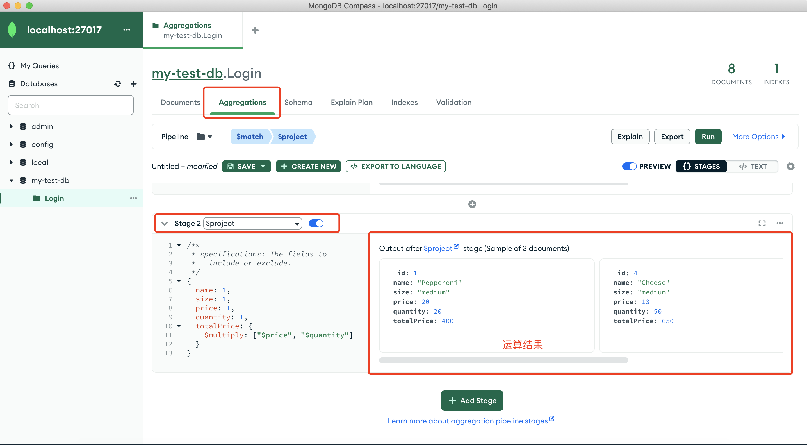
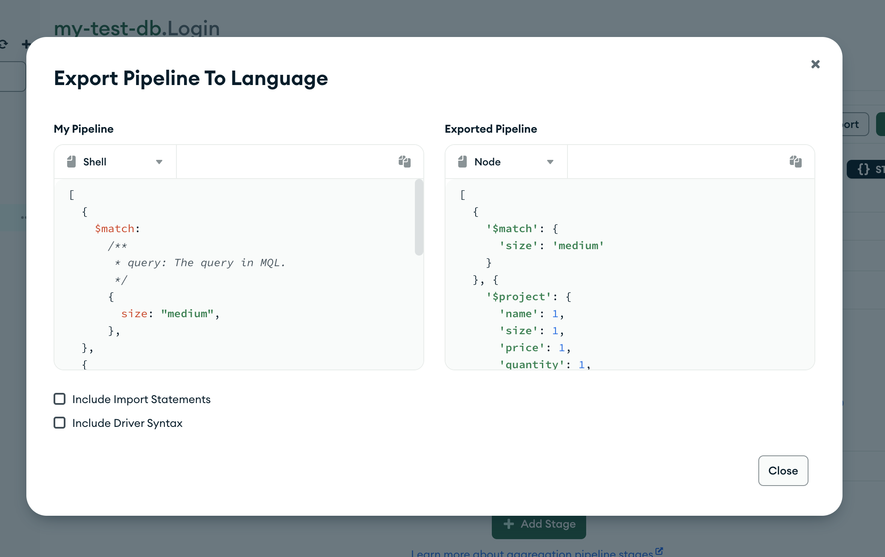

# 数据库

MySQL 为代表的关系型数据库

MongoDB 为非关系型（NoSQL）数据库。

# 安装 mongodb

> [官网链接](https://www.mongodb.com/try/download/community)

下载安装包，将其放入 `/usr/local` 目录下。`打开访达，command + shift + g可以快速去到想去的目录`

配置环境变量，打开命令行工具，`open .zshrc`，添加如下配置
```js
export PATH=${PATH}:/usr/local/mongodb5.0.18/bin
```

保存关闭后，执行 `source .zshrc` 使其生效。

然后执行 `mongod -version` 就能查看 mongodb 的信息了。
```js
db version v5.0.18
Build Info: {
    "version": "5.0.18",
    "gitVersion": "796abe56bfdbca6968ff570311bf72d93632825b",
    "modules": [],
    "allocator": "system",
    "environment": {
        "distarch": "x86_64",
        "target_arch": "x86_64"
    }
}
```

`存储数据` 和 `日志`

我们可以在 `/usr/local/mongodb5.0.18` 目录下创建 data 和 log 文件夹，当然也可以创建在任何地方。

使 `data` 和 `log` 都具有 `读写` 的权限，防止使用时出错

```js
sudu chown [用户名(电脑的)] /usr/local/mongodb5.0.18/data
sudu chown [用户名(电脑的)] /usr/local/mongodb5.0.18/log
```

我们来启动 `mongodb`

```js
// 路径：/usr/local/mongodb5.0.18

mongod --fork --dbpath data --logpath log/mongo.log --logappend

```

--fork 表示在后台运行

--dbpath 表示存储数据的路径（我们在/usr/local/mongodb5.0.18文件夹下，就直接指定 data 即可）

--logpath 表示日志文件的路径

--logappend 表示每次都是追加日志，而不是重写日志

输出如下信息，就表示 mongodb 的服务在电脑上启动了

```js
about to fork child process, waiting until server is ready for connections.
forked process: 10598
child process started successfully, parent exiting
```

我们另外起一个命令行窗口，输入 `mongo`

```js
MongoDB shell version v5.0.18
connecting to: mongodb://127.0.0.1:27017/?compressors=disabled&gssapiServiceName=mongodb
Implicit session: session { "id" : UUID("338bec0f-9330-46cc-ae47-0a17dc1f5f8b") }
MongoDB server version: 5.0.18
================

...省略...
```

当出现这样的信息，表示 mongodb 已经启动，并且控制台出现了小箭头 '>'，我们输入 `db` 会输出 test，也可以操作 db 了。

也可以在浏览器输入 `http://127.0.0.1:27017/` 查看是否可以访问。

关闭 mongodb 服务：

```js
在小箭头的命令行窗口输入 `use admin`

接着输入：db.shutdownServer({force: true})

最后: Ctrl + C 退出即可。
```

## 命令行操作 db

启动 mongo 之后，在终端输入 `show dbs` 即可查看所有的数据库

通过 `use [db name]` 可以切换到某个数据库

`show collections` 查看当前数据库下所有的 `集合`

然后我们就可以操作 db 了，比如要查询：

```js
db.Login.find({usename: 'alex.cheng'})
```

# 安装 Compass(MongoDB GUI)

> https://www.mongodb.com/try/download/compass

# MongoDB CRUD Operations

> https://www.mongodb.com/docs/v5.0/crud/

# 插入数据

- 插入一条数据

```js
db.Login.insertOne({ username:'insert one', age: 27 })
```

- 插入多条数据

```js
db.Login.insertMany([
  { username: 'many1', age: 11 },
  { username: 'many2', age: 22 }
])
```

# 查询数据

通过 find 方法进行查询，什么都不传，表示查询所有集合。(pretty 表示美化输出)

```js
 db.Login.find().pretty()
```

比如要查询 age = 18 的数据:

```js
const conditionQuery = await Login.find({ age: 18 })
```

`带条件的查询`

`$` 表示操作符，比如要查询 年龄 `大于等于20，小于等于25`  的数据：

```js
const conditionQuery = await Login.find({
  age: {
    $gte: 20, // 大于等于： g 表示 greater, t 表示 than，e 表示 equal
    $lte: 25, // 小于等于
  }
})
```

- $gte 大于等于

- $gt 大于

- $lte 小于等于

- $lt 小于

- $ne 不等于

- $eq 等于

- $in（存在并在指定数组中）

  表示查询所有 age 等于 18 和 20 的数据

```js
db.collection.find({ age: { $in: [18, 20] }})
```

- $nin（不存在或不在指定的数组中）

- $or

  表示查询 age 小于 17 或者 age 大于 25 的数据

```js
db.collection.find({
  $or: [
    { age: { $lt: 17 }},
    { age: { $gt: 25 }}
  ]
})
```

- $and

  查询 age 19 25 的数据

```js
db.collection.find({
  $and: [
    { age: 19},
    { age: 25}
  ]
})

=== 等价 ===

db.collection.find({ ae})
```


以上条件查询可以随意组合，自由搭配使用。

# 查询含有数组的数据

```json
db.collection.insertMany([
   { item: "journal", qty: 25, tags: ["blank", "red"], dim_cm: [ 14, 21 ] },
   { item: "notebook", qty: 50, tags: ["red", "blank"], dim_cm: [ 14, 21 ] },
   { item: "paper", qty: 100, tags: ["red", "blank", "plain"], dim_cm: [ 14, 21 ] },
   { item: "planner", qty: 75, tags: ["blank", "red"], dim_cm: [ 22.85, 30 ] },
   { item: "postcard", qty: 45, tags: ["blue"], dim_cm: [ 10, 15.25 ] }
]);
```

- 精准匹配

数据中 tags 值为 ['red'] 的数据

```js
db.collection.find({ tags: ["red"]})
```

- 范围匹配

查找所有 tags 中，包含 "red" 的数据

```js
db.collection.find({ tags: { $all: ["red"]}})
```

- 至少一个满足条件

表示 dim_cm 中的元素，至少有一个满足条件，即可。

```js
db.collection.find({ dim_cm: { $elemMatch: { $gt: 22, $lt: 30 }}})
```

- 根据数组的长度查询

查询 tags 数组长度为 4 的数据

```js
db.collection.find({ tags: { $size: 4 }})
```

- 查询数组里面的对象符合匹配条件的

比如有如下文档

```json
db.collection.insertMany([
   { item: "journal", instock: [ { warehouse: "A", qty: 5 }, { warehouse: "C", qty: 15 } ] },
   { item: "notebook", instock: [ { warehouse: "C", qty: 5 } ] },
   { item: "paper", instock: [ { warehouse: "A", qty: 60 }, { warehouse: "B", qty: 15 } ] },
   { item: "planner", instock: [ { warehouse: "A", qty: 40 }, { warehouse: "B", qty: 5 } ] },
   { item: "postcard", instock: [ { warehouse: "B", qty: 15 }, { warehouse: "C", qty: 35 } ] }
]);
```

指定数组元素进行匹配

```js
db.collection.find({ "instock": { warehouse: "A", qty: 5 } }) // 顺序不能错，顺序错了匹配不到
```

指定数组元素的 key，并通过条件查询

```js
db.collection.find( { 'instock.qty': { $lte: 20 } } )
```

## 查询子文档
数据如下：
```js
{
  "name": "apple",
  "from": {
    "country": "China"
  }
},
{
  "name": "apple1",
  "from": {
    "country": "China1"
  }
}
```

查询 country 为 China1 的数据

```js
db.collection.find({ 'from.country': 'China1' })
```

# 更新数据

1. db.collection.updateOne(`<filter>`, `<update>`, `<options>`)

2. db.collection.updateMany(`<filter>`, `<update>`, `<options>`)

3. db.collection.replaceOne(`<filter>`, `<update>`, `<options>`)


数据

```json
db.inventory.insertMany( [
   { item: "canvas", qty: 100, size: { h: 28, w: 35.5, uom: "cm" }, status: "A" },
   { item: "journal", qty: 25, size: { h: 14, w: 21, uom: "cm" }, status: "A" },
   { item: "mat", qty: 85, size: { h: 27.9, w: 35.5, uom: "cm" }, status: "A" },
   { item: "mousepad", qty: 25, size: { h: 19, w: 22.85, uom: "cm" }, status: "P" },
   { item: "notebook", qty: 50, size: { h: 8.5, w: 11, uom: "in" }, status: "P" },
   { item: "paper", qty: 100, size: { h: 8.5, w: 11, uom: "in" }, status: "D" },
   { item: "planner", qty: 75, size: { h: 22.85, w: 30, uom: "cm" }, status: "D" },
   { item: "postcard", qty: 45, size: { h: 10, w: 15.25, uom: "cm" }, status: "A" },
   { item: "sketchbook", qty: 80, size: { h: 14, w: 21, uom: "cm" }, status: "A" },
   { item: "sketch pad", qty: 95, size: { h: 22.85, w: 30.5, uom: "cm" }, status: "A" }
] )
```

更新匹配到的数据，将匹配到的数据里面的 size.uom 修改为 `in`，status 修改为 `p`

```js
db.inventory.updateOne(
   { item: "paper" },
   {
     $set: { "size.uom": "cm", status: "P" },
     $currentDate: { lastModified: true }
   }
)
```

批量更新

```js
db.inventory.updateMany(
   { "qty": { $lt: 50 } }, // 将 qty 小于 50 的项都更新
   {
     $set: { "size.uom": "in", status: "P" },
     $currentDate: { lastModified: true }
   }
)
```

替换更新

```js
db.inventory.replaceOne(
   { item: "paper" },
   { item: "paper", instock: [ { warehouse: "A", qty: 60 }, { warehouse: "B", qty: 40 } ] }
)
```

# mongodb 的 updateOne 和 replaceOne 有什么区别?

`updateOne` 和 `replaceOne` 是 MongoDB 中的两种更新操作方法，它们有以下区别：

1. **更新方式不同**：
   - `updateOne`：使用更新操作符（如 `$set`、`$inc` 等）来修改指定条件下的文档字段值。
   - `replaceOne`：替换匹配条件下的整个文档，使用提供的新文档完全替换匹配的文档。

2. **字段更新**：
   - `updateOne`：可以选择性地更新指定字段，只修改指定字段的值，而其他字段保持不变。
   - `replaceOne`：替换整个文档，需要提供一个新文档作为替换。

3. **文档结构**：
   - `updateOne`：保留原有文档结构，只修改指定字段的值。
   - `replaceOne`：完全替换匹配的文档，替换后的文档可以与原文档具有不同的结构。

4. **性能差异**：
   - `updateOne`：更新操作仅修改需要更新的字段，相对较轻量，可以高效地执行。
   - `replaceOne`：替换操作需要替换整个文档，可能涉及更多的数据复制和写入操作，相对较重。

综上所述，`updateOne` 适用于部分字段的更新，保留原有文档结构；`replaceOne` 适用于整个文档的替换，可以更新文档结构。选择使用哪种方法取决于你的具体需求和数据模型设计。

# 删除数据

1. db.collection.deleteMany()

2. db.collection.deleteOne()

数据

```json
db.inventory.insertMany( [
  { item: "journal", qty: 25, size: { h: 14, w: 21, uom: "cm" }, status: "A" },
  { item: "notebook", qty: 50, size: { h: 8.5, w: 11, uom: "in" }, status: "P" },
  { item: "paper", qty: 100, size: { h: 8.5, w: 11, uom: "in" }, status: "D" },
  { item: "planner", qty: 75, size: { h: 22.85, w: 30, uom: "cm" }, status: "D" },
  { item: "postcard", qty: 45, size: { h: 10, w: 15.25, uom: "cm" }, status: "A" },
]);
```

删除所有数据

```js
db.inventory.deleteMany({})
```

有条件删除

```js
// 删除所有 status 为 `A` 的数据
db.inventory.deleteMany({ status : "A" })
```

删除一条数据

```js
db.inventory.deleteOne( { status: "D" } )
```

# 删除整个表

```js
db.collection.drop()
```

# 批量写入操作（Bulk Write Operations）

`bulkWrite()方法` 支持如下操作

- 插入一个

- 更新一个

- 更新很多

- 替换一个

- 删除一个

- 删除许多

数据如下

```json
db.inventory.insertMany([
  { _id: 0, type: "pepperoni", size: "small", price: 4 },
  { _id: 1, type: "cheese", size: "medium", price: 7 },
  { _id: 2, type: "vegan", size: "large", price: 8 }
])
```

我们来使用 bulkWrite 操作它，下面包含了如下几种操作

- 插入两条数据

- 跟新一条数据

- 删除一条数据

- 替换一条数据

```js
try {
   db.inventory.bulkWrite( [
      { insertOne: { document: { _id: 3, type: "beef", size: "medium", price: 6 } } },
      { insertOne: { document: { _id: 4, type: "sausage", size: "large", price: 10 } } },
      { updateOne: {
         filter: { type: "cheese" },
         update: { $set: { price: 8 } }
      } },
      { deleteOne: { filter: { type: "pepperoni"} } },
      { replaceOne: {
         filter: { type: "vegan" },
         replacement: { type: "tofu", size: "small", price: 4 }
      } }
   ] )
} catch( error ) {
   print( error )
}
```

# buldWrite 和 insertMany，他俩有什么区别？

`bulkWrite` 和 `insertMany` 是 MongoDB 中的两种批量写入操作方法，它们有以下区别：

1. **写入方式不同**：
   - `bulkWrite`：使用批量写入操作符来执行多个写入操作，可以执行插入、更新、删除等操作。
   - `insertMany`：仅用于插入多个文档。

2. **灵活性**：
   - `bulkWrite`：支持执行多种写入操作，可以在同一个请求中执行多个不同类型的操作，例如插入、更新、删除等。
   - `insertMany`：仅用于插入多个文档，不支持更新或删除操作。

3. **性能差异**：
   - `bulkWrite`：由于可以在一个请求中执行多个操作，可以减少与数据库的通信次数，因此在执行多个写入操作时可能具有更好的性能。
   - `insertMany`：仅用于插入操作，对于大量数据的批量插入可能具有较好的性能。

综上所述，`bulkWrite` 适用于批量执行多种写入操作，提供更大的灵活性；`insertMany` 适用于批量插入多个文档。选择使用哪种方法取决于你的具体需求和数据操作类型。

# 聚合操作（聚合查询）Aggregation Operations

> https://www.mongodb.com/docs/v5.0/aggregation/

当使用 MongoDB 进行复杂的数据查询和分析时，聚合查询是一种非常有用的工具。聚合查询允许你通过组合和处理数据来生成更有意义的结果。以下是 MongoDB 中聚合查询的一般流程和常用操作：

1. **管道操作**：聚合查询使用管道操作来按照特定顺序处理数据。管道操作是一系列的阶段，每个阶段执行特定的操作，并将结果传递给下一个阶段。常用的管道操作包括：

  - `$match`：用于筛选文档，类似于查询中的 `WHERE` 条件。
  - `$group`：用于根据指定字段对文档进行分组聚合操作，可以进行计数、求和、平均值等操作。
  - `$project`：用于选择要返回的字段或计算新字段。`投影`
  - `$sort`：用于对结果进行排序。
  - `$limit`：用于限制结果集的数量。
  - `$skip`：用于跳过指定数量的文档。

2. **聚合函数**：聚合查询中可以使用各种内置的聚合函数来处理数据，例如：
  - `$sum`：计算字段值的总和。
  - `$avg`：计算字段值的平均值。
  - `$min`：获取字段值的最小值。
  - `$max`：获取字段值的最大值。
  - `$push`：将字段值添加到数组中。
  - `$addToSet`：将字段值添加到集合中，去重。

3. **示例**：以下是一个简单的聚合查询示例，假设我们有一个名为 `users` 的集合，其中包含用户的姓名和年龄信息：

```javascript
db.users.aggregate([
  { $match: { age: { $gte: 18 } } },   // 筛选年龄大于等于18的用户
  { $group: { _id: "$age", count: { $sum: 1 } } },   // 按年龄分组并计算每个年龄的用户数
  { $sort: { count: -1 } },   // 按用户数降序排序
  { $limit: 5 }   // 只返回前5个结果
])
```

以上聚合查询将返回年龄大于等于18的用户，并按用户数降序排列，最后只返回前5个结果。

聚合查询在 MongoDB 中提供了灵活和强大的数据处理能力，可以根据需求组合和定制不同的阶段和操作，以生成所需的结果。

> 使用该 db.collection.aggregate()方法运行的聚合管道不会修改集合中的文档，除非管道包含 $merge 或 $out 阶段。

假如有如下数据：

```js
db.orders.insertMany( [
   { _id: 0, name: "Pepperoni", size: "small", price: 19,
     quantity: 10, date: ISODate( "2021-03-13T08:14:30Z" ) },
   { _id: 1, name: "Pepperoni", size: "medium", price: 20,
     quantity: 20, date : ISODate( "2021-03-13T09:13:24Z" ) },
   { _id: 2, name: "Pepperoni", size: "large", price: 21,
     quantity: 30, date : ISODate( "2021-03-17T09:22:12Z" ) },
   { _id: 3, name: "Cheese", size: "small", price: 12,
     quantity: 15, date : ISODate( "2021-03-13T11:21:39.736Z" ) },
   { _id: 4, name: "Cheese", size: "medium", price: 13,
     quantity:50, date : ISODate( "2022-01-12T21:23:13.331Z" ) },
   { _id: 5, name: "Cheese", size: "large", price: 14,
     quantity: 10, date : ISODate( "2022-01-12T05:08:13Z" ) },
   { _id: 6, name: "Vegan", size: "small", price: 17,
     quantity: 10, date : ISODate( "2021-01-13T05:08:13Z" ) },
   { _id: 7, name: "Vegan", size: "medium", price: 18,
     quantity: 10, date : ISODate( "2021-01-13T05:10:13Z" ) }
] )
```

我们先匹配 `size` 为 `medium` 的文档，然后通过 `$group` 将对查找出的文档进行分组，`$name` 表示获取文档内 `name` 字段，`$quantity` 表示获取文档内 `quantity` 字段

`聚合管道 Aggregation Pipeline `

```js
db.orders.aggregate([
   // Stage 1: Filter pizza order documents by pizza size
   {
      $match: { size: "medium" }
   },
   // Stage 2: Group remaining documents by pizza name and calculate total quantity
   // 按 pizza 名称对剩余文档进行分组 并且 计算总数量
   {
      $group: { _id: "$name", totalQuantity: { $sum: "$quantity" } }
   }
])
```

最终我们查找出的结果是:
```js
[
  { _id: 'Cheese', totalQuantity: 50 },
  { _id: 'Vegan', totalQuantity: 10 },
  { _id: 'Pepperoni', totalQuantity: 20 }
]
```

我们还可以添加 stage3 阶段，通过 `$sort` 对其进行排序，我们建立一个 pipeline

```js
const pipeline = [
  {
    $match: {
      size: 'medium'
    }
  },
  {
    $group: {
      _id: '$name',
      totalQuantity: {
        $sum: '$quantity'
      }
    }
  },
  {
    $sort: {
      totalQuantity: -1 // -1  表示倒序，1 表示正序
    }
  }
]

db.collection.aggregate(pipeline)
```

我们还可以计算 `单价` 和 `数量` 的乘积，得到总价格

修改 `pipeline` 如下：

```js
{
  $project: {
    name: 1,
    quantity: 1,
    price: 1,
    totalPrice: {
      $multiply: ["$quantity", "$price"]
    }
  }
},
{
  $group: {
    _id: '$name',
    totalPrice: {
      $sum: '$totalPrice',
    },
    totalQuantity: {
      $sum: '$quantity'
    },
  }
},
```

通过 `$project` 投影映射出我们想要的字段，`1` 表示需要展示的字段，`$multiply` 表示我们要计算的乘积 `数量 * 单价`。

然后，通过 `$group` 对映射后的文档进行分组，最终结果如下：

```js
[
  { _id: 'Cheese', totalPrice: 650, totalQuantity: 50 },
  { _id: 'Pepperoni', totalPrice: 400, totalQuantity: 20 },
  { _id: 'Vegan', totalPrice: 180, totalQuantity: 10 }
]
```

# Aggregations in Compass

在 GUI compass 中使用 `聚合查询`，通过 `Add Stage` 添加 `pipeline` 每一个阶段，我们可以在 Compass 中很清楚的看到每一个 `stage` 的结果。



还可以将 `pipeline` 导出，并选择语言



# 复制集

> https://www.mongodb.com/docs/v5.0/replication/

# 索引

> https://www.mongodb.com/docs/v5.0/indexes/
