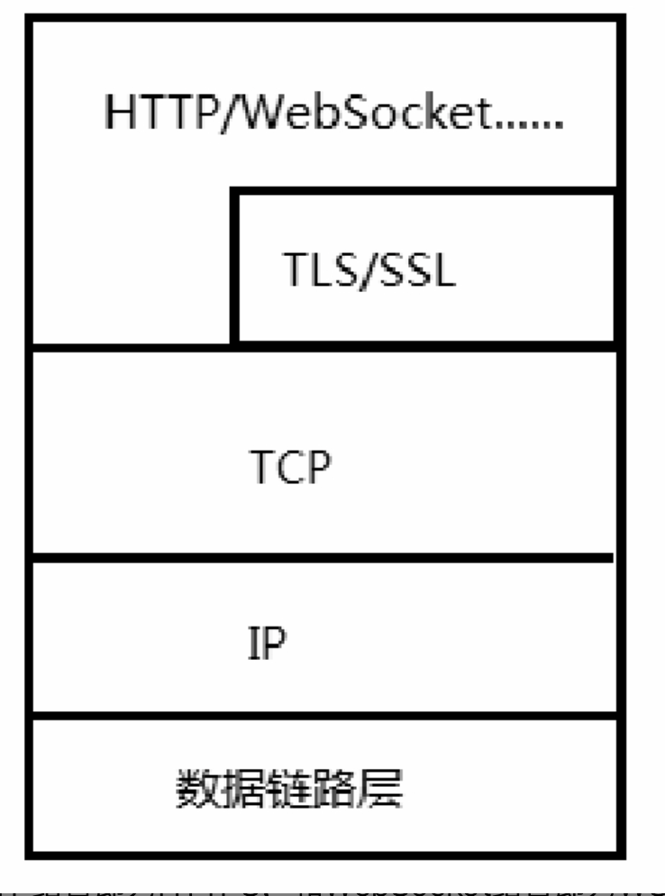
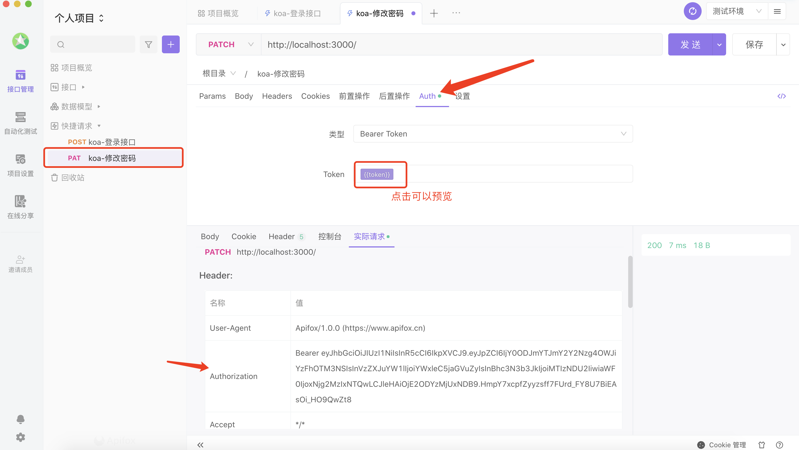

# 疑问❓

什么是运行时？举一个例子。

什么是回调？回调与异步调用有必然联系吗？

什么是事件？

并行与并发有什么区别和联系?

同步和异步，阻塞和非阻塞的区别?

如何理解“除了代码，一切都是并行的”？这句话是否绝对正确？

简述事件循环的运行过程。

nextTick的原理是什么，和setImmaite有什么区别？

# 浏览器的事件循环

- 同步代码

- 异步代码
  1. 宏任务
  2. 微任务

## 执行流程

1. 从上之下执行同步代码

2. 遇到宏任务，将其添加到宏任务队列，遇到微任务，将其添加至微任务队列

3. 同步代码执行完毕。

4. 检查微任务队列，如果存在，就开始清空队列里面的回调函数，保持 `先进先出` 的原则

  - 如果微任务回调函数包含了其它的异步代码，将其添加至相应的队列中，等待执行。

5. 微任务队列清空完毕

6. 检查宏任务队列，如果存在，就开始清空队列里面的回调函数，保持 `先进先出` 的原则

  - 如果宏任务回调函数包含了其它的异步代码，将其添加至相应的队列中，等待执行。

7. `每当一个宏任务执行完毕，立马去检查微任务队列是否存在微任务，如果存在，继续清空微任务队列`

8. 微任务队列清空完毕，接着执行宏任务代码

9. 循环操作

```js
setTimeout(() => {
  console.log('s1')

  Promise.resolve().then(() => {
    console.log('p2')
  })

  Promise.resolve().then(() => {
    console.log('p3')
  })
})

Promise.resolve().then(() => {
  console.log('p1')

  setTimeout(() => {
    console.log('s2')
  })
  setTimeout(() => {
    console.log('s3')
  })
})


// =>>>>>>> p1 s1 p2 p3 s2 s3
```

# NodeJS 事件循环

事件循环同样运行在单线程环境下，JavaScript的事件循环是依靠浏览器实现的，而Node作为另一种运行时，事件循环由底层的libuv实现。

Nodejs 事件循环分成了6个不同的阶段，其中每个阶段都维护着一个回调函数的队列，在不同的阶段，事件循环会处理不同类型的事件:

1. **timers**（定时器阶段）：处理定时器回调函数，例如 `setTimeout` 和 `setInterval`。

2. **pending callbacks**（待定回调阶段）：处理系统级回调函数，例如网络请求的回调。(tcp、UDP)

3. **idle, prepare**（空闲和准备阶段）：内部使用，一般不需要关注。

4. **poll**（轮询阶段）：等待新的 I/O 事件到达，执行 I/O 回调函数。在此阶段阻塞的地方是等待 I/O 事件到达，同时也是定时器的触发阶段。（文件的读取、写入）

5. **check**（检查阶段）：执行 `setImmediate` 的回调函数。

6. **close callbacks**（关闭回调阶段）：执行 close 回调函数，例如 `socket.on('close', ...)`。

每次循环称为一个 Tick。在每个阶段中，都会执行相应的回调函数。事件循环会不断重复运行，直到没有回调函数需要执行。


## 事件循环详细过程
http://docs.libuv.org/en/v1.x/_images/loop_iteration.png

Node.js 的事件循环（Event Loop）是 Node.js 运行时的核心机制之一，负责管理异步操作、事件回调函数的执行和事件触发等。

下面是 Node.js 事件循环的详细过程：

1. **执行全局脚本（Main Script）：** 当 Node.js 进程启动时，会先执行全局脚本。全局脚本中的`同步代码`会依次执行，遇到异步操作时会将其注册到相应的事件回调队列中。

> 同步代码执行完毕，先检查微任务队列，检查是否存在微任务，如果有就清空队列。

2. **执行事件回调函数队列：** 执行全局脚本后，`并且微任务队列没有可执行函数了`，开始执行事件回调函数队列。事件回调函数队列包括 timers、pending callbacks、idle, prepare 等阶段的回调函数队列。事件循环`按照顺序检查`并`执行`每个阶段的回调函数队列。

> 注意：再完成队列切换之前，也会先检查 `微任务` 队列是否存在可执行函数，如果有就清空队列。

3. **Timers 阶段：** 在 timers 阶段，执行已经到期的定时器回调函数。这些定时器是通过 `setTimeout()`、`setInterval()` 等函数注册的。

> 切换队列，先检查微任务

4. **I/O callbacks 阶段：** 在 I/O callbacks 阶段，执行准备好的异步 I/O 操作的回调函数。例如，当网络请求返回结果、文件读写完成时，相应的回调函数会在这个阶段执行。

5. **闲置阶段（idle、prepare）：** 这是一个内部使用的阶段，一般不需要关注。

6. **轮询（Poll）阶段：** 在 poll 阶段，Node.js 会检查是否有新的 I/O 事件需要处理。如果有新的 I/O 事件到达，会依次处理这些事件的回调函数。如果没有新的 I/O 事件到达，则会等待一段时间，等待期间如果有定时器到期或者有被 `setImmediate()` 注册的回调函数，则会`跳过 poll 阶段`，直接进入 check 阶段。

7. **Check 阶段：** 在 check 阶段，执行被 `setImmediate()` 注册的回调函数。

8. **关闭事件回调阶段（Close Callbacks）：** 在关闭事件回调阶段，执行一些关闭事件的回调函数，例如 `socket.on('close', ...)`。

9. **定时器检测阶段（Timers Check）：** 在每次事件循环的末尾，会进行定时器的检测和处理。如果有定时器到期，则会执行相应的回调函数。

> 关于 `process.nextTick` 要注意的一点是：`在事件循环的任何阶段`，如果 nextTickQueue 不为空，都会在`当前阶段操作结束后 *优先* 执行` nextTickQueue中的回调函数


我们来看下面这个例子：

```js
// timers 阶段
setTimeout(() => {
  console.log('s1')

  process.nextTick(() => {
    console.log('s1 inner nextTick')
  })
  
  Promise.resolve().then(() => {
    console.log('s1 p1')
  })
});

setTimeout(() => {
  console.log('s2')

  process.nextTick(() => {
    console.log('s2 inner nextTick')
  })
  
  Promise.resolve().then(() => {
    console.log('s2 p2')
  })
});

// poll 阶段
fs.readFile('./doc.txt', (err, data) => {
  console.log('fs ', data.toString())
})

// check 阶段
setImmediate(() => {
  console.log('setImmediate')
})

// 微任务，任意阶段执行完成后执行，优先级高于 promise
process.nextTick(() => {
  console.log('outer nextTick')
})

// 微任务，待同步代码执行完毕后执行
Promise.resolve().then(() => {
  console.log('p0')
})
```

代码执行顺序如下：

1. 从上之下，同步代码执行完毕。`各个队列信息如下`

```js
timers: `s1, s2`

poll: `'fs ', data.toString()`

check: `setImmediate`

nextTickQueue: `outer nextTick`

微任务队列: `p0`
```

2. 立即检查 `nextTickQueue`，打印 `outer nextTick`

3. 开始检查微任务队列，存在 Promise.then，打印 `p0`

4. 接着进入到 `timers` 阶段，执行 `setTimeout` 回调，打印 `s1`，并注册`nextTick` 和 `promise`。接着执行 `s2`，打印 `s2`，并注册 `nextTick` 和 `promise`

5. timers 阶段执行完毕。

6. 先检查微任务队列，nextTick 优先级高，所以先打印 s1 的 nextTick `s1 inner nextTick`，接着执行 s2 的 nextTick `s2 inner nextTick`，然后执行 `promise`，先打印 `s1 p1`，再打印 `s2 p2`

7. 微任务队列清空了。

8. 切换队列，进入到 `poll` 阶段，如果没有新的 I/O 事件到达，则会等待一段时间，等待期间如果有定时器到期或者有被 `setImmediate()` 注册的回调函数，则会`跳过 poll 阶段`，直接进入 `check` 阶段。打印 `setImmediate`

9. 切换至 `poll` 阶段，打印 `fs  hello world`.

10. 循环结束。

```js
outer nextTick
p0
s1
s2
s1 inner nextTick
s2 inner nextTick
s1 p1
s2 p2
setImmediate
fs  hello world
```

上述过程是基于 Node.js 10.14.2 版本的事件循环机制，不同版本的 Node.js 可能会有微小的差异，但总体流程是相似的。

`Node > 11`

需要注意的差异点，在于 `timers 阶段执行完一个 cb 后，会立马去查看微任务队列`，也就是和 `浏览器` 的执行顺序保持一致了。

```js
// timers 阶段
setTimeout(() => {
  console.log('s1')

  process.nextTick(() => {
    console.log('s1 inner nextTick')
  })
  
  Promise.resolve().then(() => {
    console.log('s1 p1')
  })
});

setTimeout(() => {
  console.log('s2')

  process.nextTick(() => {
    console.log('s2 inner nextTick')
  })
  
  Promise.resolve().then(() => {
    console.log('s2 p2')
  })
});
```

在 Node > 11 的环境下，这段代码执行顺序和 `浏览器环境下保持一致`。

1. 同步代码执行完毕，timers 阶段有两个定时器 `s1, s2`

2. 开始清空 timers

3. 执行 s1，由于内部注册了 `nextTick` 和 `promise`，并且 `nextTick` 优先级高，所以打印 `s1`、`s1 inner nextTick`、`s1 p1`

4. 执行 s2，由于内部注册了 `nextTick` 和 `promise`，并且 `nextTick` 优先级高，所以打印 `s2`、`s2 inner nextTick`、`s2 p2`

```js
s1
s1 inner nextTick
s1 p1
s2
s2 inner nextTick
s2 p2
```

# process.nextTick

process.nextTick 其实并不是事件循环的一部分，但它的回调方法也是由事件循环调用的，该方法定义的回调方法会被加入到名为nextTickQueue的队列中。`在事件循环的任何阶段`，如果nextTickQueue不为空，都会在`当前阶段操作结束后*优先*执行`nextTickQueue中的回调函数，当nextTickQueue中的回调方法被执行完毕后，事件循环才会继续向下执行。

Node限制了nextTickQueue的大小，如果递归调用了process.nextTick，那么当nextTickQueue达到最大限制后会抛出一个错误!

```js
process.nextTick((args) => {
  console.log(args)
}, 'is nextTick callback !')
```

# setImmediate

setImmediate 的事件会在当前事件循环的结尾触发，对应的回调方法会在`当前事件循环末尾`（check阶段）执行。

`由于process.nextTick会在当前操作完成后立刻执行，因此总会在 setImmediate 之前执行。`

```js
setImmediate(args => {
  console.log(args)
}, 'so immediate!')
```

当有递归的异步操作时只能使用setImmediate，不能使用process.nextTick，`这是因为 setImmediate 不会生成call stack。`

由于 setImmediate 的回调函数是在事件循环迭代的 `check 阶段`执行的，它不会直接将回调函数添加到当前的调用栈（call stack）中。相反，它会将回调函数放入事件队列中，等待事件循环进入下一个迭代时执行。

# 为什么递归调用中，不要使用 process.nextTick，却可以使用 setImmediate

`process.nextTick 在当前阶段完成后，直接参与 call stack（调用栈）`

在 Node.js 中，`process.nextTick` 方法的回调函数会在当前操作完成后立即执行，而且会在事件循环的`当前阶段`插入一个微任务。

与 `setTimeout` 和 `setImmediate` 不同，`process.nextTick` 的回调函数会在`当前阶段完成后立即执行`，而不会被放入事件队列或等待下一个事件循环迭代。这意味着它可以在当前调用栈中被执行，而不需要等待其他任务的执行。

因此，`process.nextTick` 的回调函数会`直接参与当前的调用栈`，可能会导致调用栈的深度增加。如果在递归的环境下大量使用 `process.nextTick`，会导致调用栈的快速增长，可能会触发堆栈溢出错误（stack overflow）。

`setImmediate 的回调函数是在事件循环的 check 阶段执行的。`

由于 setImmediate 的回调函数是在事件循环迭代的 `check 阶段`执行的，它不会直接将回调函数添加到当前的调用栈（call stack）中。相反，它会将回调函数放入事件队列中，等待事件循环进入下一个迭代时执行。

# setImmediate 和 setTimeout

将二者放在一个 I/O 操作的callback中，则永远是 `setImmediate` 先执行。

```js
// poll
fs.readFile('./index.html', () => {
  // timers
  setTimeout(() => {
    console.log('set timeout 1')
    
  }, 0);
  
  // check
  setImmediate(() => {
    console.log('setImmediate 2!')
  })
})

setTimeout(() => {
  console.log('set timeout 3')
}, 0);

setImmediate(() => {
  console.log('setImmediate 4!')
})
```

这是因为 readFile 的回调执行时，事件循环位于 poll 阶段，因此事件循环会先进入 check阶段执行setImmediate的回调，然后再进入timers阶段执行setTimeout的回调。

如果不是放在 `I/O` 中，它俩的顺序可能不确定了。

## 注意

当 setTimeout 、setImmediate 在一起使用时，执行顺序不确定。

```js
setTimeout(() => {
  console.log('timeout')
});

setImmediate(() => {
  console.log('setImmediate!')
})
```

当你多次执行代码，会发现有时候 `timeout` 执行在前，有时候执行在后，这是为什么呢？

按理说，在不给 `setTimeout` 设置时间间隔时，应该先执行 `setTimeout`，因为它处于 `timers` 阶段，而 `setImmediate` 处于 `check` 阶段。

它俩执行顺序取决于事件循环的状态和系统资源的使用情况，`setTimeout` 可能会被系统资源占用的情况导致阻塞执行，从而晚于 `setImmediate`.

# 浏览器和Node事件循环的区别

1. 任务队列数，浏览器（2），NodeJS（6）

2. 微任务执行时机（NodeJS < 11 任务队列切换之前，检查微任务），NodeJS > 11 的环境中，两者保持一致了。（`即每一个宏任务执行完毕，就去检查微任务队列。`）

3. NodeJS 中微任务有优先级（nextTick优先级高）

# 模块

- CommonJS

  1. CommonJS将每个文件都看作一个模块，模块内部定义的变量都是私有的

  2. CommonJS 加载模块的方式是 `同步的`

- AMD

  1. 异步方式加载模块

## require 及其运行机制

require关键字并不依赖于exports，我们也可以加载一个没有暴露任何方法的模块，这相当于直接执行一个模块内部的代码

1. 重复引入

Node默认先从`缓存中`加载模块，一个模块被第一次加载后，就会在缓存中维持一个副本，如果遇到重复加载的模块会直接提取缓存中的副本

2. 缓存策略

基于文件路径定位的

```js
require.cache 可以查看缓存文件信息
```

# Nodejs 中的 this

1. 在控制台中，this 指向 global

2. js 脚本中，this 指向 {}（空对象），即 `module.exports`

如果声明变量时不使用var或者let关键字，变量会挂在到 global 上。

# Nodejs 的作用域种类

1. 全局作用域

即 global 对象，如果声明变量时不使用var或者let关键字，变量会挂在到 global 上。

2. 模块作用域

在代码文件顶层（不在任何方法，对象中）使用var、let或者const修饰的变量都位于模块作用域中，不同模块作用域之间的作用域是隔离的。

this 指向 module.exports

3. 函数作用域

4. 块级作用域

# Buffer 缓冲区

主要用来处理二进制数据，`I/O`，在文件操作和网络操作中，如果不显式声明编码格式，其返回数据的默认类型就是 Buffer。

> 在最新的Node API中，Buffer()方法被标记为Deprecated，表示已经不推荐使用，因为这个方法在某些情况下可能不安全（参考https://github.com/nodejs/node/issues/4660），并且会在将来的版本中将其移除。

> https://zhuanlan.zhihu.com/p/398967492

## 为什么要有 Buffer 缓冲区？

从一个文件中读取数据，并写入到磁盘的另一个地方去，读取的操作称为 `生产者`，写入的那个文件称为 `消费者`。

存在的问题是：有时候数据的生产者无法满足消费者的消费速度，又或者消费者的消费速度比生产者的生产的速度慢许多，那么无论是那种情况，都会出现数据的等待过程（生产、消费），`等待的数据存放在哪？`，这个时候就用到了 Buffer 缓冲区了（`内存空间`）。

注意：

1. Buffer 不占据 v8 堆内存大小的内存空间，直接由 c++ 层面进行分配

2. 内存的使用由 NodeJS 来控制，由 v8 的 GC 回收

3. 一般配合 stream 流使用，充当缓冲区


## 编码类型

Buffer支持的编码类型种类有限，只有以下6种：

- ASCII

- Base64

- Binary

- Hex // 将每个字节编码为两个十六进制字符

- UTF-8

- UTF-16LE/UCS-2

## Buffer.alloc()

创建长度为 10 的以零填充的缓冲区。

```js
const buf1 = Buffer.alloc(10);

// <Buffer 00 00 00 00 00 00 00 00 00 00>
```

## Buffer.from

使用 `Buffer.from` 来初始化一个Buffer，表示创建了一个包含字节 `Hello world` 的缓冲区。

将 Buffer 转换为字符串通常称为编码，将字符串转换为 Buffer 通常称为解码。

```js
Buffer.from('Hello world') // 默认 encoding 是 utf-8

Buffer.from('helo world', 'utf-8').toString('base64') // aGVsbyB3b3JsZA==
```

`Buffer 长度`

一个中文字符占 3 个字节，比如 `Buffer.from('中')` 是 `<Buffer e4 bd a0>`

```js
console.log(Buffer.from('中').length); // 3
console.log(Buffer.from('a').length); // 1
console.log(Buffer.from('1').length); // 1
```

## 拼接 buffer

使用 `+=` 来拼接上传的数据流，这个过程包含了一个隐式的编码转换。

body+=chunk相当于body+= chunk.toString()

`但如果字符串中包含中文或者其他语言，由于toString方法默认使用utf-8编码，这时就有可能出现乱码`

官方的推荐做法是使用push方法来拼接Buffer。

`Buffer.concat(bufferList, totalLength)`: 返回新的 Buffer，它是将 list 中的所有 Buffer 实例连接在一起的结果。

```js
const data = []

rs.on('data', (chunk) => {
  data.push(chunk)
})

rs.on('end', () => {
  const buf = Buffer.concat(data)

  console.log(buf.toString())
})
```

上面的代码在拼接过程中不会有隐式的编码转换，首先将Buffer放到数组里面，等待传输完成后再进行转换，这样就不会出现乱码了。


## Buffer 实例方法

- fill(data, start, end): 使用数据填充 buffer。`[start, end)`

- write: 向 buffer 写入数据（与 fill 稍有不同）

- toString(encoding): 从 buffer 中提取数据，转化为指定的格式

- slice: 截取 buffer（类似数组的操作）

- indexOf: 在 buffer 中查找数据

- copy: 复制 buffer 中的数据

## buf.toString(encoding)

如果想把一个Buffer对象转成字符串形式，需要使用toString方法

```js
buffer.toString([encoding], start, end)

- encoding 目标编码格式

- start 起始位置

- end 结束位置
```

```js
Buffer.from('Hello world').toString('utf-8', 0, 3) // Hel
```
## 缓冲区与迭代器

可以使用 for..of 语法迭代 Buffer 实例：

```js
const { Buffer } = require('node:buffer');

const buf = Buffer.from([1, 2, 3]);

for (const b of buf) {
  console.log(b);
}
// 打印:
//   1
//   2
//   3
```

此外，buf.values()、buf.keys() 和 buf.entries() 方法可用于创建迭代器。

# File system

1. fs.readFile

readFile 方法用来 `异步` 读取文本文件中的内容

```js
const res = fs.readFile('./doc.txt', (err, data) => {
  if (err) return

  // data => Buffer

  console.log(data.toString())
})
```

readFile会将一个文件的全部内容都读到 `内存` 中，适用于体积较小的文本文件；如果你有一个数百MB大小的文件需要读取，建议不要使用readFile而是选择`stream`

2. fs.readFileSync

如果不指定 `encoding`，则会返回 `buffer` 格式的数据

```js
const res = fs.readFileSync('./doc.txt', { encoding: 'utf-8' })

console.log(res) // 八百标兵奔北坡
```

3. fs.writeFile

在WriteFile的第一个参数为文件名，如果不存在，则会尝试创建它（默认的flag为w）。

```js
fs.writeFile('./doc.txt', 'hello world', {
  flag: 'w',
  encoding: 'utf-8'
}, err => {
  if (err) {
    console.log('write file err', err)
    return
  }

  console.log('write file success ...')

  const res = fs.readFileSync('./doc.txt', { encoding: 'utf-8' })

  console.log('--', res)
})
```

4. fs.stat(异步获取)

stat方法通常用来获取文件的状态。

通常开发者可以在调用open()、read()，或者write方法之前调用fs.stat方法，用来判断该文件是否存在。

如果文件存在，result就会返回文件的状态信息。

```js
fs.stat('./doc.txt', (err, result) => {
  if (err) return

  console.log(result)
})

=== result ===

Stats {
  dev: 16777221,
  mode: 33188,
  nlink: 1,
  uid: 501,
  gid: 20,
  rdev: 0,
  blksize: 4096,
  ino: 63928842,
  size: 11,
  blocks: 8,
  atimeMs: 1686140463446.1628,
  mtimeMs: 1686140462704.6558,
  ctimeMs: 1686140462704.6558,
  birthtimeMs: 1686139851720.9082,
  atime: 2023-06-07T12:21:03.446Z,
  mtime: 2023-06-07T12:21:02.705Z,
  ctime: 2023-06-07T12:21:02.705Z,
  birthtime: 2023-06-07T12:10:51.721Z
}
```

5. fs.statSync

同步获取文件信息

6. fs.readdir

获取当前目录下所有文件/文件夹的名字

```js
fs.readdir(__dirname, (err, res) => {

  // res 是数组，包含了当前目录下所有的 文件/文件夹 的名字

  for(let subPath of res) {
    // 同步获取文件信息
    const statObj = fs.statSync(`${__dirname}/${subPath}`)

    if (statObj.isFile()) {
      // 文件
    }

    if (statObj.isDirectory()) {
      // 文件夹
    }
  }
})
```

7. fs.copyFile

一次性读取，一次性写入

```js
fs.copyFile('./doc.txt', './copy-doc.txt')
```

# stream（流）

主要用来处理比较大的数据，分段读取、分段写入等等。也可以配合 `管道pipe` 实现数据的分段传输。

- Readable 可读流

- Writeable 可写流

- Duplex 双工流（既可读，又可写）

- Transform 转换流（通常用于输入数据和输出数据不要求匹配的场景）

## Readable stream

可读流：生产供程序消费数据的流

```js
const rs = fs.createReadStream('./doc.txt')

rs.setEncoding('utf8')

rs.pipe(process.stdout)  // 控制台输出
```

`传递参数`，可以设置编码、读取的起始位置、结束位置以及 `highWaterMark`

通过 `事件监听`，流的操作 `可中断，可恢复`

```js
const rs = fs.createReadStream('./doc.txt', {
  flags: 'r', // readable,
  encoding: null, // 如果是null，表示输出 buffer
  start: 0, // 读取的起始位置
  end: 3, // 结束位置
  highWaterMark: 2, // 每次取几个字符
})

// 覆盖 options
rs.setEncoding('utf8')

rs.on('data', (chunk) => {
  console.log('data ', chunk.toString().toUpperCase())

  // 可暂停
  rs.pause()

  setTimeout(() => {
    // 恢复流
    rs.resume()
  }, 1000);
})

rs.on('open', () => {
  console.log('只要调用了 createReadStream 方法，就会触发 open 事件。')
})

rs.on('end', () => {
  console.log('数据读取完毕<----end')
})

rs.on('close', () => {
  console.log('关闭文件')
})

rs.on('error', () => {
  console.log('读取文件报错了')
})
```

我们也可以通过监听 `readable` 并通过 `rs.read` 方法来获取数据。

不过要注意的是，当 `rs.read()` 读取完数据后，最后会返回一个 `null`

```js
rs.on('readable', () => {
  const data = rs.read()
  console.log(data)
})

===>

he
ll
null
<----end
读取完成
```

所以我们可以通过 `while` 来判断

```js
rs.on('readable', () => {
  let data
  while ((data = rs.read()) !== null) {
    console.log(data.toString())
  }
})
```

实际过程中，不应该在 `on data` 或者 `on readable` 事件中处理数据，而是放到 `on end` 事件中，这个阶段表示已经完成所有数据的读取。

```js
const bufferArr = []

rs.on('data', (chunk) => {
  bufferArr.push(chunk)
})


rs.on('end', () => {
  const buffer = Buffer.concat(bufferArr)

  console.log(buffer.toString())
})
```

## Writeable stream

可写流：用于消费数据的流

```js
// 创建一个可读流
const rs = fs.createReadStream('./doc.txt')

rs.setEncoding('utf8')

// 没有文件的话，会自动创建文件
// 创建一个可写流
const ws = fs.createWriteStream('./copy-doc.txt')
rs.pipe(ws) // 将 doc 的内容写进 copy-doc
```

和 `Readable` 一样，`createWriteStream` 也支持传递 `options`

```js
const ws = fs.createWriteStream('./copy-doc.txt', {
  flags: 'w',
  encoding: 'utf-8',
  start: 0,
})

ws.write('写入了一些东西', () => {
  console.log('写入了')
})
```

需要注意的是，`write` 的第一个参数 `The "chunk" argument must be one of type string or Buffer. Received type number`。

如果你传入了一个数字或者其他类型的数据，会报错。

还有一点要注意的是，`on close` 并不是 `write` 成功后就会触发，而是手动调用了 `ws.end()` 之后，才会触发 `on close`

```js
ws.on('close', () => {
  console.log('close')
})

ws.end()
```

`ws.end()`

当我们手动调用了 `ws.end()`，表示文件写入已经完成，我们不能在 `end` 之后再执行 `write` 操作，那样会报错！

如果我们想要在 `end` 之后，还想写入内容该怎么办呢？

你可以把内容直接放到 `end(xxxx)` 中，它会将收到的参数写入到文件中。

```js
ws.end('最后再写入有点内容。')
```

### write 执行流程 

1. 搞懂 `ws.write('xxxx')` 返回值的意义

2. `highWaterMark` 起到了什么作用

3. 为什么 `ws.write` 返回值为 `false` 时，才会触发 `on drain` 事件？

4. `on drain` 事件有什么用？

5. 如何控制 `写入速度`？

6. `pipe` 方法

## 背压机制 - Backpressure

为什么需要背压机制？

```js
const rs = fs.createReadStream('./doc.txt')
const ws = fs.createWriteStream('./copy-doc.txt')

rs.on('data', chunk => {
  ws.write(chunk)
})
```

乍一看这段代码没有什么问题，但是要知道的是，`数据从磁盘读取出来的速度，要远远大于写入磁盘的速度`。这样就会出现 `产能过剩` 的问题，而 `Writeable` 内部维护了一个队列，在它不能实时的去 `消费` 由上游所传输过来的数据时，它就会将不能被 `消化` 掉的数据缓存到队列里。但是队列的内存大小有上限，如果不做 `背压机制`，很有可能就会造成 `内存溢出、GC频繁调用、占用进程导致其它进程变慢`。

基于以上原因，就需要一种 `数据在生产者和消费者之间平滑流动` 的机制，这就是 `背压机制`。

我们来简单模拟一下 `pipe` 的背压机制

定义好 `doc.txt` 文件并写好内容：

```js
// doc.txt

你好世界
```

```js
// doc.txt

const rs = fs.createReadStream('./doc.txt', {
  highWaterMark: 4 // 一个汉字占 3 个字节，highWaterMark 设置为 4 的话，表示一次可以取一个汉字 + 1 个字节
})

const ws = fs.createWriteStream('./copy-doc.txt', {
  highWaterMark: 1
})

let flag = true

rs.on('data', chunk => {
  flag = ws.write(chunk, () => {
    console.log('写完了');
  })

  if (!flag) {
    rs.pause()
  }
})

ws.on('drain', () => {
  rs.resume()
})
```

当写入的数据长度 大于设置的 highWaterMark，`ws.write` 就会返回 `false`，然后通过 `rs.pause()` 方法，暂停可读流的读取操作。

这个时候，就会触发 `drain` 事件，我们可以在这里重新启动 `读取数据` 的操作，从而达到分批、限流的目的。

实际开发中，我们可能不必这样做，因为 `pipe` 已经帮我们处理好了，上面的代码也是 `pipe` 的内部实现原理。

我们只需要调用 `pipe` 方法，传入 `可写流` 的实例即可。

```js
const rs = fs.createReadStream('./doc.txt', {
  highWaterMark: 4 
})

const ws = fs.createWriteStream('./copy-doc.txt', {
  highWaterMark: 1
})

rs.pipe(ws)
```

# HTTP服务

通过 createServer 创建一个 http 服务器

```js
const server = http.createServer((req, res) => {

  res.setHeader('Content-Type', 'text/plain')
  res.writeHead(200)

  // 查看服务器目录信息
  const fileInfo = fs.readdirSync(__dirname)
  res.end(fileInfo.toString())

})

server.on('connection', () => {
  console.log('http connect')
})

server.on('request', () => {
  console.log('http request')
})

server.listen(3000, () => {
  console.log('server running at port 3000...')
})
```

HTTP模块除了能在服务端处理客户端请求之外，还可以作为客户端向服务器发起请求，例如通过http.get发起get请求，通过post方法上传文件等

```js
// server
if (req.url === '/getUser') {
  res.end('hello world, this is http get method!')
}

// 发起请求
http.get('http://localhost:3000/getUser', res => {
  if (res.statusCode === 200) {
    let result = ''

    res.on('data', chunk => {
      result+= chunk
    })

    res.on('end', () => {
      console.log('get 数据', result)
    })

  }
})
```

# 通过命令行发起 POST 请求

编写服务端路由

```js
// 解析后的数据，会被存储在 ctx.request.body 中
const bodyParser = require('koa-bodyparser')

const app = new Koa()
app.use(bodyParser())

router.post('/', async (ctx, next) => {
  console.log('收到post请求：', ctx.request.body)
  ctx.body = ctx.request.body
})
```

打开命令行工具，输入：

```js
// -d 后面表示参数

curl -d "param1=value1&param2=value2" http://localhost:3000
```


输出：

```js
// serve console
收到post请求： { param1: 'value1', param2: 'value2' }

// 命令行
{"param1":"value1","param2":"value2"}%
```

# HTTPS



什么是 SSL ?

SSL（Secure Sockets Layer，安全套接层）协议及其继任者TLS（Transport Layer Security，传输层安全）协议是为网络通信提供安全及数据完整性的一种安全协议。TLS与SSL在传输层对网络连接进行加密。 SSL的一大优势在于它独立于上层协议，和HTTP结合即为HTTPS，和WebSocket结合即为WSS。

# 事件和监听器

```js
const eventEmitter = require("events")

const emitter = new eventEmitter()

emitter.on('login', (a, b) => {
  console.log(a, b)
})

emitter.emit('login', 1, 2)

```

如果想获取当前的emitter一共注册了哪些事件，可以使用eventNames方法。

# 多进程服务

child_process

# process

Process是一个全局对象，无须声明即可访问，每个Node进程都有独立的process对象。该对象中存储了当前进程的环境变量，也定义了一些事件。

# Koa

## 中间件

- koa-static 静态文件服务

  ```js
    staticServe(
      __dirname + '/static/',
      { extensions: ['html'], defer: true }
    )
  ```

  - defer：是否推迟响应。如果值为true，koa-staitc中间件将会在其他中间件执行完成后再执行。

  - index：默认的文件名，默认值为index.html。

  - maxage：浏览器默认的最大缓存时长max-age，单位为毫秒，默认值为0，也就是不启用缓存。

- koa-bodyparser

  解析后的数据，会被存储在 ctx.request.body 中

- koa-router

  可以设置前缀

  new Router({ prefix: '/users' })

```js
const Koa = require('koa')
const bodyParser = require('koa-bodyparser')
const router = require('koa-router')()
const staticServe = require('koa-static') // 静态文件服务

const app = new Koa()

app.use(bodyParser())

app.use(router.routes())

// extensions 表示访问时，可以省略的后缀
app.use(staticServe(__dirname + '/static/', { extensions: ['html']}))

router.get('/', async (ctx, next) => {
  ctx.response.body = `
    <h1>Index</h1>
    <form action='/login' method='post'>
      <p>Name <input name='name' /></p>
      <p>Password <input name='password' type='password' /></p>
      <p><input type='submit' value='提交' /></p>
    </form>
  `
})

router.post('/login', async (ctx, next) => {
  console.log('post 数据', ctx.request.body)

  const name = ctx.request.body.name || ''
  const password = ctx.request.body.password || ''

  if (name === 'alex.cheng' && password === '123456') {
    ctx.body = 'Login success!'
  } else {
    ctx.body = 'Some Error!'
  }
})

app.listen(3000)
```

# querystring

querystring模块由Node.js原生提供，包含相关解析和格式化工具，共有4种方法

- escape

- unescape

- parse

- stringify

```js
const queryString = require('querystring')

console.log('---------- queryString start ---------------')

const params = 'id=1&name=alex.cheng'

const escapeValue = queryString.escape(params)

console.log(escapeValue) // id%3D1%26name%3Dalex.cheng

console.log(queryString.unescape(escapeValue)) // id=1&name=alex.cheng

const parseValue = queryString.parse(params)

console.log(parseValue) // { id: '1', name: 'alex.cheng' }

console.log(queryString.stringify(parseValue)) // id=1&name=alex.cheng

```

koa-router模块封装了上下文的Request对象，在该对象中内置了query属性和querystring属性。通过query或querystring可以直接获取GET请求的数据，唯一不同的是query返回的是对象，而querystring返回的是查询字符串。

```js
router.get('/', async (ctx, next) => {

  console.log('query', ctx.request.query)
  console.log('querystring', ctx.request.querystring)

})
```
# koa 中的 ctx.accepts

在 Koa 2 中，`ctx.accepts` 是一个属性，用于获取客户端可接受的内容类型（MIME 类型）。它用于检查客户端请求头中的 Accept 字段，以确定客户端能够接受的内容类型。

`ctx.accepts` 方法可以接受一个或多个参数，每个参数表示一个内容类型，例如 `'json'`、`'html'`、`'text/plain'` 等。它会根据客户端请求头中的 Accept 字段进行匹配，返回第一个匹配到的内容类型。如果没有匹配到任何内容类型，则返回 `false`。

以下是一个示例代码，演示了如何使用 `ctx.accepts` 方法检查客户端可接受的内容类型：

```javascript
const Koa = require('koa');
const app = new Koa();

app.use(async (ctx) => {
  const acceptedType = ctx.accepts('json', 'html', 'text/plain');

  if (acceptedType) {
    ctx.body = `Accepted Content-Type: ${acceptedType}`;
  } else {
    ctx.throw(406, 'Not Acceptable');
  }
});

app.listen(3000);
```

在上面的示例中，我们通过 `ctx.accepts('json', 'html', 'text/plain')` 检查客户端可接受的内容类型。如果客户端能够接受 `'json'`、`'html'` 或 `'text/plain'` 中的任意一种类型，那么响应体中将返回对应的 Accepted Content-Type。如果客户端无法接受任何一种类型，那么会返回状态码 406 Not Acceptable。

# ctx.state

在 Koa 中，`ctx.state` 是一个用于存储上下文状态的对象。它可以用来在中间件之间传递数据，并且在请求的生命周期内保持持久性。

通常情况下，`ctx.state` 可以用于存储一些在请求处理过程中需要共享的数据，例如用户信息、权限信息、请求的元数据等。它可以在中间件中设置和获取，允许不同的中间件对该数据进行操作或使用。

一个常见的用例是在`身份验证中间件`中将用户信息存储在 `ctx.state` 中，然后在后续的中间件或路由处理函数中访问该信息，以便进行权限检查或其他操作。这样可以避免在每个中间件或路由处理函数中重复执行相同的身份验证逻辑。

示例代码：

```javascript
app.use(async (ctx, next) => {
  // 在某个中间件中设置 ctx.state
  ctx.state.user = { id: 1, name: 'John' };
  await next();
});

app.use(async (ctx) => {
  // 在后续的中间件或路由处理函数中获取 ctx.state
  const user = ctx.state.user;
  // 使用 user 进行权限检查或其他操作
  // ...
});
```

通过使用 `ctx.state`，我们可以更方便地在不同的中间件之间传递数据，并确保数据在整个请求处理过程中的持久性和一致性。

# 定义 auth 中间件

通过 `ctx.state` 保存用户信息

```js
const jwt = require('jsonwebtoken')

const auth = async (ctx, next) => {
  // 1. 获取、解析token
  const { authorization } = ctx.request.header
  const token = authorization.replace('Bearer ', '')
  const user = jwt.verify(token, 'shhhh')

  // 2. 保存用户信息
  ctx.state.user = user

  await next()
}
```

使用 `auth` 中间件

```js
router.patch('/', auth, HomeController.updatePassword)
```

然后我们就可以在 `HomeController.updatePassword` controller 中获取 user，并对 user 进行相应的处理。

```js
module.exports = {
  updatePassword: async (ctx, next) => {
    // 拿到用户信息
    const user = ctx.state.user

    // 1. 根据 ID 到数据库查询用户，判断是否存在用户
    const hasUser = await Login.find({
      username: user.username
    })
    if (!hasUser.length) return ctx.body = '数据库未查询到当前用户'

    // 2. 获取 body 参数，拿到新的密码
    const { newpassword } = ctx.request.body

    // 3. 通过 db.collection.updateOne 更新用户密码
    db.login.updateOne(
      { username: 'alex.cheng' }, // 查询
      {
        $set: {
          password: newpassword
        }
      }
    )

    // 4. 告诉用户更新密码成功，直接把最新的用户信息都返回
    const currentUser = await Login.find({
      username: user.username
    })
    ctx.body = currentUser
  },
}
```

# mongodb collection

在 Mongoose 中，`collection` 是指 MongoDB 数据库中的集合（Collection）。集合是 MongoDB 存储数据的基本单位，类似于关系数据库中的表。

在 Mongoose 中，每个模型（Model）对应着 MongoDB 数据库中的一个集合。当定义一个模型时，Mongoose 会自动将模型的名称转换为复数形式，并将其作为对应的集合名称。例如，如果定义了一个名为 `User` 的模型，则对应的集合名称将会是 `users`。

通过模型，我们可以进行各种数据库操作，如插入数据、查询数据、更新数据等。Mongoose 提供了丰富的方法和功能来操作集合中的数据，并提供了便捷的方式来定义和管理集合的结构、字段和索引等。

通过 Mongoose 的模型和集合的概念，我们可以在应用程序中使用面向对象的方式来操作 MongoDB 数据库，简化了与数据库的交互和管理。

# koa 使用 数据存储

安装 `mongoose`

> npm install mongoose -S

连接数据库，`my-test-db` 表示数据库名称

```js
const mongoose = require('mongoose')

mongoose.connect('mongodb://localhost/my-test-db')
```

连接到数据库后，需要检测连接状态，用来应付可能出现的错误或异常

```js
const db = mongoose.connection

db.on('error', console.error.bind(console, 'connection error!!'))

db.once('open', function(cb) {
  console.log('connected!')
})
```

schema：一种以文件形式存储的数据库模型骨架，不具备数据库的操作能力。

model：由schema发布生成的模型，具有抽象属性和行为的数据库操作对。

创建 `models/login.js`

```js
// schema
const loginSchema = new mongoose.Schema({
  username: String,
  password: String,
})

// 第三个参数表示 collection，
const Login = db.model('login', loginSchema, 'login')

module.exports = Login;
```

## 保存数据

向数据库插入一条数据

```js
const login = new Login({
  username: 'alex.cheng1',
  password: '123456789'
})

login.save()
  .then(res => {
    console.log('save res', res)
  })
  .catch(err => {
    console.log('save err', err)
  })
```

## 查询数据

```js
const query = await Login.find({
  username: 'alex.cheng'
})

ctx.body = `
  <h1>Login success!</h1>
  <p>username: ${query[0].username}; password: ${query[0].password}</p>
`
```

# Koa 的应用级别错误处理 `ctx.app.emit`

在 Koa 中，`ctx.app.emit` 方法用于触发应用级别的事件，并且可以在不同的中间件或请求处理函数之间进行通信。

`ctx.app.emit` 方法的作用是发送一个指定的事件到应用程序实例。这样可以让其他部分监听该事件，并采取相应的操作。它类似于 Node.js 中的事件触发器模式。

你可以使用 `ctx.app.emit` 方法来实现自定义的应用级别事件的触发和处理。下面是一个示例：

```javascript
const Koa = require('koa');

const app = new Koa();

// 监听自定义事件
app.on('myEvent', (data) => {
  console.log('Custom event triggered:', data);
});

app.use(async (ctx, next) => {
  // 触发自定义事件
  ctx.app.emit('myEvent', 'Hello, world!', ctx);
  await next();
});

app.listen(3000, () => {
  console.log('Server is running on port 3000');
});
```

在上面的示例中，我们在中间件中使用 `ctx.app.emit` 方法触发了一个自定义事件 `'myEvent'`，并且传递了 `'Hello, world!'` 作为数据。然后，在应用程序实例上监听了该事件，并在事件处理函数中打印出了接收到的数据。

通过使用 `ctx.app.emit` 方法，我们可以在应用程序中的不同部分之间实现松耦合的通信和协作。可以根据具体的业务需求，自定义并触发不同的应用级别事件，以满足特定的功能和交互需求。

## 定义统一的错误格式

我们可以在 `constant/error-type.js` 中统一定义各式各样的错误类型，保持格式统一。比如用户登录失败、密码错误、token过期、token错误等等

```js
module.exports = {
  userLoginError: {
    code: '1005',
    message: '用户登录失败',
    result: ''
  },
  invalidPassword: {
    code: '1006',
    message: '用户密码错误',
    result: ''
  },
  tokenExpiredError: {
    code: '10101',
    message: 'token 已过期',
    result: ''
  },
  jsonWebTokenError: {
    code: '10101',
    message: 'token 错误',
    result: ''
  },
}
```

然后我们在处理各式各样的逻辑时，如果发生了错误，就可以引用定义好的错误格式，通过 `ctx.app.emit` 来触发错误监听事件

比如，在解析 token 时，我们做的错误处理

```js
// 导入错误类型
const { tokenExpiredError, jsonWebTokenError } = require('../constans/error-type.js')

const { authorization } = ctx.request.header

  if (authorization) {
    const token = authorization.replace('Bearer ', '')

    try {
      const decoded = jwt.verify(token, 'shhhh')

      ctx.state = decoded // 存储用户状态，在各个中间件之间共享

      if (decoded.username === 'alex.cheng') {
        ctx.body = '可以修改密码'
      }
    } catch(error) {
      // 错误处理
      switch(error.name) {
        case 'TokenExpiredError':
          return ctx.app.emit('error', tokenExpiredError, ctx)
        case 'JsonWebTokenError':
          return ctx.app.emit('error', jsonWebTokenError, ctx)
      }
    }
  }
```

# Nodejs 中的错误处理

比较常见的错误处理方式有三种，分别是try/catch、callback和EventEmitter（下面仍简称event）。

try/catch的思想很简单，只适用于同步调用的情况。

callback则是通过定义回调的参数来解决，如果参数err的值不为空就表示出现错误。

event对象，只能用事件处理的方式来处理异常。

# MVC

MVC模式在概念上强调Model、View和Controller的分离，模块间也遵循着由Controller进行消息处理、Model进行数据源处理、View进行数据显示的职责分离原则。

# 拆分目录结构

我们不能将所有的逻辑都写到 app.js 里，项目大了之后，会变得非常臃肿，代码不仅不易读，也不好维护和管理。

1. 提取路由到单独的文件 `router/index.js`

```js
const router = require('koa-router')()
const HomeController = require('./controller/home')

module.exports = app => {
  router.get('/login', HomeController.index)
  router.get('/home', HomeController.home)
  router.get('/home/:id/:name', HomeController.homeParams)
  router.post('/login', HomeController.login)

  app.use(router.routes()).use(router.allowedMethods())
}
```

然后在 `app.js` 中调用即可 `router(app)`

2. 分离 Controller

对router.js再次进行优化分离，将对应路由的响应函数提取出来，放置在单独的文件controller/home.js中

```js
const HomeService = require('../service/home')

module.exports = {
  index: async (ctx, next) => {
    ctx.response.body = `
      <h1>Index</h1>
      <form action='/login' method='post'>
        <p>Name <input name='name' /></p>
        <p>Password <input name='password' type='password' /></p>
        <p><input type='submit' value='提交' /></p>
      </form>
    `
  },
  home: async (ctx, next) => {
    console.log(ctx.request.query)
    console.log(ctx.request.querystring)
    ctx.response.body = `
      <h1>Home Page</h1>
      <p>JSON.stringify(query): ${JSON.stringify(ctx.request.query)}</p>
      <p>querystring: ${ctx.request.querystring}</p>
    `
  },
  homeParams: async (ctx, next) => {
    console.log('home params ', ctx.params)
    const { id, name } = ctx.params
    ctx.response.body = `
      <h1>Home Params Page </h1>
      <p>id: ${id}</p>
      <p>name: ${name}</p>
    `
  },
  login: async (ctx, next) => {
    console.log('post 数据', ctx.request.body)
  
    const name = ctx.request.body.name || ''
    const password = ctx.request.body.password || ''

    const data = await HomeService.login(name, password)
    ctx.body = data
  }
}
```

3. 分离 Service

在这里，进行一些数据层的访问操作，如操作数据库、调用第三方接口获取数据等

```js
const Login = require('../models/login')

module.exports = {
  login: async (name,password ) => {
    // 聚合查询
    const pipeline = [
      {
        $match: {
          size: 'medium'
        }
      },
      {
        $project: {
          name: 1,
          quantity: 1,
          price: 1,
          totalPrice: {
            $multiply: ["$quantity", "$price"]
          }
        }
      },
      {
        $group: {
          _id: '$name',
          totalPrice: {
            $sum: '$totalPrice',
          },
          totalQuantity: {
            $sum: '$quantity'
          },
        }
      },
      {
        $sort: {
          totalQuantity: -1
        }
      }
    ]
    const result = await Login.aggregate(pipeline)
    console.log(result)

    let responseData = ''
    if (name === 'alex.cheng' && password === '123456') {
      // 查询用户
      const query = await Login.find({
        username: 'alex.cheng'
      })

      if (query.length) {
        responseData = `
          <h1>Login success!</h1>
          <p>username: ${query[0].username}; password: ${query[0].password}</p>
        `
      } else {
        responseData = '未查到对应用户，请先注册!'
      }
    } else {
      responseData = '账号 / 密码错误!'
    }

    return responseData
  }
}
```

# 路由自动加载

我们不希望每次创建了 `router`，都去手动引入、配置，而是每次建好 router 就不用处理引入的问题了。

定义 `router/home.route.js`

```js
const Router = require('koa-router')
const router = new Router({ prefix: '/home' })

const HomeController = require('../controller/HomeController')

router.get('/', HomeController)

module.exports = router
```

`router/index.js`

```js
const fs = require('fs')
const Router = require('koa-router')
const router = new Router()

fs.readdirSync(__dirname).forEach(filename => {
  if (filename !== 'index.js') {
    const currentRouter = require('./' + filename)
    router.use(currentRouter.routes())
  }
})

module.exports = router
```

使用 `app.js`

```js
const router = require('./router/index.js')

app.use(router.routes())
```

# 读取配置文件 .env

读取根目录中的 .env 文件, 将配置写到 process.env 中

```js
npm install dotenv -S
```

创建 .env 文件

```js
APP_PORT=3000
```

创建 `src/config/config.default.js`

```js
const dotenv = require('dotenv')

dotenv.config()

// console.log(process.env.APP_PORT) 在 process.env 中就可以获取端口号了

module.exports = process.env
```

# koa-body 和 koa-bodyparser

`koa-body` 和 `koa-bodyparser` 都是用于处理请求体的中间件，但它们在处理请求体的方式和功能上有一些区别。

1. **koa-body**: `koa-body` 是一个功能更为强大的请求体解析中间件。它支持解析多种类型的请求体，包括 JSON、Form 表单、文本、文件上传等。它通过检查请求头中的 Content-Type 字段来确定请求体的类型，并根据类型进行相应的解析。使用 `koa-body` 可以处理更多类型的请求体，但它相对于 `koa-bodyparser` 来说更为复杂一些。

2. **koa-bodyparser**: `koa-bodyparser` 是一个轻量级的请求体解析中间件，专门用于解析 JSON 和 Form 表单类型的请求体。它仅支持这两种常见的请求体类型，并将解析后的数据存储在 `ctx.request.body` 中供后续中间件和处理程序使用。相比于 `koa-body`，`koa-bodyparser` 的代码更简单，并且适用于大多数常见的请求体解析需求。

如果你只需要处理 JSON 和 Form 表单类型的请求体，可以使用较为简单的 `koa-bodyparser` 中间件。而如果你需要处理更多类型的请求体，如文件上传等，可以考虑使用功能更为强大的 `koa-body` 中间件。

# jwt(jsonwebtoken)

> https://www.npmjs.com/package/jsonwebtoken

当用户登录成功，我们在服务端生成 token，并返给客户端。

下一次用户发起请求时，就需要将 token 放到请求头，服务端根据 `jwt.verify` 来校验。

```js
npm install jsonwebtoken -S
```

- jwt.sign(payload, privateKey)

  Expected "payload" to be a plain object.

生成 token

```js
const res = {
  id: 1,
  name: 'alex.cheng',
  password: '123456',
  isAdmin: 1
}

const token = jwt.sign(res, 'my-secret-key', {
  expiresIn: '1h' // 过期时间
})
```

根据 token 解密:

```js
jwt.verify(token, 'my-secret-key', (err, decoded) => {
  if (err) throw new Error('verify token error')
  
  console.log('decoded token', decoded.name)
})
```

如果我们是从 MongoDB 中查出的 user info，在解密 JWT 令牌后，你得到的是一个 Mongoose 文档对象，它包含了 Mongoose 特定的属性和方法。

## jwt 错误处理

会返回一个包含 `name` 的 err 信息

1. TokenExpiredError（token 过期错误）

```js
jwt.verify(token, 'shhhhh', function(err, decoded) {
  if (err) {
    /*
      err = {
        name: 'TokenExpiredError',
        message: 'jwt expired',
        expiredAt: 1408621000
      }
    */
  }
});
```

## auth 中间件

我们需要对每一个请求都进行鉴权，判断用户是否登录，以及 token 是否过期等等。

创建 auth 中间件 `midddleware/auth.js`

```js
async (ctx, next) => {
  const { authorization } = ctx.request.header

  if (authorization) {
    const token = authorization.replace('Bearer ', '')

    const decoded = jwt.verify(token, 'shhhh')
    console.log(decoded)

    if (decoded.username === 'alex.cheng') {
      ctx.body = '可以修改密码'
    }
  } else {
    ctx.body = 'token失效或者用户未登录'
  }
}
```

# 文件上传

如果你只需要处理 JSON 和 Form 表单类型的请求体，可以使用较为简单的 `koa-bodyparser` 中间件。

而如果你需要处理更多类型的请求体，如文件上传等，可以考虑使用功能更为强大的 `koa-body` 中间件。

> https://www.npmjs.com/package/koa-body

使用 `koa-body` (v6.0.1)，它会将文件信息挂到 `ctx.request.files` 上

```js
const { koaBody } = require('koa-body')

app.use(koaBody({
  multipart: true // 开启文件上传，默认是关闭
}))
```

## apifox 模拟上传


`form-data` 这一栏中，设置的 key 是 `file`，那么 `ctx.request.files` 上，就有个 `file` 对象，它包含了文件的信息！

那我们的上传的文件或者图片，放到哪里呢？

## 配合 formidable 参数使用

- UploadDir { String }设置放置文件上传的目录，默认为 os.tmpDir ()

- keepExtensions { Boolean }写入 uploadDir 的文件是否包含原始文件的扩展名，默认为 false

创建 `upload` 文件夹，用来存放上传的文件：

```js
app.use(koaBody({
  multipart: true,
  formidable: {
    uploadDir: __dirname + '/upload',
    keepExtensions: true // 保留文件后缀
  }
}))
```

formidable `其他参数`

- `maxFieldsSize`: 指定允许的字段最大大小（字节）。
- `maxFields`: 指定允许的最大字段数。
- `keepExtensions`: 是否保留上传文件的扩展名，默认为 `false`。
- `uploadDir`: 指定上传文件的存储目录。
- `hash`: 是否生成文件的哈希值作为文件名，默认为 `false`。
- `multiples`: 是否支持上传多个文件，默认为 `false`。
- `encoding`: 指定上传文件的编码方式，默认为 `'utf-8'`。
- `type`: 指定上传文件的编码类型，默认为 `'multipart'`。
- `maxFileSize`: 指定允许的最大文件大小（字节）。`10 * 1024 * 1024`

## 上传成功后，将图片信息返回给用户

```js
module.exports = {
  upload: async (ctx, next) => {
    const { file } = ctx.request.files

    // 如果同时上传了多个文件，那么 file 是个数组

    if (file) {
      ctx.body = {
        code: 0,
        message: '文件上传成功',
        data: file
      }
    } else {
      ctx.body = '上传失败或者文件无法解析???'
    }
  }
}
```

`file.filepath` 表示上传文件在服务端存放的路径，如果我们想要修改上传文件的名字，需要在 `koaBody` 中配置 `formidable.onFileBegin` 方法

```js
app.use(koaBody({
  multipart: true,
  formidable: {
    uploadDir: __dirname + '/static',
    keepExtensions: true,
    onFileBegin(name, file) {
      if (file && file.originalFilename && file.newFilename) {
        const originalFilename = file.originalFilename.split('.')[0]
        const newFilename = file.newFilename.split('.')[0]

        file.filepath = file.filepath.replace(newFilename, originalFilename)
      }
    },
    onError(err) {
      console.log('上传失败~', err)
    }
  }
}))
```

这样我们上传的文件，在服务端也保持着同样的名字，而不是 `[hash].jpg` 这种。

## 多文件上传

html5 支持多文件上传，添加 `multiple` 属性

```js
<input type="file" name="imgs" multiple/> 
```

使用 koa-body 的话，接收的 `imgs` 是个数组 `ctx.request.files.imgs`

# Apifox 设置环境变量

比如，我们调用登录接口，都会获取到 token，那么可以将这个 token 设置为 `环境变量`，后面所有带有 `权限校验` 的接口引用这个变量就可以了，不需要我们每次都去手动复制、粘贴。


第一步

找到 `登录接口`，在面板栏有个 `后置操作`，表示接口响应成功之后，我们要做什么操作，我们选择如下 `代码片段`

1. 状态码 200

2. 设置环境变量


`pm.response.json()` 是将响应结果 json 化，我们可以获取 json 数据里面的内容。

```js
pm.test("Status code is 200", function () {
    const res = pm.response.json()
    pm.environment.set("token", res.data.token); // 设置环境变量
});
```

第二步

添加新的接口，在 `Auth` 面板设置 token 环境变量。点击 `{{token}}` 可以预览 token 信息。



发起请求，我们会发现请求头中自动带上了 `token`，即使将来 token 过期了，我们也不需要在别的接口中去修改 token，环境变量自动帮我们更新了。

# 参考

1. [文件上传攻略](https://juejin.cn/post/6844903968338870285)
2. [大文件上传和断点续传](https://juejin.cn/post/6844904046436843527)
3. [koa 项目: 代码组织、目录结构、node api](https://github.com/jj112358/node-api) [对应视频 [视频](https://www.bilibili.com/video/BV13A411w79h?p=1)]
4. [NodeJS高级编程](https://www.bilibili.com/video/BV1sA41137qw?p=1&vd_source=a9f38e58a519cc0570c2dacd34ad7ebe)
