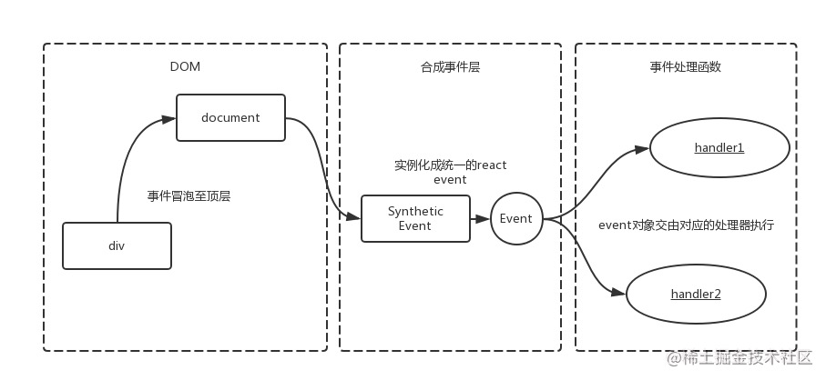

# React 老文档

> https://zh-hans.legacy.reactjs.org/

# 对组件化的理解

组件将应用的 UI 拆分成独立的、可复用的模块。

组件化的核心，就是两点:

- 封装

  共同的逻辑

- 复用

  通过属性（props）的传递，展示不同的模板内容

## 定义组件的两种方式

- class component

  条件：

  1. class 继承自 React.Component(PureComponent)

  2. class 内部必须定义 render 方法。

  3. 如果自定义了 constructor 函数，必须调用 super(props) 方法。调用super实际上是调用了 React.Component 这个 class 的 construcor 方法，用来完成 React 组件的初始化工作。

- function component

# 组件的生命周期

单组件生命周期


## componentDidMount

在 componentDidMount 生命钩子中，组件已经挂在，真实 DOM 也已经渲染完成，是调用服务器 API 最安全的地方。

componentWillMount 也可以获取服务器 API，因为越早拿到数据，越能更快的返回组件并展示正确的组件。但是当组件在服务器端渲染时，componentWillMount 会被调用两次，一次是在服务器端，一次是在浏览器端。**而 componentDidMount 能保证在任何情况下只会被调用一次。**

## componentWillReceiveProps

props 的更新，会触发子组件的 componentWillReceiveProps 生命周期方法。

如果需要用 props 中的某个属性和服务端交互，componentWillReceiveProps 就很合适。


## 父子组件生命周期执行顺序

父子组件生命周期执行顺序和 Vue 的一样。


父子组件加载时：

```js
// console.log
父组件 constructor

父组件 render

子组件 constructor

子组件 render

子组件 componentDidMount

父组件 componentDidMount
```

父组件更新时

```js
父组件 render

子组件 render

子组件 componentDidUpdate

父组件 componentDidUpdate
```

卸载子组件

```js
父组件 render

子组件 componentWillUnmount

父组件 componentDidUpdate
```

# React 中 JSX 本质是什么？

本质还是 JS。

> JSX 是 JavaScript 语法扩展，可以让你在 JavaScript 文件中书写类似 HTML 的标签。
>
> 代码更简洁，更具有可读性，更贴近 HTML。

React 中 JSX 只是一种表现形式，可以让你以一种更方便的方式动态的创建组件。JSX 最终会被转化成 JS 代码。

JSX 语法对 React 来说只是 `React.createElement` 的语法糖。所有的 JSX 语法最终都会被转换成 `React.createElement` 函数的调用。

```js
// JSX
const element = <div className="foo">Hello, React</div>

// 转换后
const element = React.createElement(
  'div',
  {
    className: 'foo'
  },
  'Hello, React'
)
```

这也就是为什么我们代码中有时候并未使用 `React`，但是必须导入的原因。

# 为什么多个 JSX 标签需要被一个父元素包裹？

JSX 虽然看起来很像 HTML，但在底层其实被转化为了 JavaScript 对象，你不能在一个函数中返回多个对象，除非用一个数组把他们包装起来。

这就是为什么多个 JSX 标签必须要用一个父元素或者 Fragment 来包裹。

# 为什么操作 DOM 比操作 JS 要慢，且更耗性能？

主要是在两个方面：

1. 跨模块通信。DOM 的实现和 JS 的实现属于两个独立的模块，跨模块交互性能消耗挺高。

2. 耗浏览器性能。当我们操作 DOM，通常会引起浏览器的重绘和回流。

# JSX 和 vDom 的关系？

JSX 需要转为成 html，必须先转化为 js，通过 vdom 来描述 html 关系，最终渲染为 html.

React.createElement 和 h 函数，都生成 vNode.

ReactDOM.render 和 setState 时，都需要 patch。

# key 的作用

React 中 key 属性是用来标记列表中的每个元素，当列表数据发生变化时，React 在做 diff 时就可以通过 key 知道哪些元素发生了变化，从而只重新渲染发生变化了的元素，提高渲染效率。

# state 和 props 的区别是什么

state 和 props 都和组件的 UI 渲染有关，它们的变化都会触发组件的重新渲染，但是 props 对于使用它的组件来说是只读的，是通过父组件传递过来，要想修改 props，只能通过父组件修改。而 state 是组件内部自己维护的状态，可变的。

# setState 合适的时候合并更新

setState 组件大部分情况下是异步的，调用后不会立即更新组件的 state，而是将 state 的更新加入到更新队列中，然后在合适的时候批量处理这些更新。

当你传入对象并调用了多次 setState，这几个对象会被合并，执行结果拿最后那个 setState。

```js
count = 0

this.setState({ count: this.state.count + 1 })
this.setState({ count: this.state.count + 1 })
this.setState({ count: this.state.count + 1 })
```

类似于将三个 count 放到同一个对象上：

```js
{
  count: this.state.count + 1,
  count: this.state.count + 1,
  count: this.state.count + 1,
}
```

所以只剩下一个 count 了，只会累加一次，count = 1。


**如果给 setState 传入一个函数，React 不会将多个更新合并为一个处理。**

```js
this.setState(pre => {
  return {
    count: pre.count + 1
  }
})

this.setState(pre => {
  return {
    count: pre.count + 1
  }
})
```

最终 count 是 2.

# setState是同步的还是异步的？

- setState 大部分情况下是 `异步` 的

  调用 setState 时，组件的 state 并不会立即改变，setState 只是把要修改的状态放入到一个队列中，React 会优化真正的执行动机。

  并且出于性能考虑，可能会将多次 setState 的状态修改合并成一次状态修改。

- **在 setTimeout 中是同步的**

- 自己定义的 DOM 事件中，setState 是同步的


```js
// count 初始值为1，每点击一次，增加 1。

<button onClick={() => {
  console.log('count ', this.state.count) // 1
  this.setState({ count: this.state.count + 1}, () => {
    console.log(this.state.count) // 2
  })
  console.log('cout ', this.state.count) // 1
}}>add</button>
```

**在 setTimeout 中是同步的**

```js
setTimeout(() => {
  this.setState({
    count: this.state.count + 1
  })

  console.log(this.state.count) // 累加了：1
}, 0);
```

自己定义的 DOM 事件中，setState 是同步的

```js
componentDidMount(): void {
  document.body.addEventListener('click', this.bodyClicked.bind(this))
}

bodyClicked() {
  console.log(this.state.count) // 0

  this.setState({
    count: this.state.count+1
  })

  console.log(this.state.count) // 1
}
```

看道面试题：初始值 count = 0，查看打印结果。

```js
componentDidMount(): void {
  this.setState({
    count: this.state.count + 1
  })

  console.log(this.state.count) // 0

  this.setState({
    count: this.state.count + 1
  })

  console.log(this.state.count) // 0


  setTimeout(() => {
    this.setState({
      count: this.state.count + 1
    })

    // setState 传入了对象，合并处理后只有一个 count + 1
    console.log(this.state.count) // 2
  }, 0);

  setTimeout(() => {
    this.setState({
      count: this.state.count + 1
    })

    console.log(this.state.count) // 3
  }, 0);
}
```

问题：为何需要异步？

setState 可以多次设置，如果设置成同步，每一次 setState 都触发更新渲染，会比较 `消耗性能`。设置成异步，可以将需要更新的数据集中起来，一次性渲染。

而且，js 是单线程的，执行 js 过程和 DOM 渲染是互斥的，也就是说 js 执行时，DOM 的渲染是被阻塞的，DOM渲染时拿到的结果就是 js 执行完毕的结果。

假设 setState 是同步的，我们想要将 `count` 累加到 10，设置了 10 次 setState，因为 DOM 渲染被阻塞了，只能等待 js 执行完毕才会渲染 DOM，所以用户是看不到 count 从 1 累加到 10 的这个过程，最终 js 执行完毕，DOM 会直接渲染出 10。


- Vue 渲染 DOM 也是异步的，可以通过 $nextTick 可以获取最新的数据

# state 与 不可变值

React采用函数式编程的不可变数据特性。

而在React中不可变值的意思就是：始终保持state的原值不变。

不要直接修改state，遇到数组或者对象，采用copy一份出去做改变。

**在做性能优化时很重要。**

```js
this.setState({
  obj1: Object.assign({}, this.state.obj1, {a: 100}),
  obj2: {...this.state.obj2, a: 100},
  arr: this.state.arr.slice(),
})
```

**不可变值的目的**

- 性能优化

在生命周期 shouldComponentUpdate 根据返回值决定是否需要重新渲染。因为父组件只要 state 或 props 更新了就会重新渲染，从而子组件也会更着渲染。

React会对新旧state和props进行比较，如果直接修改state去用于其他变量的计算，而实际上state并不需要修改，则会导致怪异的更新以及没必要的更新，因此采用这种方式是非常巧妙，且效率非常的高。

- 可追踪修改痕迹，便于排错

使用this.setState的方式进行修改state的值，相当于开了一个改变值的口子，所有的修改都会走这样的口子，相比于直接修改，这样的控制力更强，能够有效地记录与追踪每个state的改变，对排查bug十分有帮助。

# React 事件

React 元素的事件处理和 DOM 元素的很相似，但是有一点语法上的不同：

- React 事件的命名采用小驼峰式（camelCase），而不是纯小写。`<button onClick={activateLasers}>`

- 不能通过返回 false 的方式阻止默认行为。你必须显式地使用 preventDefault

- 所有事件挂在到 document 上

  React并不是将click事件绑在该div的真实DOM上，而是在document处监听所有支持的事件，当事件发生并`冒泡至document`处时，React将事件内容封装并交由真正的处理函数运行。



## event 对象（合成事件）

> React event 对象是 SyntheticBaseEvent，属于合成事件，模拟 DOM 事件的所有能力
>
> 可以通过 event.nativeEvent 获取到原生事件

```js
e.stopPropagation() 阻止触发绑定在外层标签上的事件处理函数。

e.preventDefault() 阻止少数事件的默认浏览器行为，如表单提交。
```

为何需要合成事件机制？

- 更好的兼容性和跨平台

- 挂在到 document，减少内存消耗，避免频繁的事件解绑

- 方便事件的统一管理

# 组件通信

- props

- ref（父组件获取到子组件实例）

```js
// 渲染子组件

<Child ref={child => {
  console.log('拿到 child 实例 ', child)

  console.log('调用 child 上的方法 ', child?.renderChild())
}} />
```

- callback function（父组件传递方法给子组件）

- 利用事件冒泡机制

```js
class Parent extends React.Component {
  render() {
    return (
      <div onClick={this.handleClick}>
         <Child />
      </div>
    );
  }
  handleClick = () => {
    console.log('clicked')
  }
}
function Child {
  return (
    <button>Click</button>
  );    
}
```

- 兄弟组件通信（将数据提升到父组件中）

- context（深层次组件通信，避免 props 层层传递）

```js
// common.ts
import React from "react";
export const ThemeContext = React.createContext('light')


// App.tsx
class App extends React.Component {
  render() {
    return (
      <ThemeContext.Provider value="dark">
        <Toolbar />
      </ThemeContext.Provider>
    );
  }
}

function Toolbar() {
  return (
    <div>
      <ThemedButton />
    </div>
  );
}

// ThemedButton
import { ThemeContext } from './common.ts'

class ThemedButton extends React.Component {
  static contextType = ThemeContext;
  render() {
    return <Button theme={this.context} />;
  }
}
```

如果是函数组件，则无法使用 `static contextType = ThemeContext;` 这种形式，我们可以通过 `ThemeContext.Consumer` 将函数组件包裹起来。

```js
<ThemeContext.Consumer>
  <Child />
</ThemeContext.Consumer>
```

- Redux

[组件通信参考文章](https://mp.weixin.qq.com/s?__biz=MjM5MDA2MTI1MA==&mid=2649100705&idx=1&sn=e0891e222bac865bd8abe8158948bd90&chksm=be58360c892fbf1af9ca0db974ae4e85e6a58aaa6b4b413941f5ccccf2c223b47b50e075a8ba&scene=27)


# 受控组件和非受控组件

[参考文章](https://mp.weixin.qq.com/s?__biz=MzI1ODk2Mjk0Nw==&mid=2247490176&idx=1&sn=72744e3f22fc3c749e77a070c26957f4&chksm=ea0179ecdd76f0faa76a68711e0d2c881ae7143fa1d7f73fc6ac35e11b7bd89f03df0b11463d&scene=27)

# Portals（传送门）

可以将子组件渲染到父组件以外的地方去。比如常见的全局的 `Modal` 弹窗、全局的`Message`提示。

```js
import ReactDOM from "react-dom";

render(): React.ReactNode {
  return ReactDOM.createPortal(
    <>Child Component</>,
    document.body
  )
}
```

# 异步组件

- import()
- React.lazy
- React.Suspense

```js
import React from 'react'

const AsyncDemo = React.lazy(() => import('./AsyncDemo.tsx'))

...
render() {
  return <>
    <React.Suspense fallback={<div>Loading...</div>}>
      <AsyncDemo />
    </React.Suspense>
  </>
}
...
```

将大组件进行异步加载，提高用户体验。并且异步加载的组件，会被重新打一个 js 包出来。

在 Vue 中引入组件时，直接使用 import 函数导入即可实现异步加载组件。

# react-router 如何配置懒加载？

结合异步组件的方法使用(lazy、suspense)

```js
const Home = React.lazy(() => import('./Home.tsx'))
const About = React.lazy(() => import('./About.tsx'))

const App = () => (
  <Router>
    <Suspense fallback={<div>loading</div>}>
      <Route exact path="/" component={Home}></Route>
      <Route path="/about" component={About}></Route>
    </Suspense>
  </Router>
)
```

# 性能优化 - SCU（shouldComponentUpdate）

默认返回 true

```js

shouldComponentUpdate(nextProps, nextState) {
  // 重新渲染
  if (nextState.count !== this.state.count) return true

  return false // 不重新渲染
}
```

**为什么不可变值对 SCU 这么重要？？？**

来看个错误的例子，下面这个例子会渲染 ul > li (1, 2, 3)，我们在 `onPushList` 中，通过 push 方法直接修改了 `state.list`。

然后在 `shouldComponentUpdate` 中，判断当前组件是否需要重新渲染。

你会发现，组件没有更新！！！

```js
import React from "react";

interface IState {
  list: Array<number>
}

export default class Child extends React.Component<{}, IState> {
  constructor(props: {}) {
    super(props)

    this.state = {
      list: [1, 2, 3]
    }
  }

  shouldComponentUpdate(nextProps: Readonly<{}>, nextState: Readonly<IState>, nextContext: any): boolean {
    if (nextState.list === this.state.list) {
      return false
    }

    return true
  }

  onPushList() {
    // 直接修改 list
    this.state.list.push(4)

    this.setState({
      list: this.state.list
    })
  }

  render(): React.ReactNode {
    return <>
      <button onClick={this.onPushList.bind(this)}>push list</button>

      <ul>
        {
          this.state.list.map(i => <li key={i}>{i}</li>)
        }
      </ul>
    </>
  }
}
```

为什么呢？？

这就是因为没有遵循`数据的不可变原则`的原因。

我们通过 push 方法直接对 list 增加了一个数值 `4`，此时 this.state.list = [1, 2, 3, 4]，但是 SCU 中判断逻辑也是用的 `this.state.list`，它和 `nextState.list` 是相同的，指向地址一样，数值一样，那么 SCU 返回了 false，组件不会重新渲染！

正确写法：

```js
onPushList() {
  this.setState({
    list: this.state.list.concat(4)
  })
}
```
# 性能优化 - pureComponent

继承自 pureComponent 的组件，相当于在 SCU 中实现了 `浅比较`。

# 性能优化 - React.memo

优化函数组件。

`React.memo` 包裹一个函数组件，来对它的 props 进行浅比较。等效于 PureComponent，但它只比较 props。（也可以通过第二个参数指定一个自定义的比较函数来比较新旧 props。如果函数返回 true，就会跳过更新。）

# 公共逻辑复用 HOC & render props

组件公共逻辑的抽离

## mixin

```js
import { Component } from 'react'

// mixin
const customMixin = {
  componentDidMount() {
    console.log(' --- mixin componentDidMount --- ')
  },
  sayName() {
    console.log(this.state.name)
  }
}


function componentClassMixins(Component, mixin){ /* 继承 */
  for(let key in mixin){
    Component.prototype[key] = mixin[key]
  }
}
```

调用 `componentClassMixins` 方法，第一个参数是我们的组件，第二个参数传我们编写的 mixin

## HOC

> 高阶组件是参数为组件，返回值为新组件的函数。

当多个组件都需要某个相同的功能， 使用高阶组件可以减少重复实现。

比如有很多组件都想要获取 `当前鼠标位置` 的功能。

```js
import React from "react";

interface IState {
  mouse: {
    x: number
    y: number
  }
}

const withMouse = function(Comp: React.FC<IState>) {

  class MouseComponent extends React.Component<{}, IState> {

    constructor(props: {}) {
      super(props)

      this.state = {
        mouse: {
          x: 0,
          y: 0
        }
      }
    }

    onMouseMove(event: React.MouseEvent) {
      this.setState({
        mouse: {
          x: event.clientX,
          y: event.clientY,
        }
      })
    }

    render() {
      return <div onMouseMove={this.onMouseMove.bind(this)}>
        <Comp {...this.props} mouse={this.state.mouse}/>
      </div>
    }
  }

  return MouseComponent
}

export default withMouse
```

**Vue 如何实现高阶组件**

[Vue 进阶必学之高阶组件 HOC](https://zhuanlan.zhihu.com/p/126552443)

## render props

> 术语 “render prop” 是指一种在 React 组件之间使用一个值为函数的 prop 共享代码的简单技术

- 组件接收一个 `值为函数` 的 prop，动态 prop。

- render props 函数返回一个组件

其实 render props 和 HOC 很相像，可以随意转换。

以 HOC 中 withMouse 为例，将其改为 render props

```js
// Mouse
class Mouse extends React.Component {
  constructor(props) {
    super(props)

    this.state = {
      x: 0,
      y: 0
    }
  }

  onMouseMove(event: React.MouseEvent) {
    this.setState({
      x: event.clientX,
      y: event.clientY,
    })
  }

  render() {
    return <div onMouseMove={this.onMouseMove.bind(this)}>
      {/*
        使用 `render`prop 动态决定要渲染的内容
      */}
      {this.props.render(this.state)}
    </div>
  }
}
```

App 使用 Mouse 组件，App 组件内部就可以通过 props 实时获取到 mouse 的位置了。

```js
const withMouseApp = () => {
  return (
    <Mouse render={ state => <App mouse={state} /> } />
  )
}

export default withMouseApp
```
render prop 一个有趣的事情是你可以使用带有 render prop 的常规组件来实现大多数高阶组件 (HOC)。 例如，如果你更喜欢使用 withMouse HOC而不是 <Mouse> 组件，你可以使用带有 render prop 的常规 <Mouse> 轻松创建一个。

# Diff 算法

每次组件的状态或属性更新，组件的 render 方法都会返回一个新的虚拟DOM，用来描述新的 UI 结构。

正常情况下，比较两个树形结构差异的算法的时间复杂度是O(N^3)，这个效率显然是无法接受的。

React 提出了两个假设，优化了树形结构差异的算法时间复杂度，O(N)：

1. 如果两个元素的类型不用，那么它们将生成两棵不同的树。

2. 为列表中的元素设置 key 属性，标识对应的元素在多次 render 过程中是否发生变化。


React 比较两棵树是从树的根节点开始比较的，比较规则如下：

- 当根节点是不同类型时，React 会认为新的树和旧的树完全不同，不再比较，直接替换掉旧的树

- 当根节点是相同的 DOM 元素类型时，React 会保留根节点，而比较根节点的属性，然后只更新那些变化了的属性。

  虚拟 DOM 的节点类型分两种：

  1. DOM元素类型：比如 div、p..

  2. React 组件类型：比如自定义的 React 组件。

- 当根节点是相同的组件类型时，对应的组件实例不会被销毁，只会执行更新操作，同步变化的属性到虚拟 DOM 树上。

比较完根节点后，React 会已同样的原则继续递归比较子节点，每一个子节点相对于其层级以下的节点来说又是一个根节点。

## key

当一个节点有多个子节点时，默认情况下，React 只会按照顺序逐一比较两个树上对应的节点。

比较下面两棵树，两棵树前面的两个 li 都相同，最终只会插入一个新的节点。

```js
<ul>
  <li>first</li>
  <li>second</li>
</ul>

// 仅仅只是插入了一个元素

<ul>
  <li>first</li>
  <li>second</li>
  <li>third</li>
</ul>
```

如果 `<li>third</li>` 是被插入到子节点的第一个位置，那么按照顺序比较的话，差异就大了，导致每一个节点都被修改。

**引入 key 来标识节点，React 会根据 key 来匹配子节点，只要子节点的 key 值没有变化，React 就会认为这是同一个节点。**

```js
<ul>
  <li key="first">first</li>
  <li key="second">second</li>
</ul>

<ul>
  <li key="third">third</li>
  <li key="first">first</li>
  <li key="second">second</li>
</ul>
```

有了 key 做标识，React 就在 diff 时就会知道 first 和 second 这两个元素没有发生变化，所以只会在这两个元素前面插入 third 元素。

**所以 key 的使用减少了 DOM 操作，提高了 DOM 的更新效率。**
