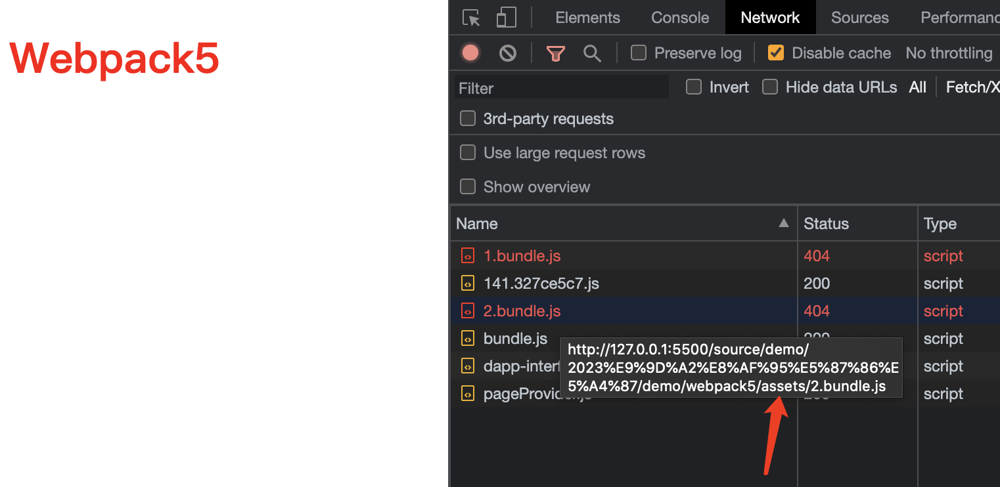

# Webpack
> 找出模块之间的依赖关系，按照一定的规则把这些模块组织、合并为一个JavaScript（以下简写为JS）文件。

Webpack认为一切都是模块，如JS文件、CSS文件、jpg和png图片等都是模块。Webpack会把所有这些模块都合并为一个JS文件，这是它最本质的工作。

当然，我们可能并不想让它把这些模块都合并成一个JS文件，这时我们可以通过一些 `规则或工具` 来改变它最终打包生成的文件。


## webpack & webpack-cli
webpack是Webpack核心npm包

webpack-cli是命令行运行webpack命令所需的npm包

## 资源拆分
我们可以把所有模块打包成一个 js 文件，但是，这样就会导致 js 过于庞大，我们希望可以将其拆分成JS、CSS和图片等资源。

Webpack提供了对拆分功能的支持，在构建的时候，可以通过Webpack的预处理器和插件等进行干预，把原本要打包成的一个.js文件拆分成JS、CSS和图片等资源。

## 打包模式

Webpack的打包模式共有三种：production、development和none，这三种模式是通过mode参数来指定的。

production和development这两种模式会分别按照线上生产环境和本地开发环境进行一些优化处理，而none模式会保留原始的打包结果。

## 配置文件

Webpack默认的配置文件是项目根目录下的 `webpack.config.js` 文件，在我们执行`npx webpack`命令的时候，Webpack会自动寻找该文件并使用其配置信息进行打包，如果找不到该文件就使用默认参数打包。
```js
// webpack.config.js
const path = require('path')

module.exports = {
  mode: 'none', // 原模原样输出代码
  entry: './index.js',
  output: {
    path: path.resolve(__dirname, 'dist'), // __dirname 是 nodejs 全局变量，表示当前文件的路径，使用 resolve 拼接
    filename: 'bundle.js'
  }
}
```

我们创建两个 js 文件，一个是 index.js，一个是 test.js。

然后在 test.js 中创建几个变量和方法，并通过 export 导出，index.js 导入，执行如下命令。
```js
// terminal
npx webpack
```

控制台输出，表示打包成功。
```js
asset bundle.js 3.18 KiB [emitted] (name: main)
runtime modules 670 bytes 3 modules
cacheable modules 203 bytes
  ./index.js 85 bytes [built] [code generated]
  ./test.js 118 bytes [built] [code generated]
webpack 5.82.1 compiled successfully in 76 ms
```

## 配置文件资源入口 entry

1. 入口entry是字符串形式

字符串形式entry已经在之前使用过了，这是最简单的形式，表示打包的入口JS文件。

2. 入口entry是数组形式

表示数组的最后一个文件是资源的入口文件，数组的其余文件会被预先构建到入口文件中。

```js
{
  //...
  entry: ["core-js/stable", "./a.js"]
  //...
}

=== 上面的配置和下面的是等效的 ===

//a.js
import "core-js/stable"

// webpack.config.js
module.exports = {
  entry: './a.js'
}
```

3. 入口entry是对象形式

对象形式的entry又被称为多入口配置。之前我们讲的都是单入口配置，就是打包后生成一个JS文件。

多入口配置就是打包后生成多个JS文件。

```js
// webpack.config.js
const path = require('path')

module.exports = {
  mode: 'none', // 原模原样输出代码
  entry: {
    bundle: './index.js',
    vendor: './vendor.js'
  }
  output: {
    path: path.resolve(__dirname, 'dist'), // __dirname 是 nodejs 全局变量，表示当前文件的路径，使用 resolve 拼接
    filename: '[name].js'
  }
}
```

4. 入口entry是函数形式

函数形式的entry，Webpack取函数返回值作为入口配置，返回值是上述三种形式之一即可。

函数形式的entry可以用来做一些额外的逻辑处理，不过在自己搭脚手架时很少使用。

## 资源出口 output

output就是资源出口配置项。

output的值是一个对象，它有几个重要的属性filename、path、publicPath和chunkFilename。

- filename

filename支持类似变量的方式生成动态文件名，如[hash]-bundle.js，其中方括号代表占位符，里面的hash表示特定的动态值。

webpack5 以前使用hash，webpack5中变成了fullhash，或者考虑使用chunkhash或contenthash。

特定动态值除了[hash]，还有[name]和[id]等。

```js
filename: '[name]-[fullhash:8].js'
```

- path

资源输出的绝对路径，存放在磁盘中。

如果你不设置它，Webpack默认其为dist目录。

```js
path: path.resolve(__dirname, 'dist')
```

- publicPath

配置项output中的publicPath表示的是资源访问路径，在Web开发时其默认值是字符串auto。

资源存放到磁盘后，浏览器如何知道该资源存放在什么位置呢？这个时候需要我们指定该资源的访问路径，这个访问路径就是用`output.publicPath`来表示的。

我们来看个示例，有三个 js 文件 `index.js, test.js, test1.js`，在 index.js 中，动态导入 test.js 和 test1.js。

```js
// test.js
const myName = 'alex'
const age = 18
const sayMe = function() {
  console.log(myName + age)
}

export default sayMe;


// test1.js
console.log('我是 test1.js')


// index.js
import './test.css'
import('./test').then(module => {
  module.default()  
})
import('./test1.js')
```

然后我们 webpack 配置不变，不加 `publicPath` 进行打包。

```js
const path = require('path')
module.exports = {
  mode: 'none',
  entry: './index.js',
  output: {
    path: path.resolve(__dirname, 'dist'),
    filename: 'bundle.js',
  },
  module: {
    rules: [{
      test: /\.css$/,
      use: ['style-loader', 'css-loader']
    }]
  }
}
```

我们会发现生成的 `dist` 目录下有三个文件，`bundle.js, 1.bundle.js, 2.bundle.js`。

bundle.js是从入口文件index.js开始打包生成的output.filename指定的文件，`1.bundle.js, 2.bundle.js`是动态加载JS模块而生成的异步资源文件，test.js文件被单独打包成1.bundle.js文件，test1.js文件被单独打包成2.bundle.js文件。

我们打开 index.html 页面，并查看 network，会发现这几个资源文件，都在 dist 目录下。

```js
http://127.0.0.1:5500/source/demo/webpack5/dist/bundle.js
http://127.0.0.1:5500/source/demo/webpack5/dist/1.bundle.js
http://127.0.0.1:5500/source/demo/webpack5/dist/2.bundle.js
```

那我们加上 `publicPath` 属性试试，看看会有什么效果呢。

其余都不变，给 output 加上 publicPath：

```js
output: {
  path: path.resolve(__dirname, 'dist'),
  filename: 'bundle.js',
  publicPath: './assets/'
},
```

打包成功后，刷新页面，会发现控制台里已经报错，`1.bundle.js, 2.bundle.js` 资源 404。

```js
http://127.0.0.1:5500/source/demo/webpack5/assets/1.bundle.js
http://127.0.0.1:5500/source/demo/webpack5/assets/2.bundle.js
```



原来，浏览器是从 `assets` 目录下加载了这两个资源文件，而我们根本没有创建这个 `assets` 目录，并且 `1.bundle.js, 2.bundle.js` 是在 `dist` 目录下，所以找不到资源了。

在把publicPath设置为`assets/` 、 `./assets/` 、`../assets/`这类路径时，它是相对于当前HTML页面路径取值的。

**如果 publicPath 的值是以 `/` 开头**，则是相对于服务器地址，表示要访问的资源以当前页面的服务器地址根目录作为基础路径。

我们来看看示例：

```js
output: {
  path: path.resolve(__dirname, 'dist'),
  filename: 'bundle.js',
  publicPath: '/assets/'
},
```

打包后，刷新页面，会发现动态加载的资源 404了，因为浏览器是从服务器根路径开始加载的 `1.bundle.js & 2.bundle.js`

```js
http://127.0.0.1:5500/assets/1.bundle.js
http://127.0.0.1:5500/assets/2.bundle.js
```

**publicPath 也可以直接写绝对HTTP地址**

```js
output: {
  path: path.resolve(__dirname, 'dist'),
  filename: 'bundle.js',
  publicPath: 'https://www.baidu.com/assets/'
},
```

```js
https://www.baidu.com/assets/1.bundle.js
https://www.baidu.com/assets/2.bundle.js
```

**相对HTTP协议地址以//开头**

与绝对HTTP协议地址相比，它省略了前面的https:或http:。

在使用相对HTTP协议地址的时候，浏览器会将当前页面使用的协议名称与相对协议地址拼接，这样本质上与使用绝对HTTP协议地址是一样的。

```js
output: {
  path: path.resolve(__dirname, 'dist'),
  filename: 'bundle.js',
  publicPath: '//www.baidu.com/assets/'
},
```

- chunkFilename

chunkFilename也用来表示打包后生成的文件名，那么它和filename有什么区别呢？

chunkFilename表示的是打包过程中非入口文件的chunk名称，通常在使用异步模块的时候，会生成非入口文件的chunk。在前面的例子中，index.js文件里有import（'./test.js'），其中的test.js就是一个异步模块，它被打包成1.bundle.js文件，这个名称就是默认的output.chunkFilename。与output.filename一样，它支持占位符，例如使用[id].js。

```js
output: {
  path: path.resolve(__dirname, 'dist'),
  filename: 'bundle.js',
  publicPath: './dist/',
  chunkFilename: '[chunkhash].js', // 新增
},
```

打包后，就不会在有 `1.bundle.js`了，因为我们生成非入口的文件改了名字：

```js
66ba79be0b67ead70ee6.js
```

## webpack预处理器 Loader

Webpack在打包的时候，将所有引入的资源文件都当作模块来处理。

但Webpack在不进行额外配置时，`自身只支持对JS文件JSON文件模块的处理`，如果你引入了一个CSS文件或图片文件，那么Webpack在处理该模块的时候，会通过控制台报错：Module parse failed...You may need an appropriate loader to handle this file type。

Webpack社区也提供了比较成熟的预处理器，我们可以直接拿来使用，例如使用file-loader和url-loader来处理图片等资源，使用babel-loader来对ES6进行转码，使用vue-loader来处理Vue组件。

### 处理 CSS

需要两个 loader, 分别是css-loader与style-loader。

css-loader是必需的，它的作用是解析CSS文件，包括解析@import等CSS自身的语法。它的作用仅包括解析CSS文件，它会将解析后的CSS文件以字符串的形式打包到JS文件中。不过，此时的CSS样式并不会生效，因为需要把CSS文件插入HTML文件中才会生效。

此时，style-loader就可以发挥作用了，它可以把JS里的样式代码插入HTML文件中。它的原理很简单，就是通过JS动态生成style标签并将其插入HTML文件的head标签中。

```js
// webpack.config.js
module.exports = {
  mode: 'none',
  entry: './index.js',
  output: {
    path: path.resolve(__dirname, 'dist'),
    filename: 'bundle.js'
  },
  module: {
    rules: [{
      // 取值是一个正则表达式，表示的含义是当文件名后缀是.css的时候，我们使用对应use项里的预处理器
      test: /\.css$/,
      // 取值是一个数组，数组每一项是一个预处理器。预处理器的执行顺序是从后向前执行，先执行css-loader，然后把css-loader的执行结果交给style-loader执行。
      use: ['style-loader', 'css-loader']
    }]
  }
}
```

源码如下：

```js
// index.js
import './test.css'
import sayMe from './test'

sayMe()


// test.css
.hello {
  color: red;
}
```

index.html
```html
<!DOCTYPE html>
<html lang="en">
<head>
  <meta charset="UTF-8">
  <meta http-equiv="X-UA-Compatible" content="IE=edge">
  <meta name="viewport" content="width=device-width, initial-scale=1.0">
  <title>Document</title>
</head>
<body>
  <h1 class="hello">Webpack5</h1>
  <script src="./dist/bundle.js"></script>
</body>
</html>
```

### loader配置项

预处理器本质上是一个函数，它接收一个资源模块，然后将其处理成Webpack能使用的形式。

用法，以处理 css 为例：

```js
module.exports = {
  mode: 'development',
  entry: './index.js',
  output: {
    path: path.resolve(__dirname, 'dist'),
    filename: 'bundle.js',
    publicPath: './assets/',
    chunkFilename: '[chunkhash:8].js'
  },
  module: { // 模块
    rules: [
      // 处理 css 文件
      {
        test: /\.css$/,
        use: ['style-loader', 'css-loader'], // 如果是单一loader，use 可以是字符串，如果要给 loader 传参，那么 use 可以配置成对象形式
        include: /src/, // 只对 src 目录下的文件做处理
        exclude: /node_modules/, // 不处理 node_modules 下的文件
      },
    ]
  }
}
```

### 处理 ES6 语法

安装 babel-loader

```js
// 需要babel 核心包
npm install -D @babel/core@7.13.0 babel-loader@8.2.2

// 需要presets包，它表示预设插件的集合，对ES6最新语法进行转码
npm install -D @babel/presets-env@7.13.10
```

```js
// 处理 es6，低版本浏览器并不支持 es6 最新语法
{
  module: {
    rules: [
      {
        test: /\.js$/,
        exclude: /node_modules/,
        use: {
          loader: 'babel-loader',
          options: {
            presets: ['@babel/presets-env']
          }
        }
      }
    ]
  }
}
```

babel-loader配置项options除了可以设置常规的Babel配置项，还可以开启缓存。可以通过增加cacheDirectory：true属性来开启缓存。在初次打包后再次打包，如果JS文件未发生变化，可以直接使用初次打包后的缓存文件，这样避免了二次转码，可以有效提高打包速度。

```js
options: {
  cacheDirectory：true,
  presets: ['@babel/presets-env']
}
```

### 处理图片资源

> 使用file-loader

```js
// index.js
import imgSrc from '../../img/babel.jpg'

const imgDom = ``

window.onload = function() {
  const img = document.getElementById('img')
  img.innerHTML = imgDom
}
```

将 file-loader 配置到 webpack.config.js 中。

```js
module: {
  rules: [{
    test: /\.css$/,
    use: ['style-loader', 'css-loader']
  }, {
    test: /\.(jpg|png|jpeg)$/,
    use: 'file-loader'
  }]
}
```

### 处理 css 中的图片资源
看似什么都不用处理，但是当你打包后，dist 目录下有两个 jpg 的文件，其中一个无法打开，而页面中 css 中引入的图片资源，就是那个无法加载出来图片。

这是因为 css-loader 会对 @import 和 url() 进行处理，就像 js 解析 import/require() 一样

所以我们使用 file-loader 时，需要将 css 中的图片采用 commonjs 的方式去引入，而不是 esmodule。

解决办法：

```js
module: {
  rules: [{
    test: /\.(jpg|png|jpeg)$/,
    use: {
      loader: 'file-loader',
      options: {
        esModule: false // 使用 commonjs 规范
      },
    },
    type: 'javascript/auto'
  }]
}
```

重新打包，这时css图片就能正常加载了，而且 dist 目录下，也只有一张图片的资源。

## webpack 插件

插件是在Webpack编译的某些阶段，通过调用Webpack对外暴露出的API来扩展Webpack的能力的。

### 清理打包后文件

```js
const { CleanWebpackPlugin } = require('clean-webpack-plugin')

// webpack.config.js
plugins: [
  new CleanWebpackPlugin()
  ]
```

## webpack devServer

到目前为止，我们都是通过打包后再查看页面的效果，这样太麻烦了，每次修改后都要打包。

有两种方式：

1. 文件监听模式

只需要加上 --watch 属性即可

```js
npx webpack --watch
```

这时，命令行程序不会退出，当我们修改文件内容，会发现页面刷新了，同时更新了我们最新的代码。

2. webpack-dev-server

它通过开启一个本地服务器来加载构建完成的资源文件，它还有代理请求等功能。构建完成的资源文件在内存中，而不是存在于磁盘。

模块热替换是一个非常强大的功能，它可以在不刷新浏览器页面的情况下，直接替换修改代码部分的页面位置，能有效提高我们的开发效率。

```js
module.exports = {
  mode: 'none',
  entry: './index.js',
  output: {
    path: path.resolve(__dirname, 'dist'),
    filename: 'bundle.js',
  },
  devServer: {
    port: 8888,
    open: true,
    hot: true, // 启用 模块热替换
    compress: true, // 启用静态资源压缩
  },
  plugins: [
    new CleanWebpackPlugin(),
    new HTMLWebpackPlugin({
      template: './index.html'
    })
  ]
}
```

使用模块热替换功能时，需要使用webpack.HotModuleReplacementPlugin插件的能力。在Webpack 5中，将hot参数设置为true时，会自动添加该插件，不需要我们进行额外的配置。

在我们的前端项目里，开启了模块热替换功能后，它并不会自动运行，它需要使用者触发。在模块文件里，需要使用module.hot接口来触发该功能。

示例：

我们可以在 index.html 文件中写入一个 `input` 标签

```html
<body>
  <h1 class="hello">Webpack55</h1>

  <input type="text" />

  <div id="img"></div>
  <!-- <script src="./dist/bundle.js"></script> -->
</body>
```

然后到 `index.js` 中，写下这样一段代码:

```js
// 触发 HMR
if (module.hot) {
  module.hot.accept()
}
```

我们做个实验，在 input 标签中输入一些文字，然后修改 index.js 的 console.log 代码，你会发现，页面上并没有刷新，也就是说，input 的内容没有被刷掉。但是 js 打印更新了。

我们还可以做实验：

比如，触发 HMR 的逻辑，不放到 index.js 中

我们创建一个 `test.js` 文件，将，触发 HMR 的逻辑放进来，然后 `index.js` 导入 `test.js`。

回到页面上，在 input 中输入文字，然后到 index.js 中修改 `console.log`代码，页面刷新了，input 的内容也清空了。

我们再到 input 中输入文字，然后回到 `test.js` 中，修改 console.log 代码，这时，页面不会刷新了，input 内容不会被刷掉，但是 test.js 文件更新了。

我们可以在需要 HMR 的文件中，加入 HMR 触发逻辑。

为了方便，也可以直接将 `HMR` 的触发逻辑，放到项目的入口文件中 `main.js`，之后其他文件改动，都不会刷新整个页面了。

为了减轻开发者的负担，社区常用的预处理器提供了支持模块热替换的功能，例如style-loader、vue-loader和react-hot-loader等。在使用这些工具的时候，它们会自动注入module.hot相关代码，完成模块热替换的工作，无须开发者手动调用，极大地减少了开发者的工作量。

### webpack source map

如果没有将Webpack配置文件的mode设置为none，那么编译后的代码会对我们的原始代码做压缩、整合等操作。而且如果使用webpack-dev-server开启的服务，打包后的代码中也会包含非常多与业务代码无关的Webpack代码。编译打包后的代码与原始代码差别非常大，我们很难调试，开发效率较低。

想要在浏览器里直接看到打包前的代码，就需要使用source map。

source map是一个单独的文件，浏览器可以通过它还原出编译前的原始代码。

```js
// webpack.config.js

devtool: 'source-map'
```

当配置了 source map 之后，我们再执行打包命令，会发现 dist 目录下多了几个 `.map` 结尾的文件，这就是 source map 文件。


source-map比较利于定位线上问题和调试代码，但其他人都可以通过浏览器开发者工具看到原始代码，有严重的安全风险，因此不推荐生产环境中用这个类型。基于同样的安全风险考虑，我们也不推荐使用inline-source-map。

## Asset Modules

Asset Modules通常被翻译为资源模块，它指的是图片和字体等这一类型文件模块，它们无须使用额外的预处理器，Webpack通过一些配置就可以完成对它们的解析。

该功能是Webpack 5新加入的，与file-loader等预处理器的功能很像。

回顾一下file-loader的作用，它解析文件导入地址并将其替换成访问地址，同时把文件输出到相应位置。导入地址包括了JS和CSS等导入语句的地址，例如JS的import和CSS的url()。

在 `处理 css 中的图片资源` 中，我们如果仅仅使用 `file-loader` 来处理，会发现页面上无法正确显示图片。最后是采用了 `esModule: false` 以及 `type: 'javascript/auto'` 的方式，使用 commonjs 来加载图片资源。

在 webpack5 中有了 Asset Modules，我们加上 `type: 'asset/resource'` 配置即可。

```js
module: {
  rules: [{
    test: /\.css$/,
    use: ['style-loader', 'css-loader']
  }, {
    test: /\.(jpg|png|jpeg)$/,
    type: 'asset/resource'
  }]
}
```

Asset Modules的几个主要配置项都存放在module.rules里，关键的配置项叫type，它的值有以下四种：

- asset/resource：与之前使用的file-loader很像，它处理文件导入地址并将其替换成访问地址，同时把文件输出到相应位置。

- asset/inline：与之前使用的url-loader很像，它处理文件导入地址并将其替换为data URL，默认是Base64格式编码的URL。

  执行打包命令，文件目录里不会新增图片文件，因为原始图片已经被处理成Base64格式编码的data URL并直接存放于打包生成的资源bundle.js文件里了。

- asset/source：与raw-loader很像，以字符串形式导出文件资源。

- asset：Webpack默认对大于8KB的资源会以asset/resource的方式处理，否则会以asset/inline的方式处理。

### 自定义资源名

1. 通过generator.filename配置项来配置

在module.rules里增加了generator.filename配置项

```js
module: {
  rules: [{
    test: /\.css$/,
    use: ['style-loader', 'css-loader']
  }, {
    test: /\.(jpg|png|jpeg)$/,
    type: 'asset/resource',
    generator: {
      filename: 'static/[hash:8][ext][query]' // 表示处理生成的图片在static目录下，其名称是8位hash值与后缀名的组合。
    }
  }]
}
```

2. 在output里配置

在output里增加了assetModuleFilename配置项，该配置项用来表示资源模块处理文件后的名称。

```js
output: {
  path: path.resolve(__dirname, 'dist'),
  filename: 'bundle.js',
  assetModuleFilename: 'static/[hash:8][ext][query]'
},
```

这两种方式配置资源文件名称的效果是一样的，并且`仅可用于type取值是asset和asset/resource的情况`。

## 生产环境配置

实际开发中，开发环境的配置和生产环境的配置有很多是相同的。

相同的配置要分别与开发环境和生产环境合并，我们会用到 ` webpack-merge ` 这个工具，它类似于Object.assign方法，但它比Object.assign更加强大，非常适合对Webpack的配置项进行合并。

那我们在构建时，如何区分生产环境和开发环境呢？

使用环境变量。

在我们使用Webpack的过程中，会遇到以下两种环境变量。

1. Node.js环境里的环境变量。（执行JS代码时可以获取到的环境变量，它们存放在process.env模块中）
  
2. Webpack打包模块里的环境变量。

### Nodejs 环境变量

在实际开发中，我们一般需要设置跨操作系统的环境变量。通常，在npm的package.json文件中，我们可以通过跨操作系统的cross-env MY_ENV=dev这种方式进行环境变量的设置。

```js
// package.json

"script": {
  "build": "cross_env MY_ENV=dev webpack"
}
```

本地开发环境可以使用 `cross-env NODE_ENV=development`，生产环境可以使用cross-env NODE_ENV=production。

```js
// webpack.config.js

console.log('环境变量 ', process.env.NODE_ENV)
```

注意：我们配置的 Nodejs 环境变量，在 js 脚本文件中是无法被获取到的，因为 js 脚本通过 html 引入，无法获取 Nodejs 中的环境变量。

### webpack 环境变量

在实际开发中，我们有时候需要在业务逻辑代码里根据此代码是运行在本地开发环境还是线上生产环境里做区分，这个时候就需要在业务模块文件里注入环境变量。

我们通过DefinePlugin插件来设置打包模块里的环境变量，它是Webpack自带的一个插件。

```js
plugins: [
  new webpack.DefinePlugin({
    isMe: "'YES'",
    env: JSON.stringify('development')
  })
]
```

需要注意的是，我们在设置一个字符串值的时候，需要在外层再包裹一层引号，或者使用JSON.stringify()方法。如果不进行一层额外包裹，Webpack会把该字符串当成一个变量来处理。

然后到 `index.js` 文件中，直接获取定义的变量即可：

```js
console.log('webpack : ', isMe, env)
```

### 样式文件提取

Webpack 3及之前的版本里常用到的插件是extract-text-webpack-plugin，Webpack 3之后的版本里一般用的插件是mini-css-extract-plugin。

使用mini-css-extract-plugin插件时有以下两个关键点：

一是它自身带有一个预处理器，在用css-loader处理完CSS模块后，需要紧接着使用MiniCssExtractPlugin.loader这个预处理器。

二是它需要在Webpack配置文件的插件列表进行配置，执行new MiniCssExtractPlugin命令时需要传入一个对象，filename表示同步代码里提取的CSS文件名称，chunkFilename表示`异步代码`里提取的CSS文件名称。

```js
module: {
  rules: [{
    test: /\.css$/,
    use: [
      MiniCssExtractPlugin.loader,
      'css-loader'
    ]
  }, {
    test: /\.(jpg|png|jpeg)$/,
    type: 'asset/resource'
  }]
},
plugins: [
  new CleanWebpackPlugin(), // 清空 dist
  new HTMLWebpackPlugin({ // 自动帮我们引入脚本和 css 文件
    template: './index.html'
  }),
  new webpack.DefinePlugin({
    isMe: "'YES'",
    env: JSON.stringify('development')
  }),
  new MiniCssExtractPlugin({
    filename: '[name]-[contenthash:8].css', // 同步代码里提取的CSS文件名称。
    chunkFilename: '[id].css' // 异步代码里提取的CSS文件名称。
  })
]
```

### 处理 sass

在业务开发中，我们通常会采用Sass或Less来书写样式文件，本节介绍Sass样式文件如何进行处理，Less样式文件的处理也是类似的。

处理Sass样式文件需要使用sass-loader预处理器，使用它需要先安装sass-loader这个npm包。sass-loader底层依赖于Node Sass或Dart Sass进行处理，它们对应的npm包的名称分别是node-sass和sass。因为node-sass包在安装使用过程中容易遇到一些问题，所以我们推荐使用sass这个npm包。

```js
npm install -D sass@1.32.8 sass-loader@11.0.1
```

Sass有两种书写样式的方式，分别是Sass和Scss，这里我们采用Scss的书写方式。

```css
// test.scss
body {
  background: pink url('../../img/home.jpg');

  .hello {
    color: red;
  }
}
```

然后在入口文件中引入 `test.scss`

修改 `webpack.config.js`

```js
module: {
  rules: [{
    test: /\.(scss|css)$/,
    use: [
      MiniCssExtractPlugin.loader,
      'css-loader',
      'sass-loader'
    ]
  },
}
```

### PostCss

PostCSS是一个转换CSS的工具，但它本身没有提供具体的样式处理能力。我们可以认为它是一个`插件平台`，具体的样式处理能力由它转交给专门的样式插件来处理。

在Webpack中使用PostCSS，需要安装`postcss-loader`这个npm包。在Webpack文件里配置处理样式模块规则时，让postcss-loader在css-loader之前进行处理即可。

```js
npm install -D postcss-loader@5.1.0
```

在使用PostCSS的时候也需要增加相应的配置文件，我们在工程根目录下增加`postcss.config.js`文件。


```js
// webpack.config.js

module: {
  rules: [{
    test: /\.(scss|css)$/,
    use: [
      MiniCssExtractPlugin.loader,
      'css-loader',
      'postcss-loader', // 新增
      'sass-loader'
    ]
  },
}
```

我们css 中加入 `flex` 样式

```css
body {
  background: pink url('../../img/home.jpg');

  .hello {
    color: red;
    display: flex;
    justify-content: center;
  }
}
```
如果我们不配置 `postcss.config.js`，那么打包后跟之前打包的结果没有任何区别。

在开发过程中，我们使用PostCSS最重要的一个功能就是提供CSS样式浏览器厂商私有前缀，它是通过Autoprefixer来实现的。我们也可以通过postcss-preset-env来实现该功能，postcss-preset-env里包含了Autoprefixer，我们先使用Autoprefixer。

```js
npm install -D autoprefixer@10.2.5
```

配置 `postcss.config.js`

```js
const autoprefixer = require('autoprefixer')
module.exports = {
  plugins: [
    autoprefixer({
      browsers: [
        'chrome >= 18'
      ]
    })
  ]
}
```

其实这个 `browsers` 也可以在 package.json 中配置 `browserslist`。

```json
"browserslist": [
  "chrome >= 18"
]
```

我们再重启项目，查看样式代码

```css
.hello {
  color: red;
  display: -webkit-box;
  display: -webkit-flex;
  display: flex;
  -webkit-box-pack: center;
  -webkit-justify-content: center;
  justify-content: center;
}
```

## 合并配置 webpack-merge

```js
npm install -D webpack-merge@5.7.3
```

我们在package.json文件里配置了两个npm命令，分别对应本地开发环境打包和生产环境打包。

```json
  "scripts": {
    "start": "cross-env NODE_ENV=development webpack serve",
    "build": "cross-env NODE_ENV=production webpack"
  },
```

我们可以直接在 `webpack.config.js` 中通过环境变量的判断，来应对生产环境和开发环境，但是当项目庞大起来了，配置越来越多且复杂的时候，这种方式就不优雅了。

业界流行的解决办法是把开发环境与生产环境公共的配置提取到一个单独的文件里，然后分别维护一份开发环境的配置文件和一份生产环境的配置文件，并将公共配置文件的JS代码合并到这两个文件里。

```js
// webpack.common.js

const path = require('path')
const HTMLWebpackPlugin = require('html-webpack-plugin')

module.exports = {
  mode: 'none',
  entry: './index.js',
  output: {
    path: path.resolve(__dirname, 'dist'),
    filename: 'bundle.js',
  },
  devServer: {
    port: 8888,
    hot: true
  },
  module: {},
  plugins: [
    new HTMLWebpackPlugin({
      template: './index.html'
    })
  ]
}
```

```js
// webpack.development.js
const { merge } = require('webpack-merge') 
const common = require('./webpack.common.js')

module.exports = merge(common, {
  module: {
    rules: [{
      test: /\.(scss|css)$/,
      use: [
        'css-loader',
        'postcss-loader',
        'sass-loader'
      ]
    }, {
      test: /\.(jpg|png|jpeg)$/,
      type: 'asset/resource'
    }]
  }
})
```

```js
// webpack.production.js
const { merge } = require('webpack-merge')
const common = require('./webpack.common.js')
const MiniCssExtractPlugin = require('mini-css-extract-plugin')

module.exports = merge(common, {
  module: {
    rules: [{
      test: /\.(scss|css)$/,
      use: [
        MiniCssExtractPlugin.loader,
        'css-loader',
        'postcss-loader',
        'sass-loader'
      ]
    }, {
      test: /\.(jpg|png|jpeg)$/,
      type: 'asset/resource'
    }]
  },
  plugins: [
    new MiniCssExtractPlugin({
      filename: '[name]-[contenthash:8].css',
      chunkFilename: '[id].css'
    })
  ]
})
```

```json
  "scripts": {
    "start": "cross-env NODE_ENV=development webpack serve --config webpack.development.js",
    "build": "cross-env NODE_ENV=production webpack --config webpack.production.js"
  },
```

## 性能优化

Webpack性能优化总体包括两部分，分别是开发环境的优化与生产环境的优化。

- 打包体积分析工具webpack-bundle-analyzer

webpack-bundle-analyzer开启的分析页面，这个页面可以通过控制鼠标来进行放大、缩小等操作。

```js
npm install -D webpack-bundle-analyzer@4.3.0
```

- 打包速度分析工具speed-measure-webpack-plugin

  speed-measure-webpack-plugin工具可以帮我们分析Webpack在打包过程中预处理器和插件等花费的时间。

- 压缩JS文件

  在Webpack 4之前，我们会使用webpack.optimize.UglifyJsPlugin或webpack-parallel-uglify-plugin这一类的插件进行JS文件压缩，现在我们通常使用terser-webpack-plugin插件进行JS文件压缩。

  在Webpack 5中，在安装Webpack时会自动安装terser-webpack-plugin插件，因此不需要我们单独安装。

- 压缩css

- 配置预处理器的exclude与include

  exclude可以排除不需要该预处理器解析的文件目录，include可以设置该预处理器只对哪些目录生效，这样可以减少不需要被预处理器处理的文件模块，从而提升构建速度。

- module.noParse

  有些模块不需要被任何预处理器解析，例如jQuery与Lodash这一类的工具库。

  ```js
  module.exports = {
    // ...
    module: {
      noParse: /jQuery|lodash/
    }
  }
  ```

- 代码分割 optimization.splitChunks

  代码分割是Webpack优化中非常重要的一部分，Webpack里主要有三种方法进行代码分割。

  1. 入口entry：配置entry入口文件，从而手动分割代码。
  2. 动态加载：通过import等方法进行按需加载。
  3. 抽取公共代码：使用splitChunks等技术抽取公共代码。

  splitChunks指的是Webpack插件SplitChunksPlugin，在Webpack的配置项optimization.splitChunks里直接配置即可，无须单独安装。

  在Webpack 4之前，Webpack是通过CommonsChunkPlugin插件来抽取公共代码的，Webpack 4之后使用的是SplitChunksPlugin插件，在Webpack 5中又对其进行了优化，接下来将详细说明SplitChunksPlugin插件在Webpack 5中的使用。

  ```js
  module.exports = {
    // ...
    optimization: {
      splitChunks: {
        // config
        chunks: 表示从什么类型的chunks里面提取代码，有三个字符串值initial、async、all可以使用，另外也可以使用函数来匹配要提取的chunks。其默认值是async，表示只从动态加载的chunks里提取代码。initial表示只从入口chunks里提取代码，all表示同时从异步chunks和入口chunks里提取代码。

        minSize: 表示提取出来的chunk的最小体积，其在Webpack 5中的默认值是20000，表示20kB，只有达到这个值时才会被提取。

        maxSize: 表示提取出来的chunk的最大体积，其默认值是0，表示不限制最大体积。它是一个可以违反的值，在被违反时起提示作用。

        minChunks: 默认值是1，表示拆分前至少被多少个chunks引用的模块才会被提取。

        //...
      }
    }
  }
  ```

- 摇树优化Tree Shaking

  Tree Shaking可以帮我们检测模块中没有用到的代码块，并在Webpack打包时将没有使用到的代码块移除，减小打包后的资源体积。它的名字也非常形象，通过摇晃树把树上干枯无用的叶子摇掉。

  通常我们在本地开发环境下不会使用Tree Shaking，因为它会降低构建速度并且没有太大意义。我们需要在生产环境打包时开启Tree Shaking，生产环境下我们只需要配置参数项mode为production，即可自动开启Tree Shaking。

- 缓存

  在使用Webpack开发前端工程时，涉及的缓存主要有两类：一类是访问Web页面时的浏览器缓存，我们称其为长期缓存；另一类是Webpack构建过程中的缓存，我们称其为持久化缓存或编译缓存。

  在Webpack 5之前的版本里，Webpack自身没有提供持久化缓存，我们在开发时经常需要使用cache-loader或dll动态链接技术来做缓存方面的处理，这无疑提高了我们的学习成本和Webpack配置的复杂度。Webpack 5提供了持久化缓存，它通过使用文件系统缓存，极大地减少了再次编译的时间。

# Rollup（ESM打包器，小巧）

123
# Parcel（零配置的前端打包器）

# ESBuild

# ESBuild
> https://esbuild.bootcss.com/

> 介绍: https://juejin.cn/post/6918927987056312327

# vite


# 参考资源

[^1]：[Webpack5](https://www.bilibili.com/video/BV14T4y1z7sw/?spm_id_from=333.337.search-card.all.click&vd_source=a9f38e58a519cc0570c2dacd34ad7ebe)
