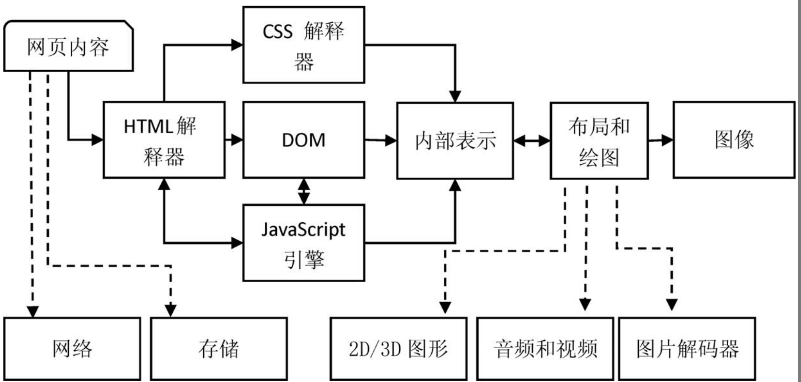

# 世界上第一个浏览器是什么？

`世界上第一个浏览器`是由蒂姆·伯纳斯-李（Tim Berners-Lee）在1990年开发的，它被称为`WorldWideWeb（万维网）或简称为WWW`。这个浏览器最初是为了在CERN（欧洲核子研究组织）内部共享和浏览文档而创建的。

WorldWideWeb浏览器是基于NeXTSTEP操作系统开发的，`它提供了一种简单的方式来浏览和导航互联网上的超文本文档`。`它支持通过URL链接访问不同的文档，并使用超文本标记语言（HTML）来描述和呈现文档内容。`

蒂姆·伯纳斯-李还发明了URL（统一资源定位符）、HTML（超文本标记语言）和HTTP（超文本传输协议），这些技术共同奠定了现代互联网的基础。

尽管WorldWideWeb浏览器在当时是一种先驱，但它为后来的浏览器发展奠定了基础，并成为了今天我们所熟知的互联网浏览器的起点。


# 浏览器发展史

1. 1990：WorldWideWeb（万维网）或简称为WWW

2. 1993：Mosaic 诞生，也就是后面大名鼎鼎的网景浏览器（Netscape）

3. 1995：微软推出 IE（第一次浏览器大战正式打响）

4. 2003 苹果公司推出 Safari，并于 2005年发起开源项目 Webkit

5. 2004 年 Firefox 1.0 发布（网景公司主导开发），拉开了第二次浏览器大战的序幕

6. 2008年 Google 公司以 webkit 作为内核，创建了一个新的项目 Chromium，在其基础上，发布了 Chrome 浏览器

  （Chromium本身就是一个浏览器，而不是 Chrome 浏览器的内核，Chrome 浏览器一般选择 Chromium 的稳定版本作为它的基础）


# 浏览器核心组成

- 外壳（用户界面）

- 持久化存储器（磁盘，记忆功能）

- 浏览器引擎

- js 引擎

- css 引擎

- c++ 绘制模块

- 网络

...

# 浏览器内核分类

> 浏览器内核。通常，它也被称为渲染引擎。

浏览器的渲染引擎就是能够将HTML/CSS/JavaScript文本及其相应的资源文件转换成图像结果的模块

- IE: Trident

- Firefox: Gecko

- Chrome: webkit，现在是 blink 内核

- Safari: webkit

- opera: webkit，现在是 blink 内核

WebKit：最初由苹果公司开发，用于Safari浏览器。它也被其他浏览器采用和修改，如Google Chrome（基于Blink）和Opera。

Blink：2013年，Google宣布了Blink内核，它其实是从WebKit复制出去的。渲染引擎 Blink 最初是基于WebKit，后来独立出来。目前主要用于Google Chrome、Opera和其他一些基于Chromium的浏览器。

Gecko：由Mozilla开发的渲染引擎，用于Firefox浏览器。

Trident：由Microsoft开发的渲染引擎，曾用于Internet Explorer浏览器。

EdgeHTML：由Microsoft开发的渲染引擎，用于旧版Microsoft Edge浏览器。然而，自2020年起，Microsoft Edge已经切换到基于Chromium的Blink引擎。

Presto：由Opera Software开发的渲染引擎，曾用于旧版Opera浏览器。

# WebKit 是什么？

`WebKit是一个开源的浏览器引擎`，最初由苹果公司开发，并用于其Safari浏览器。它是一个负责解析HTML、CSS和JavaScript的核心组件，实现了浏览器的渲染功能。

`WebKit具有高度模块化的架构，包括多个子模块，如HTML解析器、CSS解析器、JavaScript引擎等。`它负责将网页的原始代码转换为可视化的内容，以供用户在浏览器中查看和与之交互。

由于WebKit的开源性质，它不仅被苹果用于Safari浏览器，还被其他浏览器采用和修改。其中最著名的例子是Google Chrome浏览器，它使用了基于WebKit的渲染引擎Blink。

`WebKit嵌入式接口` 是指的狭义WebKit，它指的是在`WebCore（包含HTML解释器、CSS解释器和布局等模块）`和 `JavaScript引擎` 之上的一层绑定和嵌入式编程接口，可以被各种浏览器调用。(目前DOM和JavaScript引擎是分开的，这意味着JavaScript引擎访问DOM树需要较高的代价)

# 渲染引擎主要包含哪些功能模块？

- html 解释器：将HTML文本解释成DOM（文档对象模型）树

- css 解释器：级联样式表的解释器，它的作用是为DOM中的各个元素对象计算出样式信息

- layout （布局）：在DOM Tree 和 CSSOM tree 创建之后，Webkit需要将其中的元素对象同样式信息结合起来，计算它们的大小位置等布局信息，形成一个能够表示这所有信息的内部表示模型。

  计算布局的主要目的是确定页面中每个元素的几何属性，如大小、位置、边距等，并创建一个准确的布局流（Layout Flow）。计算布局是为了最终在屏幕上正确呈现和定位每个元素，以及保持它们之间的关系和相互作用。


- js 引擎：JavaScript引擎能够解释JavaScript代码并通过DOM接口和CSSOM接口来修改网页内容和样式信息，从而改变渲染的结果

- 绘图：使用图形库将`布局计算后的`各个网页的节点绘制成图像结果

# 渲染引擎的功能模块如何协同工作的？

url 请求到了网页内容

拿到 html 文本（字符串）后输入到HTML解释器，HTML解释器在解释它后构建成一棵 `DOM树`

这期间如果遇到JavaScript代码则交给`JavaScript引擎`去处理

如果网页中包含CSS，则交给`CSS解释器`去解释，形成 `CSSOM Tree`

当 `DOM Tree` 和 `CSSOM Tree` 都构建完后，渲染引擎调用 `布局模块(layout)` 计算模型内部各个元素的位置和大小信息，形成 `render tree`。（也称为回流（Reflow）或排版（Layout）过程。）

`绘制模块` 负责将`渲染树`中的每个元素转换为实际的像素。它会根据元素的样式属性，如颜色、背景、边框等，以及元素的几何属性，如位置、大小等，将元素绘制成位图或矢量图形。绘制过程包括填充像素颜色、边框描边、渐变填充、阴影效果等。

> 绘图这一环节是由计算机的图形处理单元（Graphics Processing Unit，GPU）完成的。

>GPU 是与 CPU 并行工作的独立处理器，其主要设计目标是提供高效的图形渲染和处理能力。

`合成模块`负责将绘制好的图像元素按照正确的顺序合成到屏幕上。它将渲染树中的各个元素按照层叠关系进行合成，处理透明度、混合模式等效果，以及处理层级关系、裁剪等操作。

最终，`合成模块将合成的图像发送给操作系统，以显示在屏幕上。`



# 合并 render tree 的过程

浏览器将 DOM 树和 CSSOM 树合并成渲染树（Render Tree）的过程是由渲染引擎中的布局（Layout）模块完成的，也称为回流（Reflow）或排版（Layout）过程。

渲染引擎中的布局模块负责确定页面上每个元素的大小、位置和几何属性。它会遍历渲染树，并计算每个元素在视口中的确切位置和大小，考虑盒模型、浮动、定位、文本流等因素，以及应用 CSS 属性对元素的影响。

在合并渲染树的过程中，布局模块会执行以下操作：

1. 从根节点开始遍历`（深度优先遍历）`渲染树。
2. 对每个可见的元素，根据其样式和盒模型属性计算其几何属性（如宽度、高度、位置等）。
3. 考虑元素之间的关系（如浮动、定位、文本流等），计算它们在视口中的精确位置。
4. 创建布局流（Layout Flow）来确保元素按正确的顺序绘制在屏幕上。

# Webkit 渲染过程

分为三个过程：

1. 从网页的 URL 到构建 DOM 树

2. 从DOM树到构建完WebKit的绘图上下文

3. 从绘图上下文到生成最终的图像

# js 代码的执行为什么会阻塞 DOM树和 CSSOM tree 的构建呢？

JavaScript 代码执行会阻塞 DOM 树（文档对象模型）和 CSSOM 树（CSS 对象模型）的构建，这是因为`浏览器的渲染引擎在解析 HTML、CSS 和执行 JavaScript 时是按顺序执行的`。

当浏览器解析 HTML 代码时，遇到 `<script>` 标签时会立即加载并执行其中的 JavaScript 代码。如果 JavaScript 代码需要访问或修改 DOM 元素，它需要在构建完成的 DOM 树上进行操作。因此，浏览器会阻塞 DOM 树的构建，直到 JavaScript 代码执行完毕。

类似地，如果 JavaScript 代码需要访问或修改 CSS 样式信息，它需要在构建完成的 CSSOM 树上进行操作。因此，浏览器会阻塞 CSSOM 树的构建，直到 JavaScript 代码执行完毕。

这种阻塞行为会导致页面加载和渲染的延迟，特别是在 JavaScript 代码较大或执行时间较长时。因此，在开发过程中，我们需要注意优化 JavaScript 代码，以减少其对 DOM 和 CSSOM 构建的阻塞影响。

有几种方式可以减轻 JavaScript 对 DOM 和 CSSOM 构建的阻塞效应：

1. 异步加载 JavaScript：将 JavaScript 代码放置在 `<script>` 标签中的 `async` 或 `defer` 属性中。这样可以使 JavaScript 代码异步加载，不会阻塞 DOM 和 CSSOM 的构建，从而提高页面加载性能。(当 `<script>` 标签添加了 defer 属性后，JavaScript 代码将在 HTML 解析完毕后执行，但在 DOMContentLoaded 事件之前执行。)

2. 放置 JavaScript 代码的位置：将 JavaScript 代码放置在页面底部，或使用延迟加载，以使其在 DOM 和 CSSOM 构建完成后执行。

3. 代码优化：优化 JavaScript 代码，减少不必要的计算和操作，以提高执行效率。可以使用工具进行代码压缩和合并，减小文件大小，从而减少下载和执行时间。

4. Web Workers：使用 Web Workers 可以将耗时的 JavaScript 代码放在后台线程中执行，以避免阻塞主线程，从而提高页面的响应性能。

需要注意的是，尽管 JavaScript 代码的执行会阻塞 DOM 树和 CSSOM 树的构建，但它不会阻塞其他资源的加载，如图片、样式表和字体文件等。浏览器会并行加载这些资源，以提高页面加载的效率。

# 异步任务不会阻塞 DOM 树和 CSSOM树的构建

异步任务如 setTimeout 和 Promise 的回调函数会在构建完 DOM 树和 CSSOM 树之后执行。

当浏览器遇到 setTimeout 或 Promise 等异步操作时，它会将相应的回调函数添加到任务队列中，等待执行。这些回调函数属于宏任务或微任务，具体取决于异步操作的类型。

一旦浏览器完成构建 DOM 树和 CSSOM 树的过程，会检查是否存在微任务队列。如果存在微任务，浏览器会优先执行微任务队列中的任务，然后再执行宏任务队列中的任务。这样可以确保微任务优先于下一个渲染步骤执行，保证页面更新的即时性。

# 输入 URL 到显示整个页面

当你在浏览器中输入一个 URL 并按下回车键后，会发生以下一系列步骤，以加载并显示整个页面：

1. URL 解析：浏览器首先解析输入的 URL，提取出协议（如 HTTP、HTTPS）、主机名（如 www.example.com）和路径等信息。

2. DNS 解析：浏览器将主机名发送给 DNS（域名系统）服务器，以获取主机名对应的 IP 地址。这是为了建立与目标服务器的网络连接。

3. 建立网络连接：使用获取到的 IP 地址，浏览器与目标服务器建立 TCP 连接。这是通过三次握手（SYN、SYN-ACK、ACK）实现的。

4. 发送 HTTP 请求：一旦建立了 TCP 连接，浏览器会发送一个 HTTP 请求到目标服务器，该请求包括请求行、请求头和请求体。请求行中包含了请求的方法（如 GET、POST）、路径和 HTTP 版本。

5. 服务器处理请求：目标服务器接收到浏览器发送的 HTTP 请求后，会进行相应的处理。这可能涉及到服务器端的应用程序、数据库查询等操作。

6. 返回 HTTP 响应：服务器处理完请求后，会生成一个 HTTP 响应，包括响应行、响应头和响应体。响应行中包含了状态码（如 200 OK、404 Not Found）和 HTTP 版本。

7. 接收响应：浏览器接收到服务器发送的 HTTP 响应后，开始接收响应的数据。

8. 解析 HTML：一旦浏览器接收到响应的数据，它会根据响应头中的内容类型（通常为 text/html）确定响应主体中的数据是 HTML。然后，浏览器会解析 HTML，构建 DOM 树。

9. 解析 CSS：在解析 HTML 的过程中，如果遇到外部 CSS 样式表或内联样式（`<style>` 标签），浏览器会同时解析 CSS，并构建 CSSOM 树。

10. 渲染页面：基于构建好的 DOM 树和 CSSOM 树，浏览器开始渲染页面，并确定每个元素在屏幕上的位置和外观。

11. 下载其他资源：在渲染页面的过程中，浏览器会发现页面中引用的其他资源，如图片、脚本文件、样式表等。它会并行下载这些资源，以便后续使用。

12. 执行 JavaScript：如果页面中存在 JavaScript 代码（内联或外部脚本文件），浏览器会执行这些代码。执行过程中可能会产生异步任务，如定时器、事件回调等。

13. 页面加载完成：当所有资源都被下载、解析和执行完毕，并且 DOM 树和 CSSOM 树构建完成后，页面加载完成。

# HTML解释器 解释过程

HTML解释器的工作就是将网络或者本地磁盘获取的HTML网页和资源从`字节流`解释成DOM树结构。

简单描述如下：

**首先是字节流（资源管理器请求过来），经过解码之后是字符流，然后通过`词法分析器`会被解释成 `词法单元(Tokens)`，之后经过`语法分析器`构建成节点，最后这些节点被组建成一棵DOM树。**

HTML解释器的解释过程可以分为以下几个步骤：

1. 词法分析（Lexical Analysis）：HTML解释器首先进行词法分析，将HTML代码分解为一系列的`词法单元（Tokens）`。词法单元包括标签、属性、文本等，每个词法单元都具有特定的含义和类型。

2. 语法分析（Syntax Analysis）：在语法分析阶段，解释器根据HTML的语法规则，将词法单元组织成一个语法树（Syntax Tree）。`语法树反映了HTML文档的结构和层次关系`，它由一系列的语法节点构成。

3. 构建DOM树（DOM Construction）：在构建DOM树的过程中，解释器遍历语法树的节点，并根据节点的类型和属性信息，创建相应的DOM节点对象。DOM节点包括元素节点、文本节点、注释节点等。节点之间通过父子关系、兄弟关系等链接在一起，形成了完整的DOM树。

4. 解析过程中的其他操作：在解析过程中，解释器还会进行其他操作，如处理样式表、执行脚本、处理特殊标记等。这些操作可能会触发CSS解析、脚本执行等相关的过程。

总体而言，HTML解释器通过词法分析、语法分析和DOM构建等步骤，将HTML代码解析为DOM树的结构。解析过程中，解释器会根据HTML的语法规则和标签嵌套关系，逐步构建DOM树的结构，使其能够准确地表示HTML文档的内容和结构。

```js
<!DOCTYPE html>
<html>
<head>
  <title>Example</title>
</head>
<body>
  <h1 class="heading">Hello, world!</h1>
  <p>This is a paragraph.</p>
</body>
</html>
```

经过词法分析转换后：

```vbnet
Token: Doctype ("<!DOCTYPE html>") // Doctype 代表文档类型声明
Token: StartTag ("<html>") // StartTag 开始标签
Token: StartTag ("<head>")
Token: StartTag ("<title>")
Token: TextNode ("Example") // TextNode 文本节点词法单元
Token: EndTag ("</title>") // EndTag 结束标签
Token: EndTag ("</head>")
Token: StartTag ("<body>")
Token: StartTag ("<h1>")
Token: Attribute ("class", "heading") // Attribute 属性
Token: TextNode ("Hello, world!")
Token: EndTag ("</h1>")
Token: StartTag ("<p>")
Token: TextNode ("This is a paragraph.")
Token: EndTag ("</p>")
Token: EndTag ("</body>")
Token: EndTag ("</html>")
```

有了 Tokens，这个时候就需要 `语法分析` 将词法单元组织成一个 `语法树`:

```arduino
DocumentNode
└─ ElementNode ("html")
   ├─ ElementNode ("head")
   │  └─ ElementNode ("title")
   │     └─ TextNode ("Example")
   └─ ElementNode ("body")
      ├─ ElementNode ("h1")
      │  └─ TextNode ("Hello, world!")
      └─ ElementNode ("p")
         └─ TextNode ("This is a paragraph.")
```

根节点是一个特殊的节点，通常称为DocumentNode，代表整个HTML文档。在它下面是ElementNode节点，代表HTML中的元素标签。而TextNode节点代表文本内容。

在语法树中，每个节点都代表一个语法单元，包括元素节点、文本节点等。节点之间通过父子关系、兄弟关系等链接在一起，反映了HTML文档的结构和层次关系。

# DOM树
```js
<!DOCTYPE html>
<html>
<head>
  <title>Example</title>
</head>
<body>
  <h1>Hello, world!</h1>
  <p>This is a paragraph.</p>
</body>
</html>
```

通过 HTML Parser 转换后，形成 DOM Tree:

```js
Document (root)
└── html
    ├── head
    │   └── title
    │       └── TextNode: "Example"
    └── body
        ├── h1
        │   └── TextNode: "Hello, world!"
        └── p
            └── TextNode: "This is a paragraph."
```
解析过程：
1. 解析器读取HTML代码，开始解析。
2. 遇到`<!DOCTYPE html>`声明，确定文档类型为HTML。
3. 遇到`<html>`标签，创建一个Document节点作为DOM树的根节点，并将其添加到DOM树中。
4. 遇到`<head>`标签，创建一个`head`节点，并将其作为`html`节点的子节点。
5. 遇到`<title>`标签，创建一个`title`节点，并将其作为`head`节点的子节点。
6. 遇到`<body>`标签，创建一个`body`节点，并将其作为`html`节点的子节点。
7. 遇到`<h1>`标签，创建一个`h1`节点，并将其作为`body`节点的子节点。
8. 遇到文本节点"Hello, world!"，将其作为`h1`节点的子节点。
9. 遇到`<p>`标签，创建一个`p`节点，并将其作为`body`节点的子节点。
10. 遇到文本节点"This is a paragraph."，将其作为`p`节点的子节点。
11. 解析完毕，生成了一个完整的DOM树。

解析器会根据HTML的语法规则和标签嵌套关系，逐步构建DOM树的结构。每个标签会被解析成一个DOM节点，文本内容会被解析成文本节点。DOM树的结构反映了HTML文档的层次结构和标签之间的嵌套关系。

通过解析器解析HTML代码，浏览器可以理解和处理HTML文档，然后根据DOM树的结构进行进一步的处理，如样式计算、布局和渲染，最终将网页内容展示给用户。

```js
{
  "nodeType": 9,
  "nodeName": "#document",
  "childNodes": [
    {
      "nodeType": 1,
      "nodeName": "html",
      "childNodes": [
        {
          "nodeType": 1,
          "nodeName": "head",
          "childNodes": [
            {
              "nodeType": 1,
              "nodeName": "title",
              "childNodes": [
                {
                  "nodeType": 3,
                  "nodeName": "#text",
                  "nodeValue": "Example"
                }
              ]
            }
          ]
        },
        {
          "nodeType": 1,
          "nodeName": "body",
          "childNodes": [
            {
              "nodeType": 1,
              "nodeName": "h1",
              "childNodes": [
                {
                  "nodeType": 3,
                  "nodeName": "#text",
                  "nodeValue": "Hello, world!"
                }
              ]
            },
            {
              "nodeType": 1,
              "nodeName": "p",
              "childNodes": [
                {
                  "nodeType": 3,
                  "nodeName": "#text",
                  "nodeValue": "This is a paragraph."
                }
              ]
            }
          ]
        }
      ]
    }
  ]
}
```

在这个对象表示中，每个节点都是一个JavaScript对象，具有相应的属性。常见的属性包括：

- nodeType：表示节点类型，使用数字表示，例如1表示元素节点，3表示文本节点。
- nodeName：表示节点名称，对于元素节点是标签名，对于文本节点是"#text"。
- nodeValue：表示节点的值，对于文本节点是文本内容。
- childNodes：表示子节点的列表，是一个包含子节点对象的数组。


通过这样的对象表示，我们可以遍历和操作DOM树的各个节点，访问节点的属性和内容，进行节点的增删改查等操作。
# html、css 和 JS 之间的阻塞问题

## 外链 CSS 的加载是否会阻塞 JavaScript 执行？

CSS资源还未下载完成，浏览器解析会根据标签的顺序来解析

1. 如果JavaScript代码位于<head>标签中，且位于`link`标签之前，会立即执行这段脚本

2. 然后在CSS资源下载的过程中，浏览器会暂停HTML解析和后面的JavaScript执行，等待CSS资源下载完成后再继续。这是因为浏览器默认会按照标签的顺序进行解析和执行，确保代码的执行顺序正确。

```html
<!DOCTYPE html>
<html lang="en">
<head>
    <title>css阻塞</title>
    <meta charset="UTF-8">
    <meta name="viewport" content="width=device-width, initial-scale=1">
    <script>
      alert('文档开始解析了!');
    </script>
    <link href="https://cdn.bootcss.com/bootstrap/4.0.0-alpha.6/css/bootstrap.css" rel="stylesheet">
</head>
<body>
<h1>Hello World</h1>

<script>
  alert('文档解析结束了!');
</script>
</body>
</html>
```

先 alert `文档开始解析了!`，随后加载 link 资源，`等待加载完成后`，才会执行 `alert('文档解析结束了!');`。这是由于 JS 可能会获取或者改变元素的样式，所以浏览器会按照顺序，等上面的 CSS 加载解析完成之后，再执行下面的 JS 。

## DOM解析和 CSS解析会相互阻塞吗？

DOM解析和CSS解析是可以并行进行的，它们之间不会相互阻塞。

当涉及到页面渲染时，DOM树和CSSOM树的合并会引起一定的阻塞。当DOM树和CSSOM树都构建完成后，浏览器会将它们合并成渲染树（Render Tree），用于计算布局和绘制页面。这个过程可能会阻塞渲染进程，因为它需要等待DOM树和CSSOM树的构建完成。

## css 加载会阻塞 DOM树 的渲染

以上面例子结果来看，只有当 css 资源加载完之后，页面上才显示 h1 标签，意味着 `css 加载会阻塞 DOM树 的渲染`!

严格来说，是 CSS会阻塞 `render tree` 的生成，进而会阻塞DOM的渲染。

## 总结

1. DOM解析和CSS解析是两个并行的进程，这也是为什么CSS加载不会阻塞DOM的解析。

2. 由于Render Tree是依赖于DOM Tree和CSSOM Tree的，所以他必须等待到CSSOM Tree构建完成，也就是CSS资源加载完成(或者CSS资源加载失败)后，才能开始渲染。因此，`CSS加载是会阻塞Dom的渲染的`。

3. 由于js可能会操作之前的Dom节点和css样式，因此浏览器会维持html中css和js的顺序。因此，css 的加载会在 后面的js执行前 先加载执行。所以`css加载会阻塞后面js的执行`。

# script 的 async/deder 属性

- async：异步
- defer：推迟

`async`

异步加载，不确定何时会加载好；页面加载时，遇到带有 async 的脚本也`同时加载，加载后会立即执行`，如果有一些需要操作 DOM 的脚本加载比较慢时，这样会造成 DOM 还没有加载好，脚本就进行操作，会造成错误。

`defer`

页面加载时，带有 defer 的脚本也同时加载，加载后会等待 页面加载好后，才执行。


# DOMContentLoaded

当 `<script>` 标签添加了 defer 属性后，JavaScript 代码将在 HTML 解析完毕后执行，但在 DOMContentLoaded 事件之前执行。


DOMContentLoaded是一个DOM事件，当初始的HTML文档 `被完全加载和解析完成`，而无需等待样式表、图像和子框架的完成加载时触发。简单来说，它表示文档的初始DOM结构已经构建完成。

```js
document.addEventListener('DOMContentLoaded', function() {
  // 在这里执行DOM相关的操作或初始化任务
});
```

# 三次握手

三次握手是建立 TCP 连接时使用的一种协议，用于确保双方的通信能够正常进行。下面是三次握手的详细步骤：

1. 第一次握手（SYN）：
   - 客户端（浏览器）向服务器发送一个 SYN（同步）标志的 TCP 数据包，该数据包中包含客户端选择的初始序列号（ISN）。
   - 客户端进入 SYN_SENT 状态，等待服务器的响应。

2. 第二次握手（SYN-ACK）：
   - 服务器收到客户端发送的 SYN 数据包后，会确认收到，并发送一个带有 SYN 和 ACK（确认）标志的 TCP 数据包作为回应。
   - 该数据包中包含服务器选择的初始序列号（ISN）和确认号（ACK），确认号为客户端的初始序列号加1。
   - 服务器进入 SYN_RCVD 状态。

3. 第三次握手（ACK）：
   - 客户端收到服务器发送的 SYN-ACK 数据包后，会确认收到，并发送一个带有 ACK 标志的 TCP 数据包给服务器。
   - 该数据包中的确认号为服务器的初始序列号加1。
   - 服务器收到客户端发送的 ACK 数据包后，确认号也加1。
   - 客户端和服务器都进入 ESTABLISHED 状态，TCP 连接建立成功。

通过三次握手，客户端和服务器都能够确认彼此的收发能力正常，可以开始进行数据的传输。在握手过程中，初始序列号（ISN）是为了保证每个连接都有唯一的序列号起始值，以增强连接的安全性。

需要注意的是，三次握手只是建立 TCP 连接的过程，并不代表数据的传输。数据的传输是在连接建立完成后进行的，双方可以通过已建立的连接进行数据的发送和接收。

在关闭 TCP 连接时，也需要进行类似的四次挥手（四次握手）过程，以保证双方都完成了数据传输并愿意关闭连接。

# 事件冒泡 & 事件捕获

事件冒泡（Event Bubbling）和事件捕获（Event Capturing）是指浏览器在处理页面中嵌套元素上发生的事件时，按照特定的顺序传播事件的过程。

事件冒泡（Event Bubbling）：
在事件冒泡中，当一个元素上的事件被触发时，该事件会先被分派到最内层的元素，然后逐级向上传播，直到达到最外层的元素。换句话说，事件从最具体的元素（目标元素）冒泡到最不具体的元素（根元素或文档对象）。

事件捕获（Event Capturing）：
在事件捕获中，当一个元素上的事件被触发时，该事件会先被分派到最外层的元素，然后逐级向下捕获，直到达到最内层的元素。换句话说，事件从最不具体的元素（根元素或文档对象）捕获到最具体的元素（目标元素）。

事件传播的过程包括以下三个阶段：

1. 捕获阶段（Capture Phase）：
   - 浏览器从最外层的元素开始，向下捕获事件。
   - 在捕获阶段中，事件会依次触发父级元素的事件处理程序，直到达到事件的目标元素。

2. 目标阶段（Target Phase）：
   - 事件达到目标元素后，进入目标阶段。
   - 在目标阶段中，事件处理程序会被调用。

3. 冒泡阶段（Bubble Phase）：
   - 事件处理程序执行完目标阶段后，事件开始冒泡向上传播。
   - 在冒泡阶段中，事件会依次触发父级元素的事件处理程序，直到达到最外层的元素。

默认情况下，事件处理程序在冒泡阶段执行，即先触发目标元素的事件处理程序，然后逐级向上传播。但是，你也可以使用 `addEventListener` 方法的第三个参数来设置事件的传播方式，如：

```javascript
element.addEventListener('click', handler, true); // 使用捕获阶段处理事件
element.addEventListener('click', handler, false); // 使用冒泡阶段处理事件（默认）
```

事件冒泡和事件捕获的选择取决于你的需求。通常情况下，使用冒泡阶段处理事件更为常见，因为它从具体的目标元素开始，逐级向上传播，更符合常规的处理方式。但在某些情况下，你可能需要使用捕获阶段来处理事件，特别是在事件处理程序需要在目标元素之前执行某些操作时。

```html
<!DOCTYPE html>
<html lang="en">
<head>
  <meta charset="UTF-8">
  <meta http-equiv="X-UA-Compatible" content="IE=edge">
  <meta name="viewport" content="width=device-width, initial-scale=1.0">
  <title>Document</title>
  <style>
    body {
      width: 100%;
      height: 100vh;
      background-color: antiquewhite;
    }
  </style>
</head>
<body>
  <div id="app">
    
  </div>

  <script>

    function onImg(event) {
      // event.stopPropagation() // 阻止冒泡
      console.log('img clicked11')
    }
    function onBody(event) {
      console.log('onBody clicked')
    }
    function onDiv(event) {
      console.log('onDiv clicked')
    }

    window.onload = function() {
      const img = document.querySelector('img')
      img.addEventListener('click', onImg, true)

      const div = document.getElementById('app', true)
      div.addEventListener('click', onDiv)

      const body = document.body
      body.addEventListener('click', onBody, true) // fasle 表示事件冒泡
    }
  </script>
</body>
</html>
```

`addEventListener` 第三个参数不填（默认是 false 冒泡），点击图片打印结果如下：

```js
img clicked

onDiv clicked

onBody clicked
```

如果我们给 body 的事件加上第三个参数 true，表示捕获阶段执行（从最外层 到 目标元素），打印结果如下：

```js
onBody clicked //body 的事件程序最先触发

img clicked

onDiv clicked
```


# 参考文献

- [关于 JS 与 CSS 是否阻塞 DOM 的渲染和解析](https://juejin.cn/post/6973949865130885157#comment)

- [css加载会造成阻塞吗？](https://juejin.cn/post/6844903667733118983#comment)


