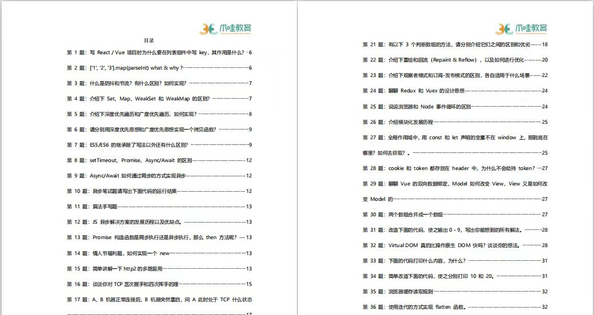
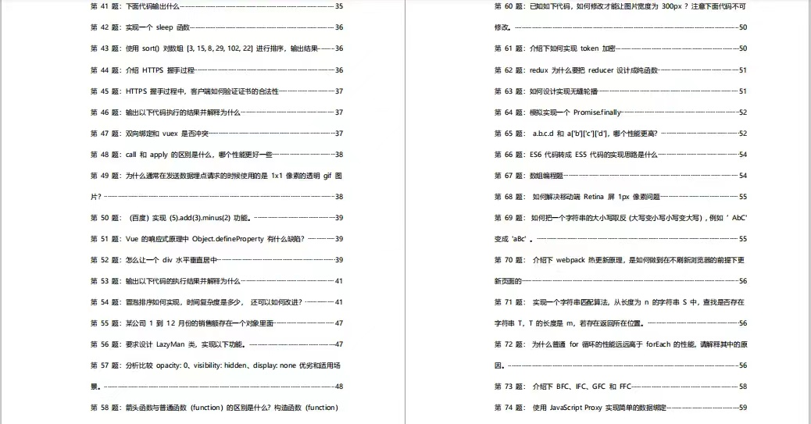

# 面试题视频
https://space.bilibili.com/1272014143?plat_id=1&share_from=space&share_medium=iphone&share_plat=ios&share_session_id=E147AA0A-8DE8-4A22-B591-0232919AB727&share_source=WEIXIN&share_tag=s_i&timestamp=1683894536&unique_k=5otokAs

# 2023年100道前端面试题 | 每天3道题
https://www.bilibili.com/video/BV1sr4y137wu/?p=8&spm_id_from=pageDriver&vd_source=a9f38e58a519cc0570c2dacd34ad7ebe


# 百度网盘-我的资源-前端框架及项目面试（Vue&React原理、Webpack&Babel、项目设计&项目流程）


# 百度网盘-我的资源-前端跳槽面试必备技巧

- 第二章：面试准备、技术栈准备

- 第三章：页面布局、css盒模型、DOM事件、原型链、面向对象

- 第四章：渲染机制、js运行机制、页面性能、错误监控

- 第五章：业务能力

- 第六章：职业竞争力、职业规划


# 前端面试指南（涵盖范围广）：https://interview.html5.wiki/


1. HTTP

  - 状态码
  - 缓存机制（强缓存，协商缓存）
  - 三次握手、四次挥手（每个阶段状态很重要） [链接](https://zhuanlan.zhihu.com/p/86426969)

2. Promise
  - 是什么？
  - 状态
  - 提供哪些 api
  - 实现 all 方法
      1. return new Promise()
      2. 遍历传入的 promises
      3. 通过 Promise.resolve 处理每个 promise
      4. 全部成功，就 resolve 成功的数组，一个失败，就直接 reject 这个错误 promise
      5. [实现链接](https://juejin.cn/post/7038371452084551694#heading-8)
  - Promise.allSettled
      1. 跟 all 不同的是，这个函数会返回所有的 promise 结果，不管成功与否
  - 实现 race 方法
      ```js
          Promise.race = (promises) => {
              return new Promise((rs, rj) => {
                  promises.forEach((pro) => {
                      // 对 pro 进行一次包装，防止非Promise对象
                      // 并且对其进行监听，将我们自己返回的Promise的resolve，reject传递给pro
                      // 哪个先改变状态，我们返回的Promise也将会是什么状态
                      Promise.resolve(pro).then(rs).catch(rj)
                  })
              })
          }
      ```
  - async/await 是什么，原理是什么?

  是 generator 函数的语法糖。

  

  - 如何实现一个 sleep 方法 (Promise + setTimeout)
  
  - [Promise 实现细节](https://juejin.cn/post/6945319439772434469)

3. Webpack
  - 原理
  - babel是什么， 原理
  - loader 和 plugin 区别
  - 做过哪些优化，常见的插件有哪些
  - 为什么 style-loader，css-loader, less-loader 要按顺序写。
  - DLL 是什么？
  - splitChunks是什么，怎么用的？
  - [b站链接](https://www.bilibili.com/video/BV1iv411N7jg?from=search&seid=2587848671896892166&spm_id_from=333.337.0.0)

4. 常见的设计模式有哪些
  - 单例模式
  - 发布订阅模式
  - 工厂模式
  - 代理模式

5. 算法刷题
  - 链表
      - 反转链表
  - 数组
  - 字符串
  - 排序（冒泡、快排、选择、插入、归并）
  - 上万条数据如何更好的渲染？（虚拟列表原理）

6. Vue
  - Vue2.x 和 Vue3.x 实现响应式数据的原理
  - 生命周期（各个阶段做了什么）
  - 双向数据绑定分别是什么，如何做到的
  - v-for 为什么不建议和 v-if 一起使用？哪个优先级高？

    v-for 优先级更好！因为 v-for 会先创建出元素，再通过 v-if 去判断元素存不存在，这样会造成页面卡顿、闪烁之类的问题，而且引起不必要的回流，消耗性能。

  - vue-router 模式，原理

  [2023年最新Vue面试题剖析原理级讲解](https://www.bilibili.com/video/BV1YM411w7Zc?p=41&vd_source=a9f38e58a519cc0570c2dacd34ad7ebe)

7. JS
  - 理清楚 this
  - new的原理以及和Object.create 方法的区别
  - 原型/原型链
  - 继承
  - ES5中的构造函数和class 的区别是什么?
  - 防抖/节流
  - 箭头函数 （和 es5 普通函数有什么区别）
  - 判断类型
    - typeof
    - instanceof (基于原型链)
    - 最佳实践：`Object.prototype.toString.call(variable)` return `"[Object xxx]"`
  - 列举 ES6 常用特性
  - 防抖/节流
      ```js
      // 节流，规定时间内执行一次，到了下个规定事件，又执行一次。每达到一个 tick 就执行
      function throttle(fn, interval) {
          let flag = true;
          return function(...args) {
              let context = this;
              if (!flag) return;
              flag = false;
              setTimeout(() => {
                  fn.apply(context, args);
                  flag = true;
              }, interval);
          };
      };
      
      ```
  - js 运行机制
  - node 事件循环和 js 的事件循环机制是否一样，区别是什么？ [链接](https://juejin.cn/post/6844903761949753352#heading-23)
  - 直面JavaScript中的30个疑难杂症 [链接](http://www.imooc.com/learn/1303)

8. HTML/CSS 相关
  - 浏览器存储，介绍 localstorage 和 session storage，cookie 的区别
      - 生命周期：
        1. cookie：可设置失效时间，没有设置的话，默认是关闭浏览器后失效（document.cookie = 'xxx'）
        2. localStorage：除非被手动清除，否则将会永久保存。
        3. sessionStorage： 仅在当前网页会话下有效，关闭页面或浏览器后就会被清除。
      - 存储空间
        1. cookie：`4KB`左右
        2. localStorage和sessionStorage：可以保存 `5MB` 的信息。
      - http请求
        1. cookie：每次都会携带在HTTP头中，如果使用cookie保存过多数据会带来性能问题
        2. localStorage和sessionStorage：仅在客户端（即浏览器）中保存，不参与和服务器的通信
    - 浏览器原理 [链接](https://github.com/ljianshu/Blog/issues/51)
    - 什么是跨域？如何解决？[链接](https://juejin.cn/post/6844903767226351623)
    - HTML5新特性有哪些？
    - BFC是什么，创建BFC的方式有哪些？
    - 浏览器灵魂拷问？ [链接](https://juejin.cn/post/6844904021308735502#heading-13)
    - 如何让子元素垂直水平居中（宽度不固定或固定）
      - 定位（position），通过 50% - 子元素一半px
      - flex 布局
      - transform: translate 设置偏移量（相对自身位置偏移）
    - 重绘和回流（重排）是什么 ? 如何避免引起回流。回流一定重绘，重绘不一定回流。    
        
      还有一种情况，是直接合成。比如利用 CSS3 的`transform`、`opacity`、`filter`这些属性就可以实现合成的效果，也就是大家常说的**GPU加速**。
    - [CSS加载会造成阻塞吗?](https://zhuanlan.zhihu.com/p/43282197?utm_source=wechat_session&utm_medium=social&utm_oi=762241709898739712)
    
    
    
9. 提升

  - 前端 100 问 
  
    [连接](https://juejin.cn/post/6844903885488783374#heading-24)
  - 前端提升路线
      
    [链接](https://www.zhihu.com/question/350289336/answer/873350617?utm_source=wechat_session&utm_medium=social&utm_oi=762241709898739712&utm_content=group1_Answer&utm_campaign=shareopn)
      
  - 前端系列文章（浏览器原理、http、ES6+、Promise、CSS）
  
    [链接](https://github.com/ljianshu/Blog)
      
  - nodejs
  
    [b站链接](https://www.bilibili.com/video/BV1sA41137qw?from=search&seid=13695427789412583637&spm_id_from=333.337.0.0)


# 准备工作

- 自我介绍
- 项目介绍
- 通用型的业务问题、项目经历（中台、rn webview）

# 面试题

- [字节跳动最爱考的 64 道算法题（JS版）](https://juejin.cn/post/6947842412102287373)
- [字节跳动最爱考的前端面试题：计算机网络基础](https://juejin.cn/post/6939691851746279437)
- [字节跳动最爱考的前端面试题：CSS](https://juejin.cn/post/6936913689115099143)
- [字节跳动最爱考的前端面试题：Javascript](https://juejin.cn/post/6934500357091360781)


# 面试题准备 1

- 计算机网络TCP的三次握手，UDP和TCP的区别。

- 知道的排序算法，以及复杂度。

- 二叉树层序遍历输出，每一层输出数组（手写算法）。

- 解决过那些问题,最难的是那些？如何定位？

- HTTPS和HTTP区别？非对称加密有哪些缺点？

- HTTP状态码，header

- XSS和CSRF攻击

- 有研究过哪些算法？

- 平时都是怎么学习的？最近都在关注哪些技术？为什么？

- 防抖、节流

- 实现图片懒加载


# 算法

排序算法   算法复杂度

# 面试题



    
        
