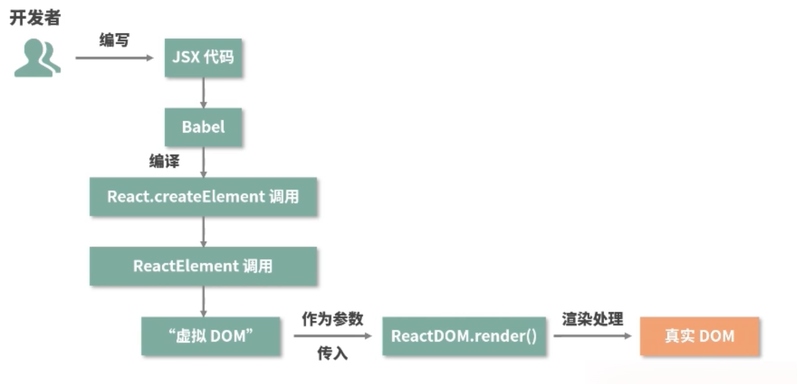
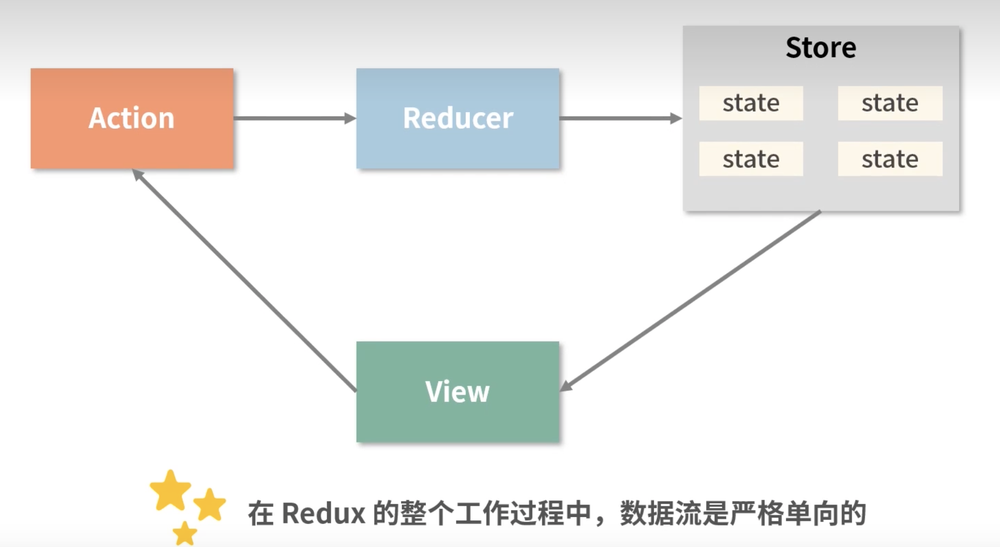
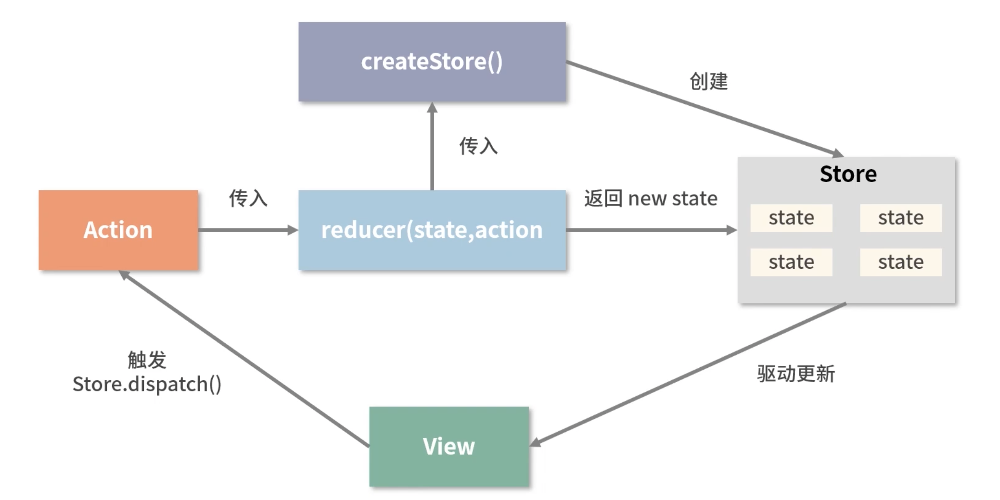

> https://www.bilibili.com/video/BV12r4y1r7vL?p=1&vd_source=a9f38e58a519cc0570c2dacd34ad7ebe

# 关于 JSX

## JSX 的本质是什么,它和 js 之间是什么关系?

## JSX 是如何在 React 中生效的,背后的功能模块是什么,这个功能模块都做了哪些事情?

## 为什么要用 JSX,不用会有什么后果(或者说为什么不直接使用 React.createElement 调用)?

- React.createElement 语法复杂,特别是在代码量多时混乱感尤为明显
- JSX 语法允许开发者使用我们最为熟悉的类HTML标签来创建模板,降低学习成本的同时也提升了研发效率和研发体验

## JSX 是如何映射为 DOM 的: 探索 createElement 源码!

```html
<!DOCTYPE html>
<html lang="en">
<head>
    <meta charset="UTF-8">
    <meta name="viewport" content="width=device-width, initial-scale=1.0">
    <title>Document</title>
    <script crossorigin src="https://unpkg.com/react@17/umd/react.development.js"></script>
    <script crossorigin src="https://unpkg.com/react-dom@17/umd/react-dom.development.js"></script>
    <script src="https://unpkg.com/@babel/standalone/babel.min.js"></script>
</head>
<body>
    <div id="app"></div>
    <script type="text/babel">
        const App = <h1>123!</h1>

        console.log(App)

        ReactDOM.render(App, document.querySelector('#app'))
    </script>
</body>
</html>
```
输出
```js
{
    "type": "h1",
    "key": null,
    "ref": null,
    "props": {
        "children": "123!"
    },
    "_owner": null,
    "_store": {}
}
```
createElement 源码

```js
function createElement(type, config, children) {
    var propName; // Reserved names are extracted

    var props = {};
    var key = null;
    var ref = null;
    var self = null;
    var source = null;

    if (config != null) {
        if (hasValidRef(config)) {
        ref = config.ref;

        {
            warnIfStringRefCannotBeAutoConverted(config);
        }
        }

        if (hasValidKey(config)) {
        key = '' + config.key;
        }

        self = config.__self === undefined ? null : config.__self;
        source = config.__source === undefined ? null : config.__source; // Remaining properties are added to a new props object

        for (propName in config) {
        if (hasOwnProperty$1.call(config, propName) && !RESERVED_PROPS.hasOwnProperty(propName)) {
            props[propName] = config[propName];
        }
        }
    } // Children can be more than one argument, and those are transferred onto
    // the newly allocated props object.


    var childrenLength = arguments.length - 2;

    if (childrenLength === 1) {
        props.children = children;
    } else if (childrenLength > 1) {
        var childArray = Array(childrenLength);

        for (var i = 0; i < childrenLength; i++) {
        childArray[i] = arguments[i + 2];
        }

        {
        if (Object.freeze) {
            Object.freeze(childArray);
        }
        }

        props.children = childArray;
    } // Resolve default props


    if (type && type.defaultProps) {
        var defaultProps = type.defaultProps;

        for (propName in defaultProps) {
        if (props[propName] === undefined) {
            props[propName] = defaultProps[propName];
        }
        }
    }

    {
        if (key || ref) {
        var displayName = typeof type === 'function' ? type.displayName || type.name || 'Unknown' : type;

        if (key) {
            defineKeyPropWarningGetter(props, displayName);
        }

        if (ref) {
            defineRefPropWarningGetter(props, displayName);
        }
        }
    }

    // `ReactElement(...);` 方法仅对参数进行了组装,返回了虚拟 dom
    return ReactElement(type, key, ref, self, source, ReactCurrentOwner.current, props);
}
```

jsx 转换 dom 流程如下




# 关于生命周期 v16.3

生命周期执行如下

```
app constructor
app componentWillMount
app render
child constructor
child componentWillMount
child render
child componentDidMount 
app componentDidMount 
--------------------父组件重新渲染-----------------------------
app render
child componentWillReceiveProps {}
child componentWillUpdate 
child render
```


```html
<!DOCTYPE html>
<html lang="en">
<head>
    <meta charset="UTF-8">
    <meta name="viewport" content="width=device-width, initial-scale=1.0">
    <title>Document</title>
    <script crossorigin src="https://unpkg.com/react@16.3/umd/react.development.js"></script>
    <script crossorigin src="https://unpkg.com/react-dom@16.3/umd/react-dom.development.js"></script>
    <script src="https://unpkg.com/@babel/standalone/babel.min.js"></script>
</head>
<body>
    <div id="app"></div>
    <script type="text/babel">

        class Count extends React.Component {
            constructor() {
                // 使用 this 前必须调用
                super()
                this.state = {
                    count: 11
                }

                console.log('child constructor')
            }

            componentWillMount(){
                console.log('child componentWillMount')
            }
            componentDidMount(){
                console.log('child componentDidMount ')
            }

            componentWillUpdate() {
                console.log('child componentWillUpdate ')
            }

            componentWillReceiveProps(nextProps) {
                console.log('child componentWillReceiveProps', nextProps)
            }

            handleClick = () => {
                console.log(this.state)
                this.setState({
                    count: this.state.count + 1
                })
            }

            render() {
                console.log('child render')

                return (
                    <>
                        <h1>{this.state.count}</h1>
                        <button onClick={this.handleClick}>add</button>
                    </>
                )
            }
        }

        class App extends React.Component {
            constructor() {
                super()
                this.state = {
                    count: 1
                }
                console.log('app constructor')
            }

            componentWillMount(){
                console.log('app componentWillMount')
            }
            componentDidMount(){
                console.log('app componentDidMount ')
                setTimeout(() => {
                    this.setState({
                        count: this.state.count + 1
                    })
                }, 1000);
            }
            render() {
                console.log('app render')
                return (
                    <>
                        <Count />
                    </>
                )
            }
        }

        ReactDOM.render(<App />, document.querySelector('#app'))
    </script>
</body>
</html>
```

# 关于单向数据流

当前组件的 state 以 props 的形式流动时,只能流向组件树中比自己层级更低的组件

子组件想要更改父组件的内容,只能通过父组件传递给子组件的函数去实现


缺点:
 - 层层传递,如果组件层级较深,会浪费很多无用代码,比较繁琐

兄弟组件如何简单通信呢?虽然我们可以通过共同父组件的能力来实现通信,但是我们可以手动实现一个 发布订阅模式 来试试.

## 发布订阅机制

早期的 addEventListner 就是发布订阅者模式

实现如下

```js
class EventEmitter {
    constructor() {
        this.eventMap = {}
    }

    // 注册事件, type 表示事件名, handler 表示事件函数
    on(type, handler) {
        if (!(handler instanceof Function)) {
            throw new Error('请传递正确函数')
        }

        if (!this.eventMap[type]) {
            this.eventMap[type] = []
        }

        this.eventMap[type].push(handler)
    }

    emit(type, params) {
        if (this.eventMap[type]) {
            this.eventMap[type].forEach((handler, index) => {
                handler(params)
            })
        }
    }

    off(type, handler) {
        if (this.eventMap[type]) {
            const isIndex = this.eventMap[type].indexOf(handler)
            if (isIndex >= 0) {
                this.eventMap[type].splice(isIndex, 1)
            }
        }
    }
}


const myEvent = new EventEmitter()

const sayHi = (what) => {
    console.log('hi', what)
}
myEvent.on('sayHi', sayHi)

myEvent.emit('sayHi', 'alex.cc')

console.log('myEvent', myEvent)

myEvent.off('sayHi', sayHi)

console.log('myEvent', myEvent)
```

## Context API

React 官方提供的一种组件树全局通信的方式.

三要素:
 - Context 对象
 - Provider
 - Consumer


## Redux

- store 是一个单一的数据源,只读
- action 是对变化的描述
- reducer 负责对变化进行分发和处理

redux 工作模式



redux 具体细节



# 关于 React Hooks v16.8

对类组件和函数组件两种组件形式的思考和侧重

函数组件因为无法定义 state,因此也叫无状态组件

区别:

- 类组件需要继承 class,函数组件不需要
- 类组件可以直接访问生命周期方法,函数组件不能
- 类组件中可以获取到实例化后的 this,函数组件没有 this
- 类组件中可以定义并维护 state,函数组件不能

Hooks 本质: 一套能够使函数组件更强大、更灵活的“钩子”函数

## 为什么告别 class,推行 hooks

1. class 语法学习成本

    逻辑层一度与生命周期耦合在一起,在多个生命周期中为了实现目标,逻辑被拆分

2. 难以理解的 this


## useState 是如何导致组件重新 render 的? 

## useEffect renturn 的方法何时触发?

1. 子组件使用 useEffect, 第二个参数传递空数组, 只有组件卸载时触发

2. 当子组件使用 useEffect,并未传递第二个参数时,父组件引起子组件重新 render 时触发

```js
// 子组件首次渲染时,不会触发 return fn
useEffect(() => {
    console.log('use effect')

    return () => {
        console.log('init and unmount')
    }
})
```

3. 当子组件使用 useEffect,传递第二个参数时,依赖值是父组件传递过来的 props, 初始化不会触发, props 更新时触发

## hooks 使用原则

1. 只在函数组件中调用 hook
2. 不要在循环、条件或嵌套函数中调用 hook (React 会按顺序执行链表)

    - mountState(首次渲染) 构建 hooks 链表,并渲染
    - updateState 方法依次遍历链表并渲染

所以,如果我们将 hooks 放到条件中,那么渲染后的 hooks 链表是不符合预期的.


# 关于虚拟 DOM

本质是 js 和 dom 之间的一个映射缓存

在形态上表现为: 一个能够描述 DOM 结构及其属性信息的 js 对象

解决的关键问题:

 - 研发体验/研发效率问题(避免了操作真实 DOM,通过数据驱动视图)
 - 跨平台问题(一次编写,可以渲染为 web、ios、andriod、小程序)


# 关于 调和和 diff 算法

## key 的作用

> key 是用来帮助 React 识别哪些内容被更改、添加或删除的. 需要赋予稳定的值,因为如果 key 发生了变化,会触发 UI 的重新渲染.

key 试图解决的问题是: 同一层级下节点的重用问题. 


# Fiber


# redux

- store
- action
- reducer

```js
import {createStore} from 'redux'

const store = createStore(
    reducer,
    initial_state,
    applyMiddleware(m1, m2, ...)
)
```


